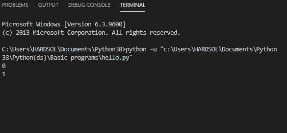
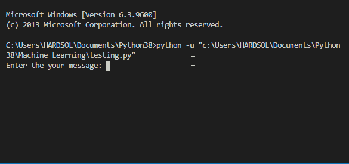
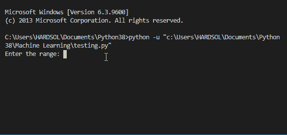
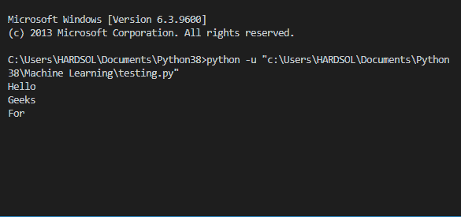

# 如何在 Python 中添加时间延迟？

> 原文:[https://www . geesforgeks . org/如何在 python 中添加时间延迟/](https://www.geeksforgeeks.org/how-to-add-time-delay-in-python/)

在本文中，我们将讨论如何在程序代码中引入或增加时间延迟。

**时间延迟**

*   为了在程序代码中增加时间延迟，我们使用了时间模块中的 sleep()函数。这是 Python 中的内置模块，我们不需要从外部安装。
*   时间延迟意味着我们在程序代码的执行时间中增加了延迟。它应该在两个语句之间或者根据您的需要在程序代码的任何部分之间。

**语法:**

```
time.sleep(value)
```

**进场:**

*   导入时间模块
*   为了在执行期间增加时间延迟，我们在两个语句之间使用 sleep()函数，在这两个语句之间我们需要延迟。在 sleep()函数中，将参数作为整数值或浮点值传递。
*   运行程序。
*   请注意执行时间的延迟。

完美理解主题。让我们通过一些例子来看看实现。

**注意:**作为输出，我已经展示了 GIF，这样你就可以注意到程序代码在执行时间内的时间延迟。

**示例 1:** 通过添加时间延迟来打印数字。

## 蟒蛇 3

```
# importing module
import time

# running loop from 0 to 4
for i in range(0,5):

  # printing numbers
  print(i)

  # adding 2 seconds time delay
  time.sleep(2)
```

**输出:**



**示例 2:** 对每个角色使用 sleep()进行戏剧性打印。

## 蟒蛇 3

```
# importing time module
import time

def message(string):

    for i in string:

        # printing each character of the message
        print(i, end="")

        # adding time delay of half second
        time.sleep(0.5)

# main function
if __name__ == '__main__':
    msg = "Its looks like auto typing"

    # calling the function for printing the 
    # characters with delay
    message(msg)
```

**输出:**



**示例 3:** 通过从用户处获取范围并添加时间延迟来打印图案。

## 蟒蛇 3

```
# importing module
import time

# function to print the pattern
def pattern(n):

    for i in range(0, n):
        for j in range(0, i+1):

            print('*', end=' ')

            # adding two second of time delay
            time.sleep(0.5)
        print(' ')

# main function
if __name__ == '__main__':

    # taking range from the user
    num = 4
    print("Printing the pattern")

    # calling function to print the pattern
    pattern(num)
```

**输出:**



**示例 4:** 使用休眠的多线程处理()

## 蟒蛇 3

```
# importing
import time
from threading import Thread

# making first thread of Geeks
class Geeks(Thread):

    def run(self):
        for x in range(4):
            print("Geeks")

            # adding delay of 2.2 seconds
            time.sleep(2.2)

# making second thread of For
class For(Thread):

    def run(self):
        for x in range(3):
            print('For')

            # adding delay of 2.3 seconds
            time.sleep(2.3)

print("Hello")

# making the object for both the 
# threads separately
g1 = Geeks()
f1 = For()

# starting the first thread
g1.start()

# starting the second thread
f1.start()

# waiting for the both thread to join
# after completing their job
g1.join()
f1.join()

# when threads complete their jobs
# message will be printed
print("All Done!!")
```

**输出:**

