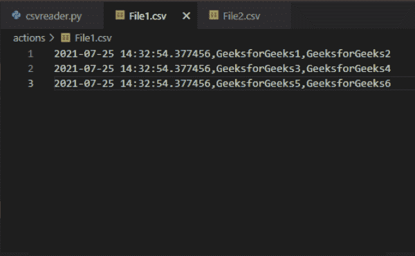
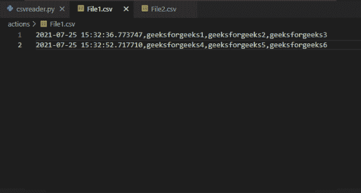
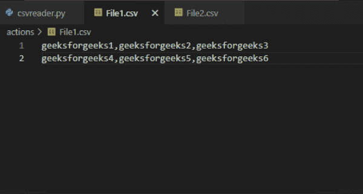
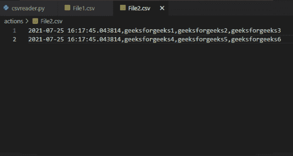

# 如何在 Python 中给 CSV 文件添加时间戳

> 原文:[https://www . geesforgeks . org/如何将时间戳添加到 python 中的 csv 文件/](https://www.geeksforgeeks.org/how-to-add-timestamp-to-csv-file-in-python/)

**先决条件:** [日期时间模块](https://www.geeksforgeeks.org/python-datetime-module/)

在这个例子中，我们将学习如何在 Python 中向 CSV 文件添加时间戳。借助 python 的 datetime 模块，我们可以轻松地为 CSV 文件添加时间戳。让我们看看 Python 中为 CSV 文件添加时间戳的分步实现。

## 创建 CSV 并添加时间戳

*   导入 csv 和 datetime 模块。我们将使用 csv 模块读写 csv 文件，并使用 datetime 模块在 csv 文件中添加当前日期和时间
*   从用户那里获取数据。
*   使用 Open()函数以读写模式(' r+')打开 CSV 文件。
    *   函数的作用是:打开一个文件，并将其作为文件对象返回。
    *   newline = ' '控制通用换行符模式的工作方式。它可以是“无”、“0”、“0”、“0”和“0”。
    *   write()返回一个 writer 对象，该对象负责将用户数据转换为分隔字符串。
*   使用 datetime 模块的 datetime.now()函数获取当前日期和时间。
*   在 for 循环的帮助下迭代 row 变量中的所有数据。
*   使用 Insert()函数在每个数据的第 0 个索引处插入当前日期和时间。
*   使用 writerow()在 CSV 文件中写入当前日期和时间的数据。

**示例 1:** 向 CSV 文件添加时间戳

## 蟒蛇 3

```py
# Importing required modules
import csv
from datetime import datetime

# Here we are storing our data in a
# variable. We'll add this data in
# our csv file
rows = [['GeeksforGeeks1', 'GeeksforGeeks2'],
        ['GeeksforGeeks3', 'GeeksforGeeks4'],
        ['GeeksforGeeks5', 'GeeksforGeeks6']]

# Opening the CSV file in read and
# write mode using the open() module
with open(r'YOUR_CSV_FILE.csv', 'r+', newline='') as file:

    # creating the csv writer
    file_write = csv.writer(file)

    # storing current date and time
    current_date_time = datetime.now()

    # Iterating over all the data in the rows 
    # variable
    for val in rows:

        # Inserting the date and time at 0th 
        # index
        val.insert(0, current_date_time)

        # writing the data in csv file
        file_write.writerow(val)
```

**输出:**



**例 2** :给 CSV 文件添加时间戳

## 蟒蛇 3

```py
# Importing required modules
import csv
from datetime import datetime

# function to write in csv file
def write_in_csv(rows):

    # Opening the CSV file in read and
    # write mode using the open() module
    with open(r'YOUR_CSV_FILE.csv', 'r+', newline='') as file:

        # creating the csv writer
        file_write = csv.writer(file)

        # Iterating over all the data in the rows 
        # variable
        for val in rows:

            # writing the data in csv file
            file_write.writerow(val)

# list to store the values of the rows
rows = []

# while loop to take
# inputs from the user
run = ''
while run != 'no':

    # lists to store the user data
    val = []

    # Taking inputs from the user
    val1 = input("Enter 1st value:- ")
    val2 = input("Enter 2nd value:- ")
    val3 = input("Enter 3rd value:- ")

    # storing current date and time
    current_date_time = datetime.now()

    # Appending the inputs in a list
    val.append(current_date_time)
    val.append(val1)
    val.append(val2)
    val.append(val3)

    # Taking input to add one more row
    # If user enters 'no' then the will loop will break
    run = input("Do you want to add one more row? Type Yes or No:- ")
    run = run.lower()

    # Adding the stored data in rows list
    rows.append(val)

# Calling function to write in csv file
write_in_csv(rows)
```

**输出:**



## 在现有 CSV 文件中添加时间戳

也可以给已经包含一些数据的 CSV 文件添加时间戳。为此，以读取模式打开第一个文件，以写入模式打开第二个文件。使用 csv 模块的 reader()函数创建第一个文件的 csv reader 对象。reader()返回一个 reader 对象，它将遍历给定 CSV 文件中的行。

使用 for 循环将存储在第一个文件中的每个数据追加到 row 变量中。使用 csv 模块的 writer()函数创建第二个文件的 writer 对象。现在使用 for 循环遍历 row 变量中的所有数据。将当前日期和时间存储在变量中，然后使用 insert()函数将其插入第 0 个索引处的数据中。使用 csv 模块的 writerow()函数将存储的数据写入文件 2。

**示例 1:** 向现有数据添加时间戳

文件 1 的内容:



## 蟒蛇 3

```py
# Importing required modules
import csv
from datetime import datetime

# creating a list to store the
# existing data of CSV file
rows = []

# Opening the CSV file in read mode using 
# the open() module
with open(r'FILE1.csv', 'r', newline='') as file:

    # Opening another CSV file to in write mode 
    # to add the data
    with open(r'FILE2.csv', 'w', newline='') as file2:

        # creating the csv reader
        reader = csv.reader(file, delimiter=',')

        # storing the data of the csv file in a list
        for row in reader:
            rows.append(row)

         # creating the csv writer
        file_write = csv.writer(file2)

        # Iterating over all the data in the rows
        # variable
        for val in rows:

            # storing current date and time in a
            # variable
            current_date_time = datetime.now()
            val.insert(0, current_date_time)

            # writing the data in csv file
            file_write.writerow(val)
```

**输出:**

