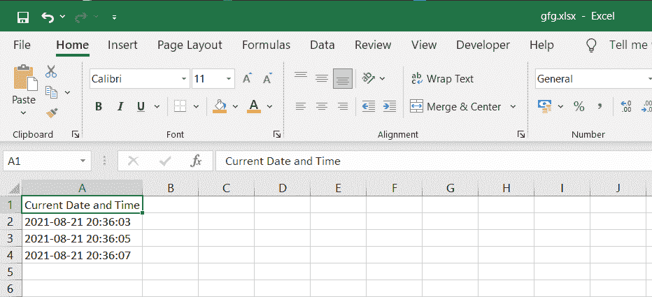

# 如何在 Python 中给 excel 文件添加时间戳

> 原文:[https://www . geesforgeks . org/如何将时间戳添加到 python 中的 excel 文件/](https://www.geeksforgeeks.org/how-to-add-timestamp-to-excel-file-in-python/)

在本文中，我们将讨论如何使用 Python 向 excel 文件添加时间戳。

## **所需模块**

*   [**日期时间:**](https://www.geeksforgeeks.org/python-datetime-module/) 这个模块帮助我们用 Python 处理日期和时间。

```py
pip install datetime
```

*   [**openpyxl**](https://www.geeksforgeeks.org/python-reading-excel-file-using-openpyxl-module/) **:是一个用来读写 Excel 文件的 Python 库。**

```py
pip install openpyxl
```

*   **时间:**该模块提供各种与时间相关的功能。

## 逐步实施

**步骤 1:** 创建工作簿对象并选择活动工作表:

```py
wb = Workbook()
ws = wb.active
```

**步骤 2(可选):**在单元格 A1 中写入标题。

```py
# Here column=1 represents column A and row=1 represents first row.
ws.cell(row=1, column=1).value = "Current Date and Time"
```

**步骤 3:** 使用以下命令从系统获取当前日期时间。

```py
time = datetime.datetime.now().strftime('%Y-%m-%d %H:%M:%S')
```

[***str time()***函数用于将日期和时间对象转换为它们的字符串表示。它接受一个或多个格式化代码输入，并返回字符串表示形式。](https://www.geeksforgeeks.org/python-strftime-function/)

**第 4 步:**将日期时间写入单元格 A2。

```py
ws.cell(row=2, column=1).value = time
```

**第五步:**使用 [***开始 2 秒的睡眠。睡眠(2)***](https://www.geeksforgeeks.org/sleep-in-python/)

**步骤 6:** 同样，再次获取当前日期时间，并将其写入单元格 A3。在这里，您将注意到与之前的日期时间相差 2 秒，因为两者之间有 2 秒的睡眠。

**第 7 步:**最后，用文件名保存 excel 工作簿并关闭工作簿

```py
wb.save('gfg.xlsx')
wb.close()
```

下面是完整的实现:

## 蟒蛇 3

```py
# Import the required modules
import datetime
from openpyxl import Workbook
import time

# Main Function
if __name__ == '__main__':

    # Create a workbook object
    wb = Workbook()

    # Select the active sheet
    ws = wb.active

    # Heading of Cell A1
    ws.cell(row=1, column=1).value = "Current Date and Time"

    # Cell A2 containing the Current Date and Time
    ws.cell(row=2, column=1).value = datetime.datetime.now().strftime('%Y-%m-%d %H:%M:%S')

    # Sleep of 2 seconds
    time.sleep(2)

    # Cell A3 containing the Current Date and Time
    ws.cell(row=3, column=1).value = datetime.datetime.now().strftime('%Y-%m-%d %H:%M:%S')
    time.sleep(2)

    # Cell A4 containing the Current Date and Time
    ws.cell(row=4, column=1).value = datetime.datetime.now().strftime('%Y-%m-%d %H:%M:%S')

    # Save the workbook with a
    # filename and close the object
    wb.save('gfg.xlsx')
    wb.close()
```

**输出:**

