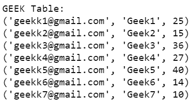
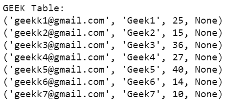
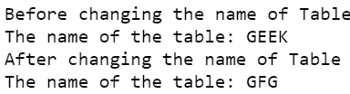

# 如何用 Python 改变一个 SQLite 表？

> 原文:[https://www . geeksforgeeks . org/how-alter-a-SQLite-table-use-python/](https://www.geeksforgeeks.org/how-to-alter-a-sqlite-table-using-python/)

在本文中，我们将讨论如何使用 sqlite3 模块从 Python 程序更改 SQLite 数据库中的表。

我们可以通过使用 ALTER 语句来做到这一点。它允许:

*   向表中添加一列或多列

## 更改表的名称。

### **在表格**中添加 **列**

下面给出了在 SQLite 的现有表中添加新列的 ALTER TABLE 语法:

> ALTER TABLE 表名 ADD COLUMN 列名 COLUMN 类型

该列已添加，但所有值都为空。

**创建表格:**

## 蟒蛇 3

```py
import sqlite3

# Connecting to sqlite
connection_obj = sqlite3.connect('geek.db')

# cursor object
cursor_obj = connection_obj.cursor()

# Drop the GEEK table if already exists.
cursor_obj.execute("DROP TABLE IF EXISTS GEEK")

# Creating table
table = """ CREATE TABLE GEEK (
            Email VARCHAR(255) NOT NULL,
            Name CHAR(25) NOT NULL,
            Score INT
        ); """

cursor_obj.execute(table)

# Inserting data into geek table
connection_obj.execute(
    """INSERT INTO GEEK (Email,Name,Score) VALUES ("geekk1@gmail.com","Geek1",25)""")
connection_obj.execute(
    """INSERT INTO GEEK (Email,Name,Score) VALUES ("geekk2@gmail.com","Geek2",15)""")
connection_obj.execute(
    """INSERT INTO GEEK (Email,Name,Score) VALUES ("geekk3@gmail.com","Geek3",36)""")
connection_obj.execute(
    """INSERT INTO GEEK (Email,Name,Score) VALUES ("geekk4@gmail.com","Geek4",27)""")
connection_obj.execute(
    """INSERT INTO GEEK (Email,Name,Score) VALUES ("geekk5@gmail.com","Geek5",40)""")
connection_obj.execute(
    """INSERT INTO GEEK (Email,Name,Score) VALUES ("geekk6@gmail.com","Geek6",14)""")
connection_obj.execute(
    """INSERT INTO GEEK (Email,Name,Score) VALUES ("geekk7@gmail.com","Geek7",10)""")

# Display table
data = cursor_obj.execute("""SELECT * FROM GEEK""")
print('GEEK Table:')
for row in data:
    print(row)

connection_obj.commit()

# Close the connection
connection_obj.close()
```

**输出:**



*现在我们添加一个新的列“用户名”:*

## 蟒蛇 3

```py
import sqlite3

# Connecting to sqlite
connection_obj = sqlite3.connect('geek.db')

# cursor object
cursor_obj = connection_obj.cursor()

# Add a new column to geek table
new_column = "ALTER TABLE GEEK ADD COLUMN UserName CHAR(25)"

cursor_obj.execute(new_column)

# Display table
data = cursor_obj.execute("SELECT * FROM GEEK")
print('GEEK Table:')
for row in data:
    print(row)

connection_obj.commit()

# Close the connection
connection_obj.close()
```

**输出:**



## **更改表格名称**

下面给出了在 SQLite 中更改表名的 ALTER TABLE 语法:

> 更改表名重命名为新表名；

我们将使用上面创建的同一个 GEEK 表:

## 蟒蛇 3

```py
import sqlite3

# Connecting to sqlite
connection_obj = sqlite3.connect('geek.db')

# cursor object
cursor_obj = connection_obj.cursor()

# select from sqlite_master
cursor_obj.execute("SELECT * FROM sqlite_master")

table = cursor_obj.fetchall()
print("Before changing the name of Table")
print("The name of the table:", table[0][2])

# Rename the SQLite Table
renameTable = "ALTER TABLE GEEK RENAME TO GFG"
cursor_obj.execute(renameTable)

# select from sqlite_master
cursor_obj.execute("SELECT * FROM sqlite_master")

table = cursor_obj.fetchall()

print("After changing the name of Table")
print("The name of the table:", table[0][2])

connection_obj.commit()

connection_obj.close()
```

**输出:**

