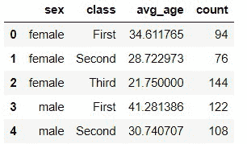
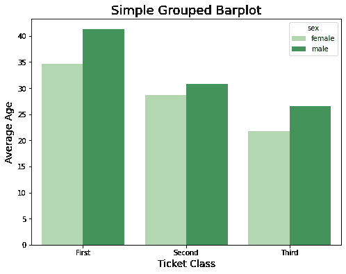
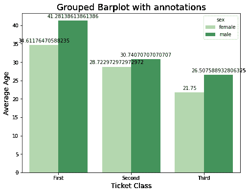
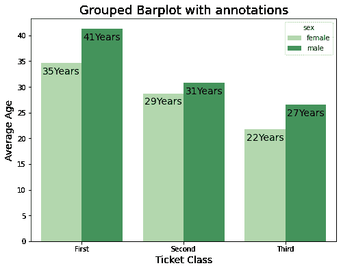

# 如何在 Python 中标注分组条形图中的条？

> 原文:[https://www . geeksforgeeks . org/如何注释成组条形图-python 中的条形图/](https://www.geeksforgeeks.org/how-to-annotate-bars-in-grouped-barplot-in-python/)

条形图是表示类别和数字特征之间关系的图形。许多矩形条对应于类别特征的每个类别，这些条的大小代表相应的值。使用分组条形图，我们可以研究两个以上要素之间的关系。

在 Python 中，我们可以使用 [Matplotlib](https://www.geeksforgeeks.org/bar-plot-in-matplotlib/) 库或 [seaborn](https://www.geeksforgeeks.org/seaborn-barplot-method-in-python/?ref=lbp) 库绘制条形图，这是一个基于 Matplotlib 构建的更高级的库，它还支持[熊猫](https://www.geeksforgeeks.org/python-pandas-dataframe/)数据结构。在本文中，我们使用了 seaborn.barplot()函数来绘制分组条形图。

使用条形图进行数据可视化的另一个重要方面是使用注释，即添加文本以更好地理解图表。这可以通过使用 matplotlib 库 pyplot 模块中的 [annotate()](https://www.geeksforgeeks.org/matplotlib-pyplot-annotate-in-python/) 函数来实现，如下步骤所述。

**步骤 1:** 导入使用的库和数据集。在这里，我们使用了泰坦尼克号数据集，它内置了海鸟。

## 蟒蛇 3

```
# importing the libraries used
import seaborn as sns
import matplotlib.pyplot as plt

# Importing the dataset
df = sns.load_dataset("titanic")
print(df.head())
```

**输出:**


原始数据集

我们将绘制一个分组条形图来分析泰坦尼克号上不同性别乘客的平均年龄和数量。为此，我们需要转换数据集。

**步骤 2:** 在原始数据集上使用分组和聚合来转换数据集。

## 蟒蛇 3

```
# transforming the dataset for barplot
data_df = df.groupby(['sex', 'class']).agg(
    avg_age=('age', 'mean'), count=('sex', 'count'))

data_df = data_df.reset_index()
print(data_df.head())
```

**输出:**



转换数据集

**说明:**分组条形图需要至少两个分类特征和一个数字特征。在这里，我们已经过滤掉了用于分类的“类别”特征和用于使用[熊猫对酒吧进行分组的“性别”特征。Dataframe.groupby()](https://www.geeksforgeeks.org/python-pandas-dataframe-groupby/) 函数。然后，我们使用[pandas . core . group by . data frame group by . agg()](https://www.geeksforgeeks.org/how-to-combine-groupby-and-multiple-aggregate-functions-in-pandas/)汇总了每组的平均年龄和数量。之前的操作产生了一个多索引数据帧，因此我们重置索引以获得如下所示的数据集。

**步骤 3:** 现在，我们使用 seaborn.barplot()函数，使用转换后的数据集绘制一个简单的 Barplot。

## 蟒蛇 3

```
# code to plot a simple grouped barplot
plt.figure(figsize=(8, 6))
sns.barplot(x="class", y="avg_age",
            hue="sex", data=data_df,
            palette='Greens')

plt.ylabel("Average Age", size=14)
plt.xlabel("Ticket Class", size=14)
plt.title("Simple Grouped Barplot", size=18)
```

**输出:**



请注意，我们使用了“色调”关键字参数来根据“性别”特征对条形进行分组。

**第 4 步:**标注条形

## 蟒蛇 3

```
# code for annotated grouped barplot
plt.figure(figsize=(8, 6))
splot = sns.barplot(x="class", y="avg_age", hue="sex",
                    data=data_df, palette='Greens')

for p in splot.patches:
    splot.annotate(format(p.get_height()),
                   (p.get_x() + p.get_width() / 2., p.get_height()),
                   ha='center', va='center',
                   xytext=(0, 9),
                   textcoords='offset points')

plt.ylabel("Average Age", size=14)
plt.xlabel("Ticket Class", size=14)
plt.title("Grouped Barplot with annotations", size=18)
```

**输出:**



**解释:**在上面的代码中，我们使用了 seaborn plot 对象的“patches”属性来迭代每个条。我们已经计算了高度，坐标，并使用[注释](https://www.geeksforgeeks.org/matplotlib-pyplot-annotate-in-python/)功能为每个栏放置文本。

**第五步:**因为每个小节代表年龄，放小数并不能让它的值变得合理。我们将通过舍入到最接近的整数，然后使用 format()函数来自定义我们的文本，如下面的代码所示。

## 蟒蛇 3

```
# code for annotated barplot
plt.figure(figsize=(8, 6))
splot = sns.barplot(x="class", y="avg_age", hue="sex",
                    data=data_df, palette='Greens')

plt.ylabel("Average Age", size=14)
plt.xlabel("Ticket Class", size=14)
plt.title("Grouped Barplot with annotations", size=18)
for p in splot.patches:
    splot.annotate(format(round(p.get_height()), '.0f')+"Years",
                   (p.get_x() + p.get_width() / 2., p.get_height()),
                   ha='center', va='center',
                   size=14,
                   xytext=(0, -12),
                   textcoords='offset points')
```

**输出:**



此外，通过改变坐标，我们已经在酒吧内移动了我们的文本。