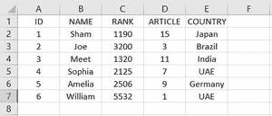

# 如何在现有 csv 文件中追加新行？

> 原文:[https://www . geesforgeks . org/如何向现有 csv 文件追加新行/](https://www.geeksforgeeks.org/how-to-append-a-new-row-to-an-existing-csv-file/)

为了给现有的 CSV 文件添加一个新行，我们有很多方法。在这里，我们将讨论有效执行这项任务的 2 种方法。因此，我们有两种方法，第一种是“将列表作为新行追加到现有 CSV 文件中”，第二种是“将字典作为新行追加到现有 CSV 文件中”。

首先，让我们看看我们现有的 CSV 文件内容。假设我们有一个包含以下内容的 CSV 文件 event.csv。


追加前的 CSV 文件

对于编写 CSV 文件，CSV 模块提供了两个不同的类 writer 和 Dictwriter。

**将列表作为新行追加到** **现有 CSV 文件**中

让我们看看如何使用 writer 类将列表作为新行追加到现有的 CSV 文件中。要做到这一点有几个步骤。

*   从 csv 模块导入编写器类
*   在追加模式下打开你现有的 CSV 文件
    为此文件创建一个文件对象。
*   将此文件对象传递给 csv.writer()并获取 writer 对象。
*   将列表作为参数传递给 writer 对象的 writerow()函数。
    (它会在 CSV 文件中添加一个列表作为新行)。
*   关闭文件对象

让我们将一个要添加的列表作为新行。

```py
List=[6,'William',5532,1,'UAE']

```

现在将上述步骤应用到程序中。

## 蟒蛇 3

```py
# Import writer class from csv module
from csv import writer

# List 
List=[6,'William',5532,1,'UAE']

# Open our existing CSV file in append mode
# Create a file object for this file
with open('event.csv', 'a') as f_object:

    # Pass this file object to csv.writer()
    # and get a writer object
    writer_object = writer(f_object)

    # Pass the list as an argument into
    # the writerow()
    writer_object.writerow(List)

    #Close the file object
    f_object.close()
```

**输出:**



追加列表后的 CSV 文件

当您执行此程序时，请确保您的 CSV 文件必须关闭，否则此程序会给您一个权限错误。

### **在现有 CSV 文件中追加一个字典作为新行**

让我们看看如何使用 DictWriter 类将字典作为新行追加到现有的 CSV 文件中。有几个步骤可以做到这一点。

*   从 CSV 模块导入 DictWriter 类。
*   在追加模式下打开你的 CSV 文件
    为此文件创建一个文件对象。
*   将文件对象和列名列表传递给 DictWriter()
    你会得到一个 DictWriter 的对象。
*   将字典作为参数传递给 DictWriter
    的 Writerow()函数(它会在 CSV 文件中添加一个新行)。
*   关闭文件对象

让我们将一个要添加的字典作为新行。

```py
dict={'ID':6,'NAME':'William','RANK':5532,'ARTICLE':1,'COUNTRY':'UAE'}

```

现在将上述步骤应用到程序中。

## 蟒蛇 3

```py
# Import DictWriter class from CSV module
from csv import DictWriter

# list of column names 
field_names = ['ID','NAME','RANK',
               'ARTICLE','COUNTRY']

# Dictionary
dict={'ID':6,'NAME':'William','RANK':5532,
      'ARTICLE':1,'COUNTRY':'UAE'}

# Open your CSV file in append mode
# Create a file object for this file
with open('event.csv', 'a') as f_object:

    # Pass the file object and a list 
    # of column names to DictWriter()
    # You will get a object of DictWriter
    dictwriter_object = DictWriter(f_object, fieldnames=field_names)

    #Pass the dictionary as an argument to the Writerow()
    dictwriter_object.writerow(dict)

    #Close the file object
    f_object.close()
```

**输出:**


追加字典后的 CSV 文件

当您执行此程序时，请确保您的 CSV 文件必须关闭，否则此程序会给您一个权限错误。