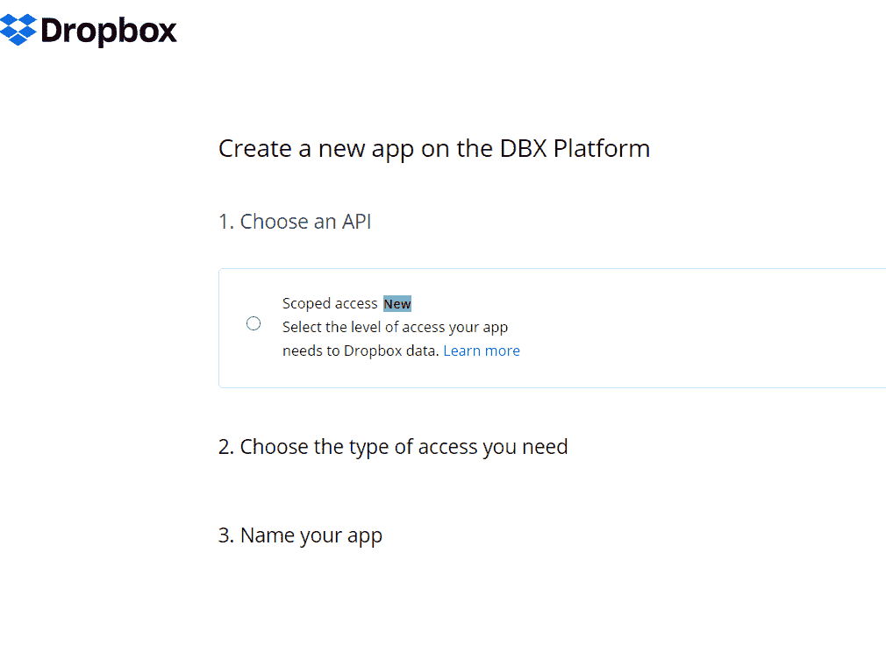
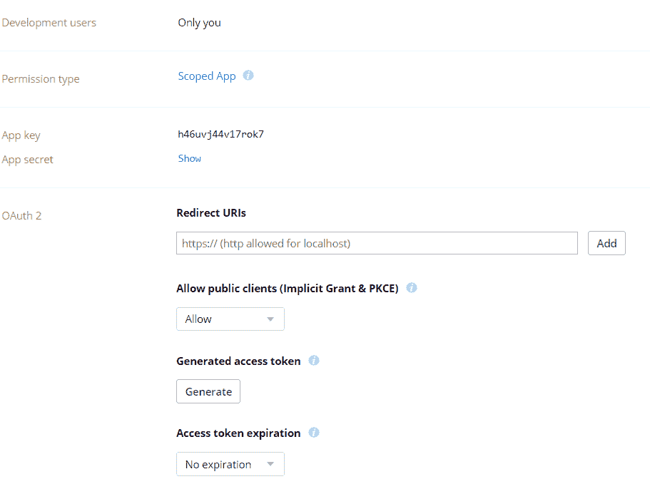
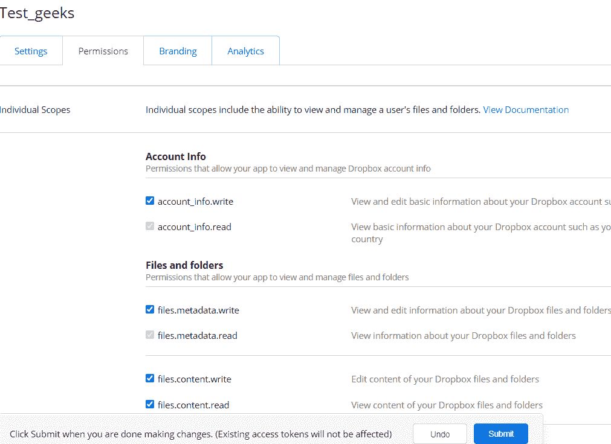
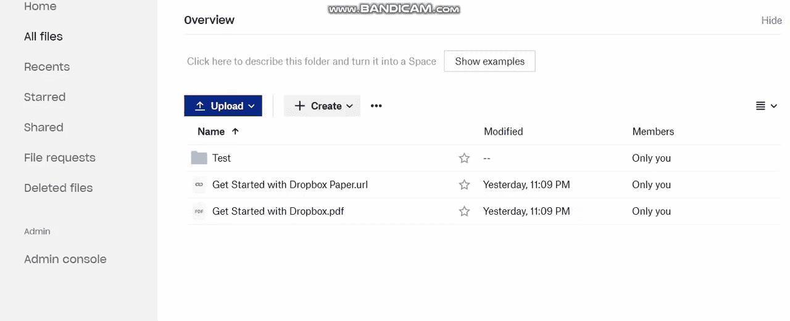

# 如何使用 Python 中的 Dropbox API 实现存储自动化？

> 原文:[https://www . geeksforgeeks . org/如何使用 python 中的 dropbox-api 实现存储自动化/](https://www.geeksforgeeks.org/how-to-automate-the-storage-using-dropbox-api-in-python/)

在这个数据时代，存储、管理和组织数据是每个企业都要考虑的重要因素。Dropbox 是市场上最受欢迎的云存储系统之一，它还在继续改进其功能。在本文中，我们将演示如何使用 Python 连接到 dropbox API 并高效执行存储自动化。

### **获取连接收存箱的密钥**

*   去**会看到这样的一页。选择“作用域访问”选项，并在步骤 2 中选择“完整收存箱”，用任何重要的名称命名您的应用程序。**

****

*   **在 Oauth2 部分，将访问令牌到期设置为“**无到期**，生成访问令牌。**

****

*   **转到权限选项卡，选择所需的适当权限，然后单击提交。**

****

*   **通过上述步骤生成的令牌密钥，我们可以使用该令牌连接到收存箱并执行存储自动化。您可以使用以下命令安装 python 库:**

```py
pip install dropbox 
```

****生成令牌的演示视频:****

**<video class="wp-video-shortcode" id="video-588257-1" width="640" height="360" preload="metadata" controls=""><source type="video/mp4" src="https://media.geeksforgeeks.org/wp-content/uploads/20210413083509/Key-Generation.mp4---Google-Drive_2.mp4?_=1">[https://media.geeksforgeeks.org/wp-content/uploads/20210413083509/Key-Generation.mp4---Google-Drive_2.mp4](https://media.geeksforgeeks.org/wp-content/uploads/20210413083509/Key-Generation.mp4---Google-Drive_2.mp4)</video>**

### ****使用令牌密钥连接收存箱:****

**使用生成的令牌连接到 dropbox 并创建一个对象。**

## **蟒蛇 3**

```py
# importing necessary libraries
import dropbox

# Token Generated from dropbox
TOKEN = "access_token"

# Establish connection
def connect_to_dropbox():

    try:
        dbx = dropbox.Dropbox(TOKEN)
        print('Connected to Dropbox successfully')

    except Exception as e:
        print(str(e))

    return dbx

dbx = connect_to_dropbox()
```

****输出:****

```py
Connected to Dropbox successfully
```

**我们已成功连接到 Dropbox。我们现在可以列出文件夹/文件，读取文件，上传文件，删除文件等。**

### **列出文件夹中的文件**

**首先，调用上面的方法连接并创建一个 dropbox 对象，然后为要扫描的文件夹分配一个路径，然后使用 file_list_folder()方法和 for 循环遍历旧的文件夹。**

## **蟒蛇 3**

```py
# explicit function to list files
def list_files_in_folder():

    # here dbx is an object which is obtained
    # by connecting to dropbox via token
    dbx = connect_to_dropbox()

    try:
        folder_path = "/folder_path"

        # dbx object contains all functions that 
        # are required to perform actions with dropbox
        files = dbx.files_list_folder(folder_path).entries
        print("------------Listing Files in Folder------------ ")

        for file in files:

            # listing
            print(file.name)

    except Exception as e:
        print(str(e))

list_files_in_folder()
```

****输出:****

****

**现在我们已经成功地使用 python 连接到 dropbox，列出了其中存在的文件夹。**