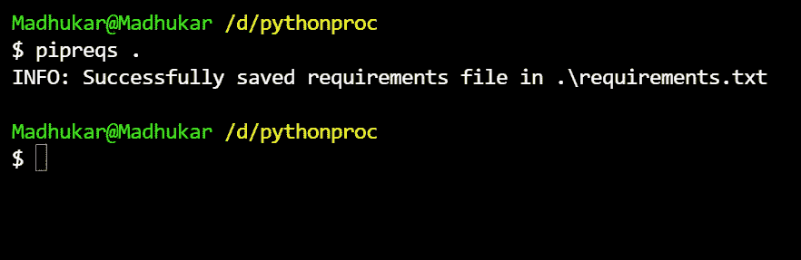
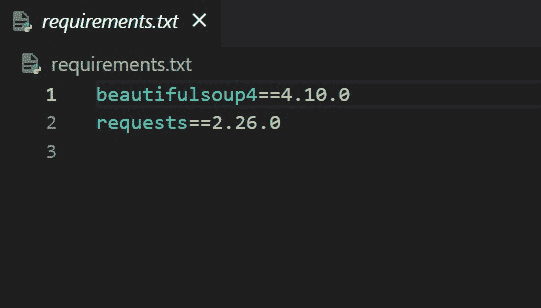
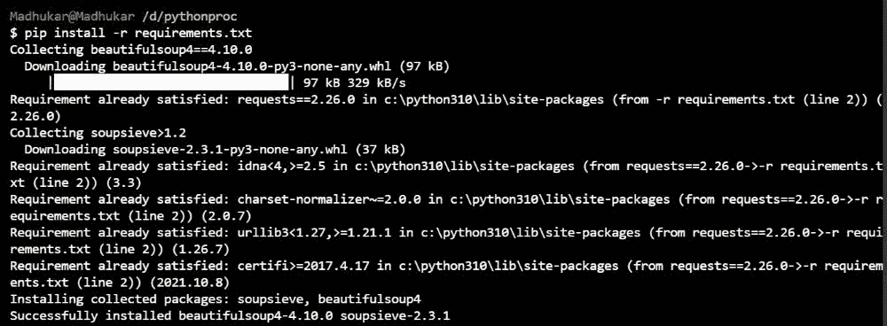

# 如何从 Python 脚本自动安装所需的包？

> 原文:[https://www . geesforgeks . org/如何从 python 脚本中自动安装所需的包/](https://www.geeksforgeeks.org/how-to-automatically-install-required-packages-from-a-python-script/)

当在 python 中工作，不得不使用你不知道的库或者使用一台新的 pc 时，逐个安装所有的库是一项非常繁忙的工作。每次都要找出库的名字，一个一个安装。但是如果我们知道像 *pipreqs* 这样的库，它会自动安装运行程序所需的所有库，这将使我们的工作变得非常容易，我们可以专注于代码，而不是浪费时间一个接一个地安装库。

## **什么是**[](https://github.com/bndr/pipreqs)****？****

**这是一个 python 库，它根据任何项目的导入生成 pip *requirements.txt* 文件，然后您可以一次安装所有这些文件。**

## **安装管道:**

**在你的电脑上运行这个命令来安装 *pipreqs* 库。**

```py
pip install pipreqs
```

****步骤 1:** 转到您的 python 脚本所在的目录，例如，假设我们将这段代码放在目录中。**

## **蟒蛇 3**

```py
import os
import requests
import urllib.request
from bs4 import BeautifulSoup
print('GFG is the best')
```

****步骤 2:** 在该目录中运行以下命令，该命令将创建一个需求文件。**

```py
pipreqs
```

****

**在我们的例子中，需求文件看起来像这样。**

****

**这表明我们的系统中不存在请求和美丽的程序库，我们必须安装它们来运行我们的程序。**

****步骤 3:** 现在运行此命令，安装运行程序所需的所有库**

```py
pip install -r requirements.txt
```

**

安装所有库** 

**现在，如果我们运行代码，它将成功运行代码。**