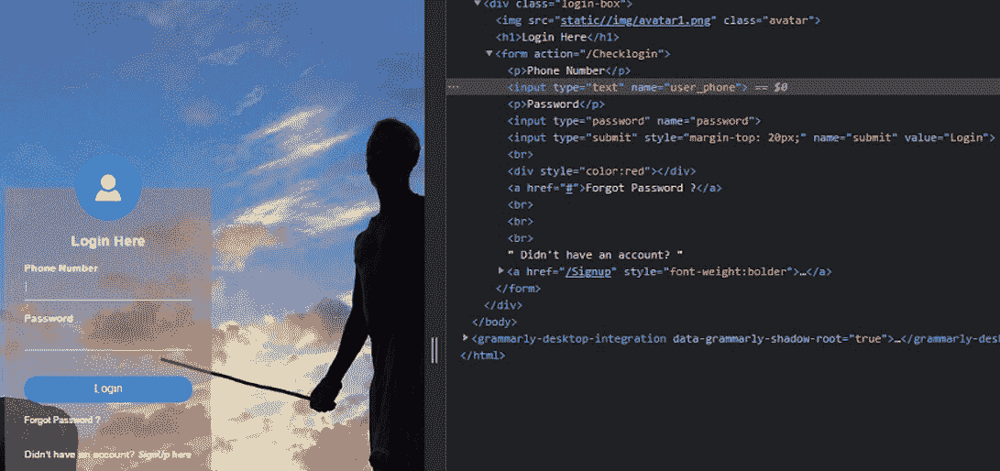
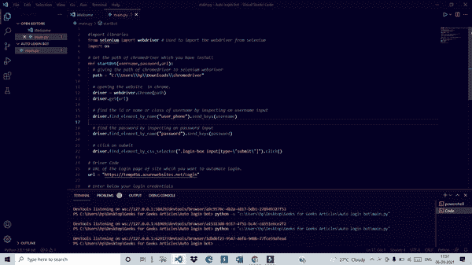

# 如何用 Python 构建简单的自动登录机器人

> 原文:[https://www . geesforgeks . org/how-to-build-a-simple-auto-log in-bot-with-python/](https://www.geeksforgeeks.org/how-to-build-a-simple-auto-login-bot-with-python/)

在本文中，我们将看到如何使用 python 构建一个简单的自动登录机器人。

在目前的场景中，每个网站都使用身份验证，我们必须通过输入适当的凭据来登录。但是有时一次又一次地登录一个特定的网站会变得非常忙乱。所以，为了解决这个问题，让我们用 python 构建自己的自动登录机器人。

我们将使用[硒](https://www.geeksforgeeks.org/browser-automation-using-selenium/) (python 库)来制作自动登录机器人。Python 硒库帮助我们访问硒网络驱动程序的所有功能，如火狐、Chrome、远程等。

## 装置

首先，我们必须使用下面的命令安装 selenium:

```
pip install selenium
```

在成功安装 selenium 之后，我们还必须安装 chromedriver 来访问 selenium 的 chrome webdriver。你可以从[这里](https://chromedriver.chromium.org/home)下载(根据你的系统 chrome 版本和你的 OS 下载版本)。

确保您已经记录了 chromedriver 的下载位置(因为它在我们的 python 脚本中使用)。现在下载后提取 zip 文件，请注意提取文件的文件位置，因为我们稍后在 python 代码中需要它。(您可以通过单击属性，然后单击详细信息来找到位置)。

## **分步实施:**

*   首先从 selenium 库中导入网络驱动程序。
*   找到您要登录的登录页面的网址。
*   向 selenium webdriver 提供位置可执行 chrome 驱动程序，以访问 chrome 浏览器。
*   最后，通过右键单击检查用户名和密码，找到用户名和密码的名称或 id 或类或 CSS 选择器。



**下面是实现:**

## 蟒蛇 3

```
# Used to import the webdriver from selenium
from selenium import webdriver 
import os

# Get the path of chromedriver which you have install

def startBot(username, password, url):
    path = "C:\\Users\\hp\\Downloads\\chromedriver"

    # giving the path of chromedriver to selenium webdriver
    driver = webdriver.Chrome(path)

    # opening the website  in chrome.
    driver.get(url)

    # find the id or name or class of
    # username by inspecting on username input
    driver.find_element_by_name(
        "id/class/name of username").send_keys(username)

    # find the password by inspecting on password input
    driver.find_element_by_name(
        "id/class/name of password").send_keys(password)

    # click on submit
    driver.find_element_by_css_selector(
        "id/class/name/css selector of login button").click()

# Driver Code
# Enter below your login credentials
username = "Enter your username"
password = "Enter your password"

# URL of the login page of site
# which you want to automate login.
url = "Enter the URL of login page of website"

# Call the function
startBot(username, password, url)
```

**输出:**

