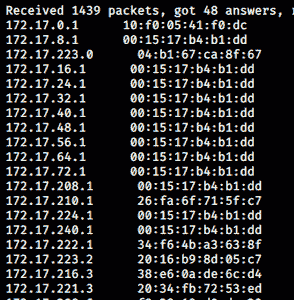

# 如何用 Scapy 用 Python 搭建 WiFi 扫描仪？

> 原文:[https://www . geeksforgeeks . org/如何用 python 构建 wifi 扫描仪/](https://www.geeksforgeeks.org/how-to-build-a-wifi-scanner-in-python-using-scapy/)

在本文中，我们将使用 Scapy 在 Python 中构建一个 WiFi 扫描仪。WiFi 扫描或网络扫描是指扫描我们连接的整个网络，并试图找出连接到我们网络的所有客户端。我们可以使用每个客户端的 IP 和 MAC 地址来识别它们。我们可以使用 ARP ping 找出我们网络中的活动系统。

网络扫描器将发送 ARP 请求，指示谁有一些特定的 IP 地址，比如说“192.168.1.1”，该 IP 地址的所有者(目标)将自动响应，说他是“192.168.1.1”，有了该响应，MAC 地址也将包含在数据包中，这允许我们在发送广播数据包(向网络中的所有设备发送数据包)时成功同时检索所有网络用户的 IP 和 MAC 地址。

**创建网络扫描仪的一些重要功能:**

*   **ARP():** 这个函数在 scapy 模块中定义，允许我们创建 ARP 数据包(请求或响应)。默认情况下，如果我们调用它，它会为我们创建一个 ARP 请求包。这个方法为我们提供了我们创建的数据包的状态。它没有提供关于数据包的详细信息，它只是给了我们基本的想法，比如数据包的类型是什么，数据包的目的地是什么，等等。例如，如果我们想要使用 ARP()方法创建一个 ARP 数据包，该方法存在于 scapy 模块中，并且想要查看数据包的摘要，那么我们可以通过创建 ARP 类的对象来实现。
*   **show()方法:**这个方法和 summary()方法非常相似。它给出了关于数据包的更详细的信息。这个函数的用法也非常类似于 summary()方法。
*   **ls()函数:**这个方法存在于 scapy 类中。通过使用这种方法，我们可以看到可以为特定数据包设置哪些字段。

我们将创建一个 ARP 数据包，在 ls()函数的帮助下，我们将看到这个数据包的可用字段。

**进场:**

*   使用 ARP()方法创建一个 ARP 数据包。
*   使用变量设置网络范围。
*   使用以太()方法创建以太网数据包。
*   使用变量 hwdst 将目的地设置为广播。
*   使用“/”组合 ARP 请求数据包和以太网帧。
*   将此发送到您的网络，并从不同的设备获取响应。#scapy.srp()
*   打印响应数据包中的 IP 和 MAC 地址。

**下面是 Python 实现:**

## 蟒蛇 3

```
import scapy.all as scapy 

request = scapy.ARP() 

request.pdst = '192.168.0.1/24'
broadcast = scapy.Ether() 

broadcast.dst = 'ff:ff:ff:ff:ff:ff'

request_broadcast = broadcast / request 
clients = scapy.srp(request_broadcast, timeout = 10,verbose = 1)[0] 
for element in clients: 
    print(element[1].psrc + "      " + element[1].hwsrc) 
```

**输出:**



**说明:**

这里 x =网络范围。例如 x = 192.168.0.1/24、172.16.5.1/16 等

*   pdst 是 ARP 数据包应该到达的地方(目标)，
*   psrc 是要在目标的 arp 表中更新的 IP，
*   hwsrc 是发送方的硬件地址。
*   hwdst 是目标硬件地址