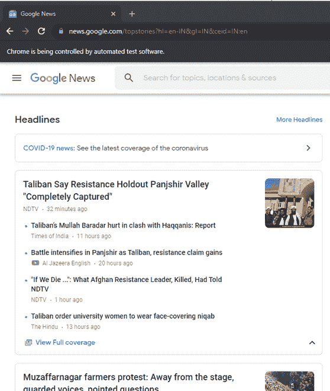
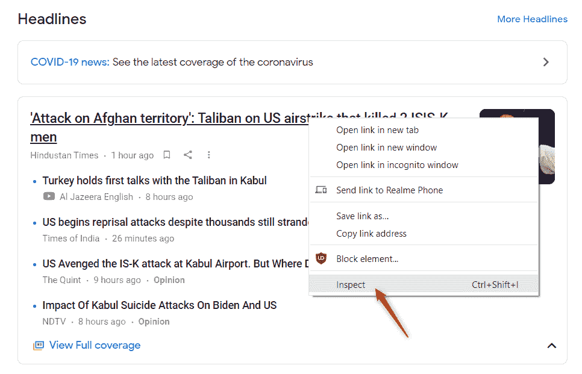
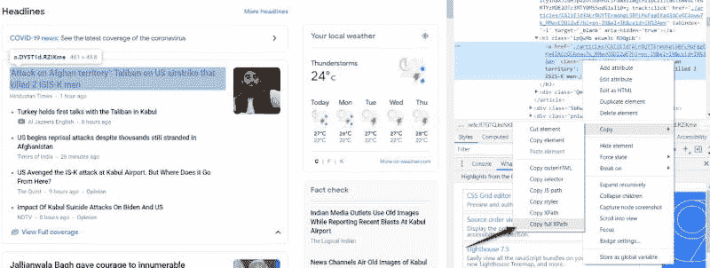
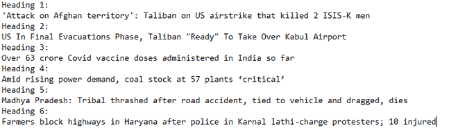
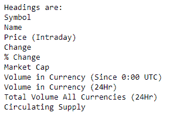
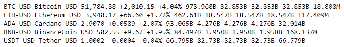
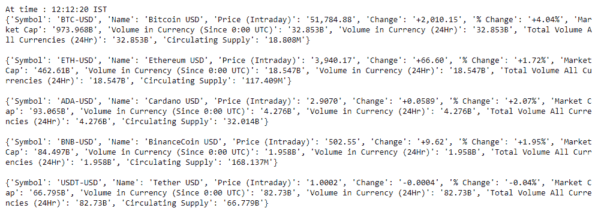
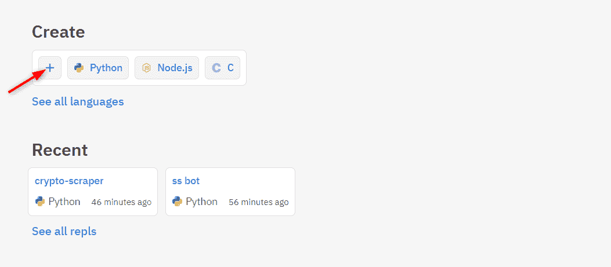
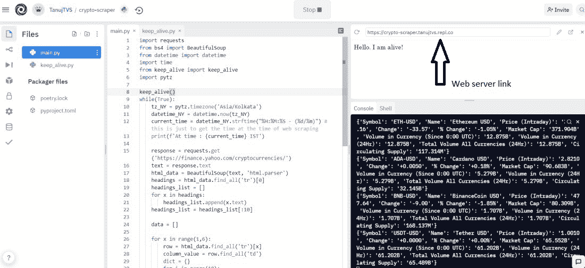
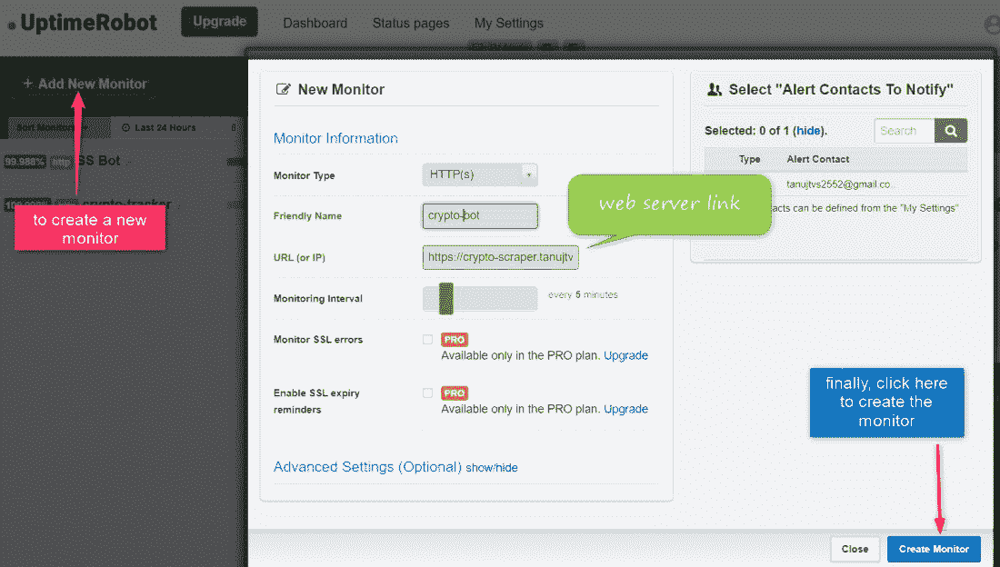

# 如何用 Python 构建网页抓取机器人

> 原文:[https://www . geesforgeks . org/how-to-build-web-scratch-bot-in-python/](https://www.geeksforgeeks.org/how-to-build-web-scraping-bot-in-python/)

在本文中，我们将看到如何用 Python 构建一个网页抓取机器人。

网页抓取是从网站提取数据的过程。机器人是一段代码，它将使我们的任务自动化。因此，网页抓取机器人是一个程序，它会根据我们的要求自动抓取网站的数据。

## 需要的模块

*   [**bs4**](https://www.geeksforgeeks.org/implementing-web-scraping-python-beautiful-soup/)【T4:美人汤(bs4)是一个从 HTML 和 XML 文件中拉出数据的 Python 库。这个模块没有内置 Python。要安装此软件，请在终端中键入以下命令。

> pip 安装 bs4

*   [**请求**](https://www.geeksforgeeks.org/python-requests-tutorial/) **:** 请求让你发送 HTTP/1.1 请求极其轻松。该模块也没有内置 Python。要安装此软件，请在终端中键入以下命令。

> pip 安装请求

*   [**Selenium**](https://www.geeksforgeeks.org/selenium-basics-components-features-uses-and-limitations/)**:Selenium 是目前最流行的自动化测试工具之一。它可以用来自动运行像 Chrome、火狐、Safari 等浏览器。**

> pip 安装硒

## **方法 1:** **使用硒**

我们需要安装一个 [chrome 驱动程序](https://chromedriver.chromium.org/home)来自动使用 selenium，我们的任务是创建一个机器人，它将持续抓取谷歌新闻网站，并每 10 分钟显示所有标题。

### 逐步**实施:**

**第一步:**首先我们导入一些需要的模块。

## 蟒蛇 3

```py
# These are the imports to be made
import time
from selenium import webdriver
from datetime import datetime
```

**第二步:**下一步是打开需要的网站。

## 蟒蛇 3

```py
# path of the chromedriver we have just downloaded
PATH = r"D:\chromedriver"
driver = webdriver.Chrome(PATH)  # to open the browser

# url of google news website
url = 'https://news.google.com/topstories?hl=en-IN&gl=IN&ceid=IN:en'

# to open the url in the browser
driver.get(url)  
```

**输出:**



**第三步:**从网页中提取新闻标题，要提取页面的特定部分，我们需要它的 XPath，右键点击需要的元素，选择下拉框中的 Inspect 即可访问。



单击“检查”后，将出现一个窗口。从那里，我们必须复制元素完整的 XPath 来访问它:



**注意:**你可能并不总是通过检查得到你想要的确切元素(取决于网站的结构)，所以你可能需要浏览一会儿 HTML 代码才能得到你想要的确切元素。现在，只需复制该路径并将其粘贴到代码中。运行完所有这些代码后，您将在终端上打印出第一个标题的标题。

## 蟒蛇 3

```py
# Xpath you just copied
news_path = '/html/body/c-wiz/div/div[2]/div[2]/\
div/main/c-wiz/div[1]/div[3]/div/div/article/h3/a'

# to get that element
link = driver.find_element_by_xpath(news_path)  

# to read the text from that element
print(link.text)  
```

**输出:**

> “对阿富汗领土的袭击”:塔利班对美国空袭，造成 2 名 ISIS-K 男子死亡

**第四步:**现在，目标是得到所有在场头条的 X _ Paths。

一种方法是，我们可以复制所有标题的所有 XPaths(每次大约有 6 个标题会出现在谷歌新闻中)，我们可以获取所有这些，但是如果有大量的东西要废弃，这种方法就不适合了。因此，优雅的方法是找到标题的 XPaths 的模式，这将使我们的任务变得更加容易和高效。下面是网站上所有标题的 XPaths，让我们找出模式。

> /html/body/c-wiz/div/div[2]/div[2]/div/main/c-wiz/div[1]/div[**3**]/div/div/article/H3/a
> 
> /html/body/c-wiz/div/div[2]/div[2]/div/main/c-wiz/div[1]/div[**4**]/div/div/article/H3/a
> 
> /html/body/c-wiz/div/div[2]/div[2]/div/main/c-wiz/div[1]/div[**5**]/div/div/article/H3/a
> 
> /html/body/c-wiz/div/div[2]/div[2]/div/main/c-wiz/div[1]/div[**6**]/div/div/article/H3/a
> 
> /html/body/c-wiz/div/div[2]/div[2]/div/main/c-wiz/div[1]/div[**7**]/div/div/article/H3/a
> 
> /html/body/c-wiz/div/div[2]/div[2]/div/main/c-wiz/div[1]/div[**8**]/div/div/article/H3/a

因此，通过查看这些 XPath，我们可以看到只有第 5 个 div 在变化(粗体)。基于此，我们可以生成所有标题的 XPaths。我们将通过使用它们的 XPath 来访问页面中的所有标题。为了提取所有这些，我们有如下代码

## 蟒蛇 3

```py
# I have used f-strings to format the string
c = 1
for x in range(3, 9):
    print(f"Heading {c}: ")
    c += 1
    curr_path = f'/html/body/c-wiz/div/div[2]/div[2]/div/main\
    /c-wiz/div[1]/div[{x}]/div/div/article/h3/a'
    title = driver.find_element_by_xpath(curr_path)
    print(title.text)
```

**输出:**



现在，代码几乎完成了，我们要做的最后一件事是代码应该每 10 分钟出现一次标题。因此，我们将运行一会儿循环，并在获得所有标题后睡 10 分钟。

**以下是完整实现**

## 蟒蛇 3

```py
import time
from selenium import webdriver
from datetime import datetime

PATH = r"D:\chromedriver"

driver = webdriver.Chrome(PATH)

url = 'https://news.google.com/topstories?hl=en-IN&gl=IN&ceid=IN:en'

driver.get(url)

while(True):
    now = datetime.now()

    # this is just to get the time at the time of 
    # web scraping
    current_time = now.strftime("%H:%M:%S")
    print(f'At time : {current_time} IST')
    c = 1

    for x in range(3, 9):
        curr_path = ''

        # Exception handling to handle unexpected changes
        # in the structure of the website
        try:
            curr_path = f'/html/body/c-wiz/div/div[2]/div[2]/\
            div/main/c-wiz/div[1]/div[{x}]/div/div/article/h3/a'
            title = driver.find_element_by_xpath(curr_path)
        except:
            continue
        print(f"Heading {c}: ")
        c += 1
        print(title.text)

    # to stop the running of code for 10 mins
    time.sleep(600) 
```

**输出:**


<video class="wp-video-shortcode" id="video-677221-1" width="640" height="360" preload="metadata" controls=""><source type="video/mp4" src="https://media.geeksforgeeks.org/wp-content/uploads/20210902223708/new-bot-video.mp4?_=1">[https://media.geeksforgeeks.org/wp-content/uploads/20210902223708/new-bot-video.mp4](https://media.geeksforgeeks.org/wp-content/uploads/20210902223708/new-bot-video.mp4)</video>

## 方法 2:使用请求和美化组

请求模块从网站获取原始的 HTML 数据，漂亮的汤被用来清晰地解析这些信息，以获得我们需要的确切数据。与 Selenium 不同的是，它不需要安装浏览器，而且更加轻便，因为它不需要浏览器的帮助就可以直接访问网络。

### **分步实施:**

**第一步:**导入模块。

## 蟒蛇 3

```py
import requests
from bs4 import BeautifulSoup
import time
```

**第二步:**接下来要做的是获取 URL 数据，然后解析 HTML 代码

## 蟒蛇 3

```py
url = 'https://finance.yahoo.com/cryptocurrencies/'
response = requests.get(url)
text = response.text
data = BeautifulSoup(text, 'html.parser')
```

**第三步:**首先，我们将从表格中获取所有标题。

## 蟒蛇 3

```py
# since, headings are the first row of the table
headings = data.find_all('tr')[0]
headings_list = []  # list to store all headings

for x in headings:
    headings_list.append(x.text)
# since, we require only the first ten columns
headings_list = headings_list[:10]

print('Headings are: ')
for column in headings_list:
    print(column)
```

**输出:**



**第四步:**同样可以得到每行的所有值

## 蟒蛇 3

```py
# since we need only first five coins
for x in range(1, 6):
    table = data.find_all('tr')[x]
    c = table.find_all('td')

    for x in c:
        print(x.text, end=' ')
    print('')
```

**输出:**



**以下是完整实现:**

## 蟒蛇 3

```py
import requests
from bs4 import BeautifulSoup
from datetime import datetime
import time

while(True):
    now = datetime.now()

    # this is just to get the time at the time of
    # web scraping
    current_time = now.strftime("%H:%M:%S")
    print(f'At time : {current_time} IST')

    response = requests.get('https://finance.yahoo.com/cryptocurrencies/')
    text = response.text
    html_data = BeautifulSoup(text, 'html.parser')
    headings = html_data.find_all('tr')[0]
    headings_list = []
    for x in headings:
        headings_list.append(x.text)
    headings_list = headings_list[:10]

    data = []

    for x in range(1, 6):
        row = html_data.find_all('tr')[x]
        column_value = row.find_all('td')
        dict = {}

        for i in range(10):
            dict[headings_list[i]] = column_value[i].text
        data.append(dict)

    for coin in data:
        print(coin)
        print('')
    time.sleep(600)
```

**输出:**



## 托管 Bot

这是一种特定的方法，用于在不需要任何人工干预的情况下持续在线运行机器人。replit.com 是一个在线编译器，我们将在那里运行代码。我们将在 python 中的 flask 模块的帮助下创建一个小型网络服务器，这有助于代码的持续运行。请在该网站上创建一个帐户并创建一个新的回复。



创建复制器后，创建两个文件，一个运行机器人代码，另一个使用 flask 创建网络服务器。

**密码跟踪器的代码。py:**

## 蟒蛇 3

```py
import requests
from bs4 import BeautifulSoup
from datetime import datetime
import time

# keep_alive function, that maintains continious 
# running of the code.
from keep_alive import keep_alive
import pytz

# to start the thread
keep_alive()
while(True):
    tz_NY = pytz.timezone('Asia/Kolkata')
    datetime_NY = datetime.now(tz_NY)

    # this is just to get the time at the time of web scraping
    current_time = datetime_NY.strftime("%H:%M:%S - (%d/%m)")
    print(f'At time : {current_time} IST')

    response = requests.get('https://finance.yahoo.com/cryptocurrencies/')
    text = response.text
    html_data = BeautifulSoup(text, 'html.parser')

    headings = html_data.find_all('tr')[0]
    headings_list = []
    for x in headings:
        headings_list.append(x.text)
    headings_list = headings_list[:10]

    data = []

    for x in range(1, 6):
        row = html_data.find_all('tr')[x]
        column_value = row.find_all('td')
        dict = {}
        for i in range(10):
            dict[headings_list[i]] = column_value[i].text
        data.append(dict)

    for coin in data:
        print(coin)

    time.sleep(60)
```

**keep _ alive . py(网络服务器)的代码:**

## 蟒蛇 3

```py
from flask import Flask
from threading import Thread

app = Flask('')

@app.route('/')
def home():
    return "Hello. the bot is alive!"

def run():
  app.run(host='0.0.0.0',port=8080)

def keep_alive():
    t = Thread(target=run)
    t.start()
```

保持活动是网络中的一种方法，用于防止某个链接断开。这里，保活代码的目的是使用 flask 创建一个 web 服务器，它将保持代码的线程(密码跟踪器代码)处于活动状态，这样它就可以持续提供更新。



现在，我们创建了一个 web 服务器，现在，我们需要一些东西来持续 ping 它，这样服务器就不会停机，代码也能持续运行。uptimerobot.com 有一个网站做这项工作。在其中创建一个帐户



<video class="wp-video-shortcode" id="video-677221-2" width="640" height="360" preload="metadata" controls=""><source type="video/mp4" src="https://media.geeksforgeeks.org/wp-content/uploads/20210902225131/replit-gfg-crypto-bot.mp4?_=2">[https://media.geeksforgeeks.org/wp-content/uploads/20210902225131/replit-gfg-crypto-bot.mp4](https://media.geeksforgeeks.org/wp-content/uploads/20210902225131/replit-gfg-crypto-bot.mp4)</video>

在 Replit 中运行加密跟踪器代码。因此，我们成功地创建了一个网页抓取机器人，它将每 10 分钟连续抓取特定的网站，并将数据打印到终端。