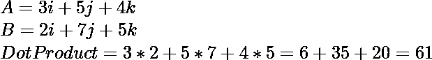

# Python 中如何计算两个向量的点积？

> 原文:[https://www . geesforgeks . org/如何计算 python 中两个向量的点积/](https://www.geeksforgeeks.org/how-to-calculate-dot-product-of-two-vectors-in-python/)

在数学中，**点积**或也称为**标量积**是一种代数运算，它取两个等长的数字序列并返回一个数字。让我们给出两个向量 **A** 和 **B，**，我们必须找到两个向量的点积。

鉴于此，


还有，


> **在哪里，**
> 
> **i:** 沿 x 方向的单位向量
> 
> **j:** 沿 y 方向的单位向量
> 
> **k:** 沿 z 方向的单位向量

那么点积计算如下:


**示例:**

给定两个向量 A 和 B，



## Python 中两个向量的点积

Python 提供了一种非常有效的方法来计算两个向量的点积。通过使用在 numpy 模块中可用的 **numpy.dot()** 方法，可以做到这一点。

> **语法:**
> 
> numpy.dot(vector_a，vector_b，out =无)
> 
> **参数:**
> 
> **vector _ a:**【array _ like】如果 a 是复数，其复共轭用于点积的计算。
> 
> **vector _ b:**【array _ like】如果 b 是复数，则其复共轭用于点积的计算。
> 
> **out:** 【数组，可选】输出参数必须是 C 连续的，其数据类型必须是将为点(a，b)返回的数据类型。
> 
> **返回:**
> 
> 向量 a 和 b 的点积。如果向量 a 和向量 b 是 1D，则返回标量

**例 1:**

## 计算机编程语言

```py
# Python Program illustrating
# dot product of two vectors

# Importing numpy module
import numpy as np

# Taking two scalar values
a = 5
b = 7

# Calculating dot product using dot()
print(np.dot(a, b))
```

**输出:**

```py
35
```

**例 2:**

## 计算机编程语言

```py
# Python Program illustrating
# dot product of two vectors

# Importing numpy module
import numpy as np

# Taking two 1D array
a = 3 + 1j
b = 7 + 6j

# Calculating dot product using dot()
print(np.dot(a, b))
```

**输出:**

```py
(15+25j)
```

**例 3:**

## 计算机编程语言

```py
# Python Program illustrating
# dot product of two vectors

# Importing numpy module
import numpy as np

# Taking two 2D array
# For 2-D arrays it is the matrix product
a = [[2, 1], [0, 3]]
b = [[1, 1], [3, 2]]

# Calculating dot product using dot()
print(np.dot(a, b))
```

**输出:**

```py
[[5 4]
 [9 6]]
```

**例 4:**

## 计算机编程语言

```py
# Python Program illustrating
# dot product of two vectors

# Importing numpy module
import numpy as np

# Taking two 2D array
# For 2-D arrays it is the matrix product
a = [[2, 1], [0, 3]]
b = [[1, 1], [3, 2]]

# Calculating dot product using dot()
# Note that here I have taken dot(b, a)
# Instead of dot(a, b) and we are going to
# get a different output for the same vector value
print(np.dot(b, a))
```

**输出:**

```py
[[2 4]
 [6 9]]
```