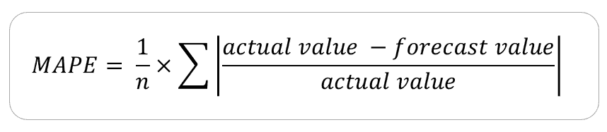
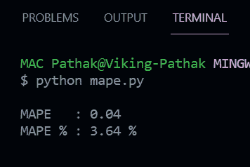
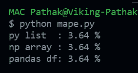

# 如何用 Python 计算 MAPE？

> 原文:[https://www . geesforgeks . org/如何计算-python 中的 mape/](https://www.geeksforgeeks.org/how-to-calculate-mape-in-python/)

在本文中，我们将看到如何计算一种被称为均值的方法来确定预测精度。**绝对百分比误差(或简称 MAPE)** 在 python 中也称为平均绝对百分比偏差(MAPD)。MAPE 项决定了我们的预测有多准确。MAPE 的“M”代表取一系列平均值的平均值，“A”代表使用绝对值来防止正负误差相互抵消的绝对值，“P”代表使该精度指标成为相对指标的百分比，“E”代表误差，因为该指标有助于确定我们预测的误差量。

考虑下面的例子，我们有一个商店的销售信息。“天”列表示我们所指的日期，实际销售额列表示相应日期的实际销售额，而预测销售额列表示销售数字的预测值(可能是 ML 模型)。APE 列代表绝对百分比误差(APE)，代表相应日期的实际值和预测值之间的百分比误差。百分比误差公式为**(实际值-预测值)/实际值**。APE 是该百分比误差的正(绝对)值

<figure class="table">

| 

**第**天

 | 

**实际销售额**

 | 

**预测销售额**

 | 

**绝对百分比误差(APE)**

 |
| --- | --- | --- | --- |
| one | One hundred and thirty-six | One hundred and thirty-four | Zero point zero one four |
| Two

 | One hundred and twenty | One hundred and twenty-four | Zero point zero three three |
| three | One hundred and thirty-eight | One hundred and thirty-two | Zero point zero four three |
| four | One hundred and fifty-five | One hundred and forty-one | Zero point zero nine |
| five | One hundred and forty-nine | One hundred and forty-nine | Zero |

</figure>

现在，MAPE 值可以通过取 APE 值的平均值得到。该公式可表示为–



文件夹公式

### 让我们看看如何在 python 中对上述数据集进行同样的操作:

## 计算机编程语言

```
# Define the dataset as python lists
actual   = [136, 120, 138, 155, 149]
forecast = [134, 124, 132, 141, 149]

# Consider a list APE to store the
# APE value for each of the records in dataset
APE = []

# Iterate over the list values
for day in range(5):

    # Calculate percentage error
    per_err = (actual[day] - forecast[day]) / actual[day]

    # Take absolute value of
    # the percentage error (APE)
    per_err = abs(per_err)

    # Append it to the APE list
    APE.append(per_err)

# Calculate the MAPE
MAPE = sum(APE)/len(APE)

# Print the MAPE value and percentage
print(f'''
MAPE   : { round(MAPE, 2) }
MAPE % : { round(MAPE*100, 2) } %
''')
```

**输出:**



地图输出 – 1

MAPE 输出是非负浮点。MAPE 的最佳值是 0.0，而较高的值决定了预测不够准确。然而，MAPE 值应该有多大才能称之为低效预测取决于用例。在上面的输出中，我们可以看到预测值足够好，因为 MAPE 表明每天销售额的预测值有 3%的误差。

如果你正在用 python 处理时间序列数据，你可能正在处理熊猫或 NumPy。在这种情况下，您可以使用下面的代码来获得 MAPE 输出。

## 计算机编程语言

```
import pandas as pd
import numpy as np

# Define the function to return the MAPE values
def calculate_mape(actual, predicted) -> float:

    # Convert actual and predicted
    # to numpy array data type if not already
    if not all([isinstance(actual, np.ndarray),
                isinstance(predicted, np.ndarray)]):
        actual, predicted = np.array(actual), 
        np.array(predicted)

    # Calculate the MAPE value and return
    return round(np.mean(np.abs((
      actual - predicted) / actual)) * 100, 2)

if __name__ == '__main__':

    # CALCULATE MAPE FROM PYTHON LIST
    actual    = [136, 120, 138, 155, 149]
    predicted = [134, 124, 132, 141, 149]

    # Get MAPE for python list as parameters
    print("py list  :",
          calculate_mape(actual,
                         predicted), "%")

    # CALCULATE MAPE FROM NUMPY ARRAY
    actual    = np.array([136, 120, 138, 155, 149])
    predicted = np.array([134, 124, 132, 141, 149])

    # Get MAPE for python list as parameters
    print("np array :", 
          calculate_mape(actual,
                         predicted), "%")

    # CALCULATE MAPE FROM PANDAS DATAFRAME

    # Define the pandas dataframe
    sales_df = pd.DataFrame({
        "actual"    : [136, 120, 138, 155, 149],
        "predicted" : [134, 124, 132, 141, 149]
    })

    # Get MAPE for pandas series as parameters
    print("pandas df:", 
          calculate_mape(sales_df.actual, 
                         sales_df.predicted), "%")
```

**输出:**



MAPE 输出 – 2

在上面的程序中，我们描述了一个单一的函数` ***calculate_mape()*** `,它对给定的 python 列表、NumPy 数组或 pandas 系列进行 mape 计算。输出与传递给所有 3 种数据类型格式作为函数参数的数据相同。