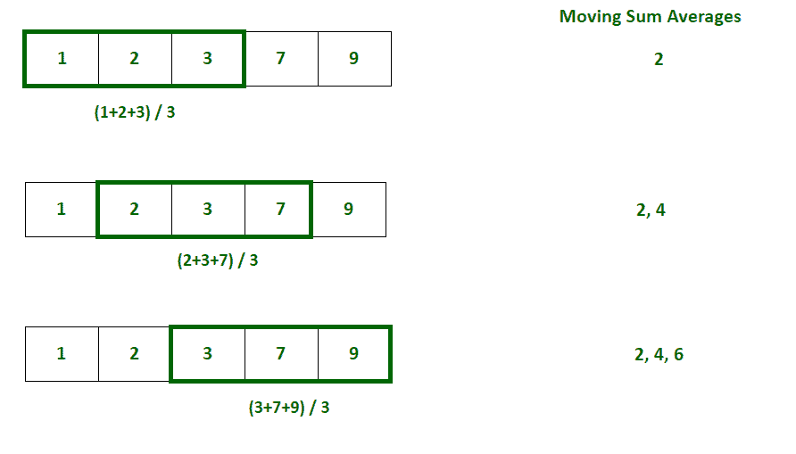
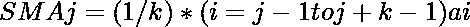
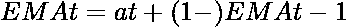

# 如何用 Python 计算均线？

> 原文:[https://www . geeksforgeeks . org/python 中如何计算移动平均线/](https://www.geeksforgeeks.org/how-to-calculate-moving-averages-in-python/)

在本文中，我们将看到如何在 Python 中计算移动平均线。移动平均指的是全部观测值的固定大小子集的一系列平均值。也称为滚动平均、运行平均、滚动平均或运行平均。

考虑 n 个观测值的集合，k 是用于确定任何时间 t 的平均值的窗口大小。然后，移动平均值列表通过最初取当前窗口中出现的前 k 个观测值的平均值并将其存储在列表中来计算。现在，窗口根据待确定的移动平均值的条件被扩展，并且窗口中存在的元素的平均值再次被计算并存储在列表中。这个过程一直持续到窗口到达集合的末尾。

**例如:**给定一个五个整数的列表 arr=[1，2，3，7，9]，我们需要计算窗口大小指定为 3 的列表的移动平均值。我们将首先计算前 3 个元素的平均值，并将其存储为第一个移动平均值。然后窗口将向右移动一个位置，窗口中出现的元素的平均值将被计算并存储在列表中。同样，该过程将重复，直到窗口到达数组的最后一个元素。以下是上述方法的说明:



**下面是实现:**

## 蟒蛇 3

```py
# Program to calculate moving average
arr = [1, 2, 3, 7, 9]
window_size = 3

i = 0
# Initialize an empty list to store moving averages
moving_averages = []

# Loop through the array to consider
# every window of size 3
while i < len(arr) - window_size + 1:

    # Store elements from i to i+window_size
    # in list to get the current window
    window = arr[i : i + window_size]

    # Calculate the average of current window
    window_average = round(sum(window) / window_size, 2)

    # Store the average of current
    # window in moving average list
    moving_averages.append(window_average)

    # Shift window to right by one position
    i += 1

print(moving_averages)
```

**输出:**

```py
[2.0, 4.0, 6.33]
```

## 简单移动平均线:

形状记忆合金的计算方法是取当前窗口中某一时刻 k(窗口大小)观测值的未加权平均值。它用于分析趋势。

**公式:**



**在哪里，**

*   形状记忆合金 <sub>j</sub> =第十个窗口的简单移动平均值
*   k =窗口的大小
*   观察组的柠檬

## **方法 1:使用 Numpy**

[Python 的 Numpy 模块](https://www.geeksforgeeks.org/python-numpy/)提供了一种简单的方法来计算观测值数组的简单移动平均值。它提供了一个名为 [numpy.sum()](https://www.geeksforgeeks.org/numpy-sum-in-python/) 的方法，该方法返回给定数组的元素之和。移动平均线可以通过找到窗口中存在的元素的总和并将其除以窗口大小来计算。

## 蟒蛇 3

```py
# Program to calculate moving average using numpy

import numpy as np

arr = [1, 2, 3, 7, 9]
window_size = 3

i = 0
# Initialize an empty list to store moving averages
moving_averages = []

# Loop through the array t o
#consider every window of size 3
while i < len(arr) - window_size + 1:

    # Calculate the average of current window
    window_average = round(np.sum(arr[
      i:i+window_size]) / window_size, 2)

    # Store the average of current
    # window in moving average list
    moving_averages.append(window_average)

    # Shift window to right by one position
    i += 1

print(moving_averages)
```

**输出:**

```py
[2.0, 4.0, 6.33]
```

## **方法二:使用熊猫**

[Python 的 Pandas 模块](https://www.geeksforgeeks.org/introduction-to-pandas-in-python/)提供了一种简单的方法来计算一系列观测值的简单移动平均值。它提供了一种叫做[熊猫的方法。Series.rolling(window_size)](https://www.geeksforgeeks.org/python-pandas-series-rolling/) 返回指定大小的滚动窗口。窗口的平均值可以用[熊猫来计算。Series.mean()](https://www.geeksforgeeks.org/python-pandas-series-mean/) 对上面得到的窗口对象起作用。熊猫。Series.rolling(window_size)将返回一些空序列，因为它至少需要 k 个(window 的大小)元素才能滚动。

## 计算机编程语言

```py
# Python program to calculate
# simple moving averages using pandas
import pandas as pd

arr = [1, 2, 3, 7, 9]
window_size = 3

# Convert array of integers to pandas series
numbers_series = pd.Series(arr)

# Get the window of series
# of observations of specified window size
windows = numbers_series.rolling(window_size)

# Create a series of moving
# averages of each window
moving_averages = windows.mean()

# Convert pandas series back to list
moving_averages_list = moving_averages.tolist()

# Remove null entries from the list
final_list = moving_averages_list[window_size - 1:]

print(final_list)
```

**输出:**

```py
[2.0, 4.0, 6.33]
```

## 累积移动平均线

CMA 的计算方法是取计算时所有观测值的未加权平均值。它用于时间序列分析。

**公式:**


**其中:**

*   CMA <sub>t</sub> =时间 t 的累计移动平均值
*   k <sub>t</sub> =截至时间 t 的观察次数
*   ai =观察组的第一个元素

## **方法 1:使用 Numpy**

Python 的 Numpy 模块提供了一种计算观测值数组累积移动平均值的简单方法。它提供了一个名为 [numpy.cumsum()](https://www.geeksforgeeks.org/numpy-cumsum-in-python/) 的方法，该方法返回给定数组元素的累积和的数组。移动平均线可以通过将元素的累积总和除以窗口大小来计算。

## 计算机编程语言

```py
# Program to calculate cumulative moving average
# using numpy

import numpy as np

arr = [1, 2, 3, 7, 9]

i = 1
# Initialize an empty list to store cumulative moving
# averages
moving_averages = []

# Store cumulative sums of array in cum_sum array
cum_sum = np.cumsum(arr);

# Loop through the array elements
while i <= len(arr):

    # Calculate the cumulative average by dividing
    # cumulative sum by number of elements till 
    # that position
    window_average = round(cum_sum[i-1] / i, 2)

    # Store the cumulative average of
    # current window in moving average list
    moving_averages.append(window_average)

    # Shift window to right by one position
    i += 1

print(moving_averages)
```

**输出:**

```py
[1.0, 1.5, 2.0, 3.25, 4.4]
```

## **方法二:使用熊猫**

Python 的 Pandas 模块提供了一种简单的方法来计算一系列观测值的累积移动平均值。它提供了一种叫做熊猫的方法。Series.expanding()返回一个窗口，该窗口跨越到时间 t 之前的所有观测值。该窗口的平均值可以通过使用[pands 来计算。Series.mean()](https://www.geeksforgeeks.org/python-pandas-series-mean/) 功能作用于上面得到的窗口对象。

## 计算机编程语言

```py
# Python program to calculate
# cumulative moving averages using pandas
import pandas as pd

arr = [1, 2, 3, 7, 9]
window_size = 3

# Convert array of integers to pandas series
numbers_series = pd.Series(arr)

# Get the window of series of
# observations till the current time
windows = numbers_series.expanding()

# Create a series of moving averages of each window
moving_averages = windows.mean()

# Convert pandas series back to list
moving_averages_list = moving_averages.tolist()

print(moving_averages_list)
```

**输出:**

```py
[1.0, 1.5, 2.0, 3.25, 4.4]
```

## **指数移动平均线**

均线是通过一次取观察值的加权平均值来计算的。观察值的权重随时间呈指数下降。它用于分析最近的变化。

**公式:**



**其中:**

*   均线 <sub>t</sub> =时间 t 的指数移动平均线
*   α =观察重量随时间的减少程度
*   a <sub>t</sub> =在时间 t 的观察

## 计算机编程语言

```py
# Program to calculate exponential
# moving average using formula

import numpy as np

arr = [1, 2, 3, 7, 9]
x=0.5  # smoothening factor

i = 1
# Initialize an empty list to
# store exponential moving averages
moving_averages = []

# Insert first exponential average in the list
moving_averages.append(arr[0])

# Loop through the array elements
while i < len(arr):

    # Calculate the exponential
    # average by using the formula
    window_average = round((x*arr[i])+
                           (1-x)*moving_averages[-1], 2)

    # Store the cumulative average
    # of current window in moving average list
    moving_averages.append(window_average)

    # Shift window to right by one position
    i += 1

print(moving_averages)
```

**输出:**

```py
[1, 1.5, 2.25, 4.62, 6.81]
```

## **方法一:使用熊猫**

Python 的 Pandas 模块提供了一种简单的方法来计算一系列观测值的指数移动平均值。它提供了一种叫做[熊猫的方法。Series.ewm.mean()](https://www.geeksforgeeks.org/how-to-calculate-moving-average-in-a-pandas-dataframe/) 计算给定观测值的指数移动平均值。熊猫。Series.ewm()采用一个称为平滑因子的参数，即观察权重随时间降低的程度。平滑因子的值始终介于 0 和 1 之间。

## 计算机编程语言

```py
# Python program to
# calculate exponential moving averages
import pandas as pd

arr = [1, 2, 3, 7, 9]

# Convert array of integers to pandas series
numbers_series = pd.Series(arr)

# Get the moving averages of series
# of observations till the current time
moving_averages = round(numbers_series.ewm(
  alpha=0.5, adjust=False).mean(), 2)

# Convert pandas series back to list
moving_averages_list = moving_averages.tolist()

print(moving_averages_list)
```

**输出:**

```py
[1.0, 1.5, 2.25, 4.62, 6.81]
```

## 应用程序

1.  **时间序列分析:**平滑短期变化，突出趋势、周期等长期观察。
2.  **财务分析:**用于股票市场的财务分析，如计算股票价格、收益，分析市场趋势。
3.  **环境工程:**用于考虑污染物浓度等各种因素分析环境条件。
4.  **计算机性能分析:**用于通过计算平均 CPU 利用率、平均进程队列长度等指标来分析计算机性能。