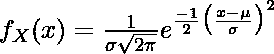

# 在 Python 中给定均值和标准差的情况下，如何计算正态分布中的概率？

> 原文:[https://www . geesforgeks . org/如何计算正态分布中的概率-给定 python 中的平均值和标准偏差/](https://www.geeksforgeeks.org/how-to-calculate-probability-in-a-normal-distribution-given-mean-and-standard-deviation-in-python/)

正态分布是实值随机变量的一种连续概率分布。它基于平均值和标准偏差。概率分布函数计算分布中单个点的可能性。计算正态分布的概率密度函数的一般公式是



在这里，

*   意思是
*   σ是分布的标准偏差
*   x 是数字

为其计算 PDF..我们可以使用 [SciPy](https://docs.scipy.org/doc/scipy/reference/generated/scipy.stats.norm.html) 模块计算正态分布中的概率。

### 安装:

> pip 安装 scipy

### 使用的功能:

我们将使用 scipy.stats.norm.pdf() 方法计算一个数字 *x.* 的概率分布

> **语法:** scipy.stats.norm.pdf(x，loc =无，scale =无)
> 
> **参数:**
> 
> *   **x** :阵列状物体，需要计算概率。
> *   **loc** :可选(默认值=0)，代表分布的平均值。
> *   **刻度**:可选(默认=1)，代表分布的标准差。
> 
> **返回:**作为数组对象在 x 处计算的概率密度函数。

在 scipy 中，用于计算平均值和标准偏差的函数分别是平均值()和标准偏差()。

*   卑鄙

**语法:**

> 平均值(数据)

*   对于标准偏差

**语法:**

> 标准(数据)

### 方法

*   导入模块
*   创建必要的数据
*   为函数提供所需的值
*   显示值

**示例:**

## 蟒蛇 3

```py
from scipy.stats import norm
import numpy as np

data_start = -5
data_end = 5
data_points = 11
data = np.linspace(data_start, data_end, data_points)

mean = np.mean(data)
std = np.std(data)

probability_pdf = norm.pdf(3, loc=mean, scale=std)
print(probability_pdf)
```

**输出:**

> 0.0804410163156249