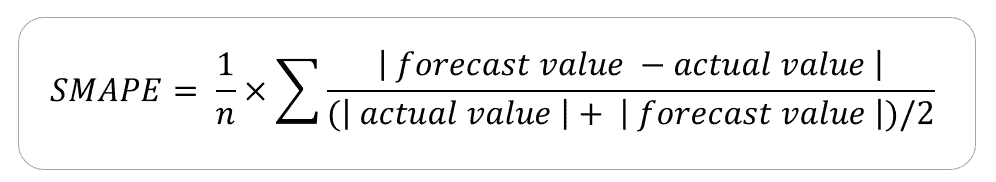
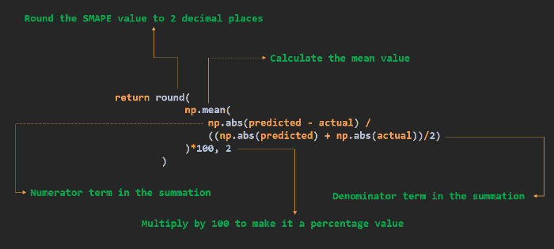

# 如何用 Python 计算 SMAPE？

> 原文:[https://www . geeksforgeeks . org/如何计算-python 中的 smape/](https://www.geeksforgeeks.org/how-to-calculate-smape-in-python/)

在本文中，我们将看到如何计算一种方法来确定预测精度，这种方法在 Python 中称为对称平均绝对百分比误差(或简称 SMAPE)。

SMAPE 是克服 MAPE 预报误差测量局限性的替代方法之一。与平均绝对百分比误差相反，SMAPE 既有下限也有上限，因此，它被称为对称。SMAPE 中的“S”代表对称，“M”代表取一系列平均值的平均值，“A”代表使用绝对值来防止正负误差相互抵消的绝对值，“P”是使该精度度量成为相对度量的百分比，“E”代表误差，因为该度量有助于确定我们预测的误差量。

### SMAPE 的公式是:



smape 公式

考虑下面的例子，我们有一个商店的销售信息。“天”列表示我们所指的天数，“实际销售额”列表示相应日期的实际销售额，而“预测销售额”列表示销售数字的预测值(可能使用 ML 模型)。最后一列是倒数第三列和倒数第二列之间的除法。

<figure class="table">

| 

**第**天

 | 

**实际销售额**

 | 

**预测销售额**

 | 

**A**

**&#124;预测–实际&#124;**

 | 

**B**

**(&#124;实际&#124;+&#124;预测&#124;) / 2**

 | 

**甲乙**

 |
| --- | --- | --- | --- | --- | --- |
| one | One hundred and thirty-six | One hundred and thirty-four | Two | One hundred and thirty-five | Zero point zero one four |
| Two | One hundred and twenty | One hundred and twenty-four | four | One hundred and twenty-two | Zero point zero three two |
| three | One hundred and thirty-eight | One hundred and thirty-two | six | One hundred and thirty-five | Zero point zero four four |
| four | One hundred and fifty-five

 | One hundred and forty-one | Fourteen | One hundred and forty-eight | Zero point zero nine four |
| five | One hundred and forty-nine | One hundred and forty-nine | Zero | One hundred and forty-nine | Zero |

</figure>

上述示例的 SMAPE 值将是 A/B 列中条目的平均值。数值出来是 **0.0368** 。

### 用 Python 计算 SMAPE

## 计算机编程语言

```py
import pandas as pd
import numpy as np

# Define the function to return the SMAPE value
def calculate_smape(actual, predicted) -> float:

    # Convert actual and predicted to numpy
    # array data type if not already
    if not all([isinstance(actual, np.ndarray), 
                isinstance(predicted, np.ndarray)]):
        actual, predicted = np.array(actual),
        np.array(predicted)

    return round(
        np.mean(
            np.abs(predicted - actual) / 
            ((np.abs(predicted) + np.abs(actual))/2)
        )*100, 2
    )

if __name__ == '__main__':

    # CALCULATE SMAPE FROM PYTHON LIST

    actual    = [136, 120, 138, 155, 149]
    predicted = [134, 124, 132, 141, 149]

    # Get SMAPE for python list as parameters
    print("py list  :", 
          calculate_smape(actual, predicted), "%")

    # CALCULATE SMAPE FROM NUMPY ARRAY
    actual    = np.array([136, 120, 138, 155, 149])
    predicted = np.array([134, 124, 132, 141, 149])

    # Get SMAPE for python list as parameters
    print("np array :", 
          calculate_smape(actual, predicted), "%")

    # CALCULATE SMAPE FROM PANDAS DATAFRAME
    # Define the pandas dataframe
    sales_df = pd.DataFrame({
        "actual"    : [136, 120, 138, 155, 149],
        "predicted" : [134, 124, 132, 141, 149]
    })

    # Get SMAPE for pandas series as parameters
    print("pandas df:", calculate_smape(sales_df.actual, 
                                        sales_df.predicted), "%")
```

**输出:**

```py
py list  : 3.73 %
np array : 3.73 %
pandas df: 3.73 %
```

**说明:**

在程序中，我们计算了以 3 种不同数据类型格式提供的相同数据集的 SMAPE 度量值作为函数参数，即 python 列表、NumPy 数组和 pandas dataframe。该函数被一般化为使用任何类似 python 系列的数据作为输入参数。该函数首先将数据类型转换为 numpy 数组，以便使用 NumPy 方法更容易进行计算。返回语句可以通过下图来解释:



smape 代码 Exl