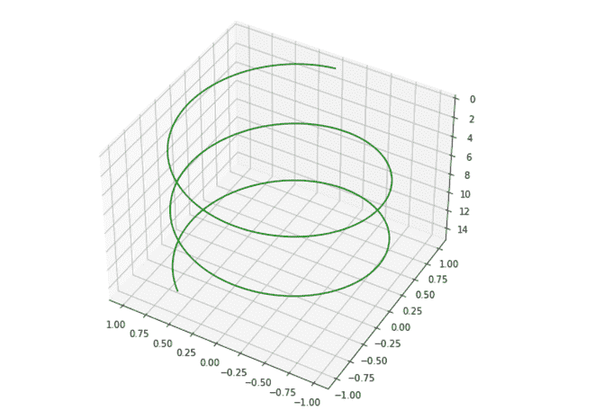
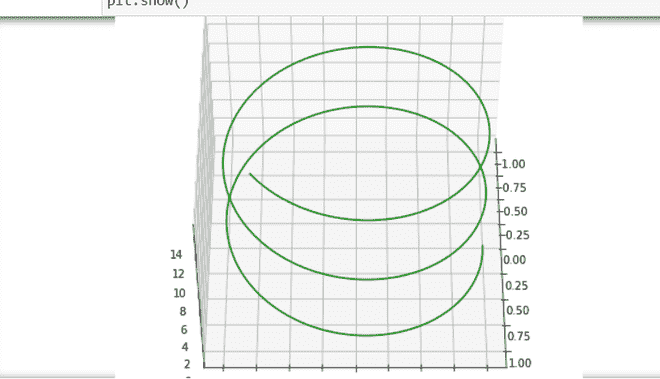
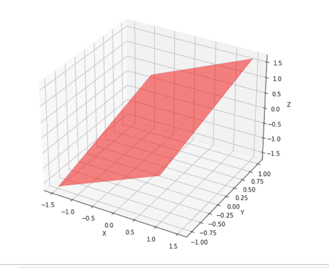

# 如何在 Python 中改变 3D 图的角度？

> 原文:[https://www . geesforgeks . org/如何更改 python 中的 3d 绘图角度/](https://www.geeksforgeeks.org/how-to-change-angle-of-3d-plot-in-python/)

**前提条件:**[【matplot lib】](https://www.geeksforgeeks.org/python-introduction-matplotlib/)、[【num py】](https://www.geeksforgeeks.org/python-numpy/)

在本文中，我们将看到如何从不同的角度查看我们的图表，这里我们使用三种不同的方法来绘制我们的图表。在开始之前，让我们看一下这个目标所需模块的一些基本概念。

*   Matplotlib 是一个基于 NumPy 数组构建的多平台数据可视化库，旨在与更广泛的 SciPy 堆栈协同工作
*   **Numpy** 是一个通用的数组处理包。它提供了一个高性能的多维数组对象，以及使用这些数组的工具。它是用 Python 进行科学计算的基础包
*   mpl_toolkits 提供了一些基本的 3D 绘图(散点、冲浪、线、网格)工具。

**进场:**

*   导入所需的库。
*   创造一个人物。
*   创建数据表。
*   更改三维绘图的角度
*   显示图表。

**步骤 1:** 导入库。

## 蟒蛇 3

```py
from mpl_toolkits import mplot3d
import numpy as np
import matplotlib.pyplot as plt
```

**第二步:**绘制三维轴图。

## 蟒蛇 3

```py
from mpl_toolkits import mplot3d
import numpy as np
import matplotlib.pyplot as plt

fig = plt.figure(figsize = (8, 8))
ax = plt.axes(projection = '3d')
```

**步骤 3:** 为样品的所有 3 轴创建数据表。

## 蟒蛇 3

```py
from mpl_toolkits import mplot3d
import numpy as np
import matplotlib.pyplot as plt

fig = plt.figure(figsize = (8, 8))
ax = plt.axes(projection = '3d')

# Data for a three-dimensional line
z = np.linspace(0, 15, 1000)
x = np.sin(z)
y = np.cos(z)
ax.plot3D(x, y, z, 'green')
```

**第 4 步:**使用 view_init()可用于以编程方式旋转轴。

> **语法** view_init(学生、阿兹姆)
> 
> **参数:**
> 
> *   elev '存储 z 平面上的仰角。
> *   “azim”存储 x，y 平面中的方位角。构造函数。

## 蟒蛇 3

```py
from mpl_toolkits import mplot3d
import numpy as np
import matplotlib.pyplot as plt

fig = plt.figure(figsize = (8,8))
ax = plt.axes(projection = '3d')

# Data for a three-dimensional line
z = np.linspace(0, 15, 1000)
x = np.sin(z)
y = np.cos(z)
ax.plot3D(x, y, z, 'green')

ax.view_init(-140, 60)
```

**以下是全部实现:**

**例 1:** 在本例中，我们将绘制一个提升角度为-140 度、水平角度为 60 度的曲线图。

## 蟒蛇 3

```py
from mpl_toolkits import mplot3d
import numpy as np
import matplotlib.pyplot as plt

fig = plt.figure(figsize = (8,8))
ax = plt.axes(projection = '3d')

# Data for a three-dimensional line
z = np.linspace(0, 15, 1000)
x = np.sin(z)
y = np.cos(z)
ax.plot3D(x, y, z, 'green')

ax.view_init(-140, 60)

plt.show()
```

**输出:**



**例 2:** 在本例中，我们将绘制一个提升角度为 120 度、水平角度为 30 度的曲线图。

## 蟒蛇 3

```py
from mpl_toolkits import mplot3d
import numpy as np
import matplotlib.pyplot as plt

fig = plt.figure(figsize = (8, 8))
ax = plt.axes(projection = '3d')

# Data for a three-dimensional line
z = np.linspace(0, 15, 1000)
x = np.sin(z)
y = np.cos(z)
ax.plot3D(x, y, z, 'green')

ax.view_init(120, 30)

plt.show()
```

**输出:**



**例 3:** 在本例中，我们将绘制一个视角为 50 度的矩形平板图。

## 蟒蛇 3

```py
import numpy as np
from matplotlib import pyplot as plt
from mpl_toolkits.mplot3d import Axes3D
from math import sin, cos

fig = plt.figure(figsize = (8,8))
ax = fig.add_subplot(111, projection = '3d')

#creating Datasheet
y = np.linspace(-1, 1, 200)
x = np.linspace(-1, 1, 200)
x,y = np.meshgrid(x, y)

#set z values
z = x + y 

# rotate the samples by changing the value of 'a'
a = 50 

t = np.transpose(np.array([x, y, z]), ( 1, 2, 0))

m = [[cos(a), 0, sin(a)],[0, 1, 0],
     [-sin(a), 0, cos(a)]]

X,Y,Z = np.transpose(np.dot(t, m), (2, 0, 1))

#label axes
ax.set_xlabel('X')
ax.set_ylabel('Y')
ax.set_zlabel('Z')

#plot figure
ax.plot_surface(X,Y,Z, alpha = 0.5,
                color = 'red')

plt.show()
```

**输出:**

