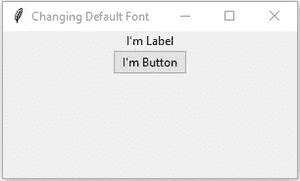
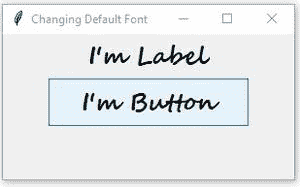

# 如何更改 Tkinter 中的默认字体？

> 原文:[https://www . geesforgeks . org/how-change-default-font-in-tkinter/](https://www.geeksforgeeks.org/how-to-change-default-font-in-tkinter/)

**先决条件** : [Tkinter](https://www.geeksforgeeks.org/python-gui-tkinter/)

Tkinter 为不同的东西提供了多种字体，如标题、标题、文本、菜单等。但好的一点是，我们可以使用 **tkinter.font** 模块覆盖这些字体。

Tkinter 提供的一些字体有:

*   TkDefaultFont
*   TkMenuFont
*   TkFixedFont
*   TkSmallCaptionFont 等等。

在本文中，我们将更改默认字体。为此，我们需要覆盖/更改 **TkDefaultFont 的配置。**更改/覆盖默认字体非常容易，可以通过下列方式完成:

*   使用 **font.nametofont** 方法创建字体对象。
*   在字体对象上使用**配置**方法
*   然后改变字体样式，如**字族**、**字号、**等。

下面给出了做同样事情的正确方法。

### 方法

*   导入模块
*   创建窗口
*   使用 **font.nametofont** 方法创建字体对象。
*   在字体对象上使用**配置**方法
*   然后改变字体样式，如**字族**、**字号、**等。
*   添加所需元素
*   执行代码

**程序:**

## 蟒蛇 3

```py
# Import tkinter.Tk and widgets
from tkinter import Tk, font
from tkinter.ttk import Button, Label

class App:
    def __init__(self, master: Tk) -> None:
        self.master = master

        # Creating a Font object of "TkDefaultFont"
        self.defaultFont = font.nametofont("TkDefaultFont")

        # Overriding default-font with custom settings
        # i.e changing font-family, size and weight
        self.defaultFont.configure(family="Segoe Script",
                                   size=19,
                                   weight=font.BOLD)

        # Label widget
        self.label = Label(self.master, text="I'm Label")
        self.label.pack()

        # Button widget
        self.btn = Button(self.master, text="I'm Button")
        self.btn.pack()

if __name__ == "__main__":
    # Top level widget
    root = Tk()

    # Setting window dimensions
    root.geometry("300x150")

    # Setting app title
    root.title("Changing Default Font")

    print(font.names())

    app = App(root)

    # Mainloop to run application
    # infinitely
    root.mainloop()
```

**输出**:

在更改配置之前



更改配置后

