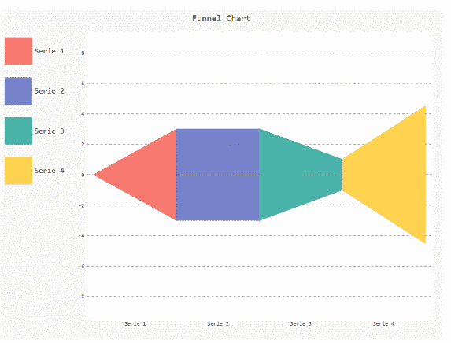
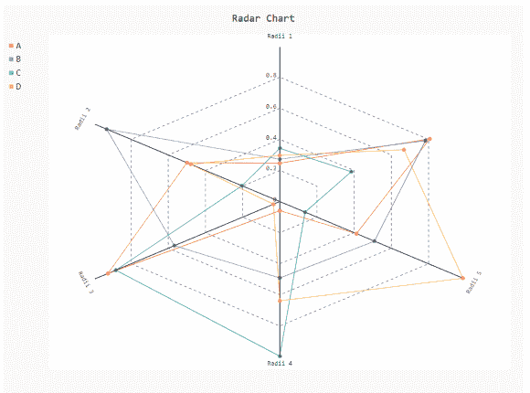

# 如何在 Pygal 中更改图例框大小？

> 原文:[https://www . geesforgeks . org/how-change-legend-box-size-in-py gal/](https://www.geeksforgeeks.org/how-to-change-legend-box-size-in-pygal/)

**先决条件:** [皮格尔](http://www.pygal.org/en/stable/)

Pygal 是一个 Python 模块，主要用于构建 SVG(标量矢量图形)图形和图表。Pygal 是 Python 的图形和用户界面库，提供设计和科学应用程序通常需要的功能。
在本文中，我们将看到如何通过仅更改图例 Box 的整数值来更改图例 Box 的大小。制作图表时，正确传递图例框的大小非常重要，这样它看起来在大小和位置上都得到了优化。

**接近**

*   导入所需模块。
*   创建图表对象。
*   在同一函数中传递图例框大小。
*   给图表贴上标签。
*   显示图形。

下面给出了上述概念的实现:

**例 1:**

## 蟒蛇 3

```py
# importing pygal
import pygal
import numpy

# creating the chart object
# Resize legend box size
chart = pygal.Funnel(legend_box_size=48)

# Random data
chart.add('Serie 1', [1, 2, 3])
chart.add('Serie 2', [4, 2, 0])
chart.add('Serie 3', [1, -1, 1])
chart.add('Serie 4', [3, 1, 5])

# naming the title
chart.title = 'Funnel Chart'

chart.render_to_png('aa.png')
```

**输出**



**例 2:**

## 蟒蛇 3

```py
# importing pygal
import pygal
import numpy

# creating the chart object
# Resize legend box size
Radar_Chart = pygal.Radar(legend_box_size=5)

Radar_Chart.x_labels = ['Radii 1', 'Radii 2',
                        'Radii 3', 'Radii 4',
                        'Radii 5']

# Random data
Radar_Chart.add('A', numpy.random.rand(6))
Radar_Chart.add('B', numpy.random.rand(6))
Radar_Chart.add('C', numpy.random.rand(6))
Radar_Chart.add('D', numpy.random.rand(6))

# naming the title
Radar_Chart.title = 'Radar Chart'

Radar_Chart.render_to_png('aa.png')
```

**输出**

