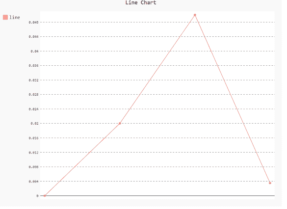
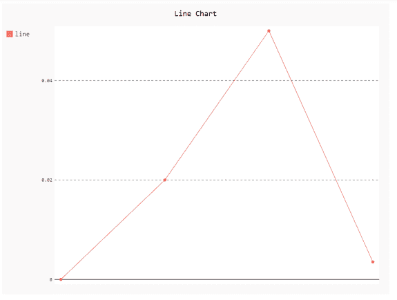

# 如何改变 pygal 中的刻度数？

> 原文:[https://www . geeksforgeeks . org/如何更改 pygal 中的刻度数/](https://www.geeksforgeeks.org/how-to-change-number-of-scales-in-pygal/)

**先决条件:** [皮格尔](http://www.pygal.org/en/stable/)

**Pygal** 是一个 Python 模块，主要用于构建 SVG(标量矢量图形)图形和图表。Pygal 是 Python 的图形和用户界面库，提供设计和科学应用程序通常需要的功能。

在本文中，我们将看到如何改变 pygal 中的音阶数量。图表上的刻度显示了数字或图片在数据中的使用方式。为图表轴选择的比例对受众如何理解信息有重大影响，并且是优化数据可视化的重要部分。因此，比例尺在绘制图表中起着至关重要的作用。

**接近**

*   导入所需模块。
*   创建图表对象。
*   通过最大/最小刻度数。
*   给图表贴上标签。
*   显示图形。

**语法:**

> *   **分钟刻度**
> *   **最大刻度**
> 
> 如果可能，您可以指定自动缩放生成的最大/最小刻度数。

**例 1:**

## 蟒蛇 3

```py
# importing pygal
import pygal
import numpy

# creating the chart object
# minimum number of scale
chart = pygal.Line(min_scale=40)

# Random data
chart.add('line', [0, .02, .05, .0035])

# naming the title
chart.title = 'Line Chart'

chart.render_to_png('aa.png')
```

**输出**



**例 2:**

## 蟒蛇 3

```py
# importing pygal
import pygal
import numpy

# creating the chart object
# maximum number of scale
chart = pygal.Line(max_scale=3)

# Random data
chart.add('line', [0, .02, .05, .0035])

# naming the title
chart.title = 'Line Chart'

chart.render_to_png('aa.png')
```

**输出**

