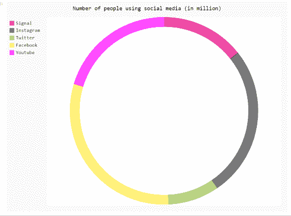
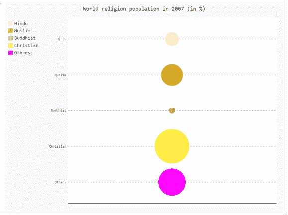

# 如何用 pygal 改变曲线图的颜色？

> 原文:[https://www . geeksforgeeks . org/如何使用 pygal 更改图形的颜色/](https://www.geeksforgeeks.org/how-to-change-the-color-of-a-graph-plot-using-pygal/)

**先决条件:** [皮格尔](http://www.pygal.org/en/stable/)

Pygal 是 Python 的图形和用户界面库，提供设计和科学应用程序通常需要的功能。
在本文中，我们将看到如何在 Pygal 模块中更改图表颜色。制作图表时，调整颜色对我们来说很重要。以下方法用于创建图表和相应的图表颜色变化。在这里，我们将看到一些例子来说明我们的观点，根据我们的要求。

**进场:**

*   导入所需模块。
*   创建图表对象。
*   更改图表的颜色。
*   给图表贴上标签。
*   显示图形。

下面给出了上述概念的实现:

**例 1:**

## 蟒蛇 3

```py
import pygal
from pygal.style import Style

# change graph color
custom_style = Style(
    colors=('#E80080', '#404040', '#9BC850', '#ffeb44', '#ff00ff'))

# creating Pie chart object
pie_chart = pygal.Pie(inner_radius=1, style=custom_style)

pie_chart.title = 'Number of people using social media (in million)'
pie_chart.add('Signal', 14.36)
pie_chart.add('Instagram', 26.01)
pie_chart.add('Twitter', 8.8)
pie_chart.add('Facebook', 30.32)
pie_chart.add('Youtube', 20.3)

pie_chart.render_to_png('aa.png')
```

**输出**



**例 2:**

## 蟒蛇 3

```py
# importing pygal
import pygal
from pygal.style import Style

# change graph color
custom_style = Style(
    colors=('#ffebcd', '#daa520', '#9BC850', '#ffeb44', '#ff00ff'))

# creating Bar chart object
pie_chart = pygal.Bar(style=custom_style)

# chart data
pie_chart.add('Hindu', 13.36)
pie_chart.add('Muslim', 21.01)
pie_chart.add('Buddhist', 5.8)
pie_chart.add('Christian', 33.32)
pie_chart.add('Others', 26.3)

# naming the title
pie_chart.title = 'World religion population in 2007 (in %)'

pie_chart.render_to_png('aa.png')
```

**输出**


**例 3:**

## 蟒蛇 3

```py
# importing pygal
import pygal
from pygal.style import Style

# change graph color
custom_style = Style(
    colors=('#ffebcd', '#daa520', '#9BC850', '#ffeb44', '#ff00ff'))

# creating Dot chart object
pie_chart = pygal.Dot(style=custom_style)

# chart data
pie_chart.add('Hindu', 13.36)
pie_chart.add('Muslim', 21.01)
pie_chart.add('Buddhist', 5.8)
pie_chart.add('Christian', 33.32)
pie_chart.add('Others', 26.3)

# naming the title
pie_chart.title = 'World religion population in 2007 (in %)'

pie_chart.render_to_png('aa.png')
```

**输出**

