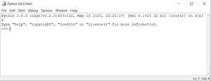
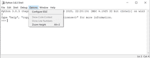
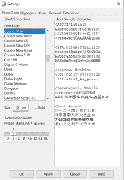
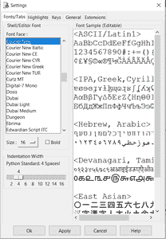
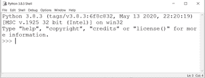

# 如何更改 Python Shell 中的字体大小？

> 原文:[https://www . geesforgeks . org/如何更改 python-shell 中的字体大小/](https://www.geeksforgeeks.org/how-to-change-the-font-size-in-python-shell/)

在本文中，我们将看到如何在 Python Shell 中更改字体大小

**按照以下步骤更改字体大小:**

**第一步:**打开 Python 外壳

Python 外壳

**步骤 2:** 点击**选项**并选择**配置空闲**

**第 3 步:**在字体/制表符选项卡中设置**大小**值

**第四步:**我们选择一个尺寸值为 **16** 点击**应用**点击**确定**

**第五步:**现在字体大小增加到 16

同样，我们可以减小 python 外壳中的字体大小