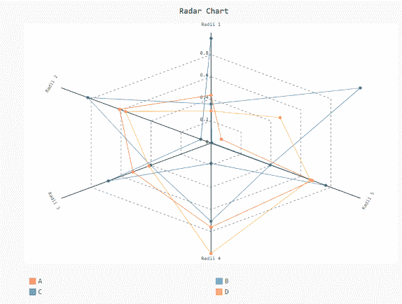
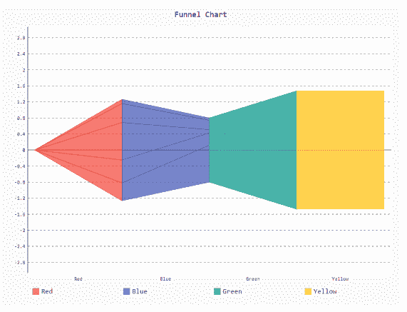

# 如何改变传说在 Pygal 中的位置？

> 原文:[https://www . geesforgeks . org/如何更改 pygal 中图例的位置/](https://www.geeksforgeeks.org/how-to-change-the-position-of-legend-in-pygal/)

**先决条件:** [皮格尔](http://www.pygal.org/en/stable/)

Pygal 是一个 Python 模块，主要用于构建 SVG(标量矢量图形)图形和图表。Pygal 是 Python 的图形和用户界面库，提供设计和科学应用程序通常需要的功能。
在本文中，我们将看到如何在绘图窗口中更改图例位置和图例列数。在制作剧情时，优化它的大小和图例位置对我们来说很重要。以下是根据我们的要求更改默认图例位置的各种方法。

**进场:**

*   导入所需模块。
*   创建图表对象。
*   在同一函数中传递图例位置。
*   给图表贴上标签。
*   显示图形。

下面给出了上述概念的实现:

**例 1:**

## 蟒蛇 3

```
# importing pygal
import pygal
import numpy

# creating the chart object
Radar_Chart = pygal.Radar(legend_at_bottom=True)

Radar_Chart.x_labels = ['Radii 1', 'Radii 2',
                        'Radii 3', 'Radii 4',
                        'Radii 5']

# Random data
Radar_Chart.add('A', numpy.random.rand(6))
Radar_Chart.add('B', numpy.random.rand(6))
Radar_Chart.add('C', numpy.random.rand(6))
Radar_Chart.add('D', numpy.random.rand(6))

# naming the title
Radar_Chart.title = 'Radar Chart'

Radar_Chart.render_to_png('aa.png')
```

**输出**



**例 2:**

## 蟒蛇 3

```
# importing pygal
import pygal
import numpy

# creating the chart object
funnel = pygal.Funnel(legend_at_bottom=True, legend_at_bottom_columns=4)

# Random data
funnel.add('Red', numpy.random.rand(5))
funnel.add('Blue', numpy.random.rand(5))
funnel.add('Green', numpy.random.rand(5))
funnel.add('Yellow', numpy.random.rand(5))

# naming the title
funnel.title = 'Funnel Chart'

funnel.render_to_png('aa.png')
```

**输出**

