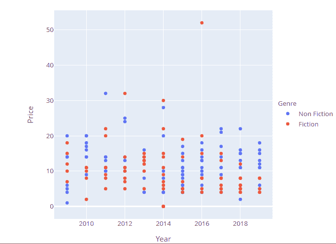
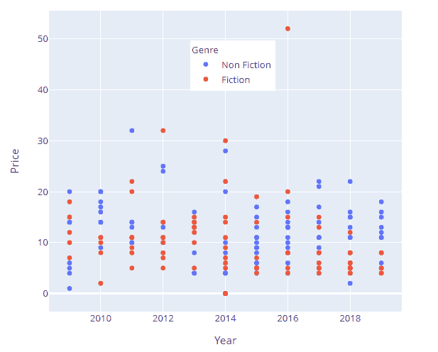

# 如何使用 Plotly Python 改变图例的位置？

> 原文:[https://www . geeksforgeeks . org/如何使用 plotly-python 更改图例位置/](https://www.geeksforgeeks.org/how-to-change-the-position-of-legend-using-plotly-python/)

在本文中，我们将讨论如何使用 Python 在 Plotly 中更改图例的位置。

当一个对象的变化必须参照另一个对象来描述时，默认情况下会出现图例。图例使图形更容易阅读，因为它包含所用颜色代码或键的描述。默认情况下，图例出现在图的右上角，但在图的外部，但是可以根据需要定位它们。让我们首先创建一个规则的图，以便区别可以很明显。

**使用的数据集:** [点击此处](https://drive.google.com/file/d/1NCWoQFjgFp6o-XXGBX0Z4N-0gY7k1MFw/view?usp=sharing)

**例**:常规图

## 蟒蛇 3

```
# import libraries
import plotly.express as px
import pandas as pd

# read dataset
data = pd.read_csv("bestsellers.csv")

fig = px.scatter(data, x="Year", y="Price", color="Genre")

fig.show()
```

**输出**:


为了定位图例，我们使用 update_layout 函数，将图例设置为描述图例属性的字典。定位键设置位置，x 和 y 容纳相对于轴的边距。

**语法**:

> update _ layout(legend = dict(Yan chor，y，xanchor，x))

通过为上述参数设置适当的值，可以完成所需的任务。

### **示例**:将图例放在中间

## 蟒蛇 3

```
# import the modules
import plotly.express as px
import pandas as pd

# read the data
data = pd.read_csv("bestsellers.csv")

# scatter plot
fig = px.scatter(data, x="Year", y="Price", color="Genre")
fig.update_layout(legend=dict(y=0.5))
fig.show()
```

**输出**:



### **示例**:在剧情上定位图例

## 蟒蛇 3

```
# import the modules
import plotly.express as px
import pandas as pd

# read the dataset
data = pd.read_csv("bestsellers.csv")

# scatter plot
fig = px.scatter(data, x="Year", y="Price", color="Genre")
# layout
fig.update_layout(legend=dict(yanchor="top", y=0.9, xanchor="left", x=0.4))
fig.show()
```

**输出**:

