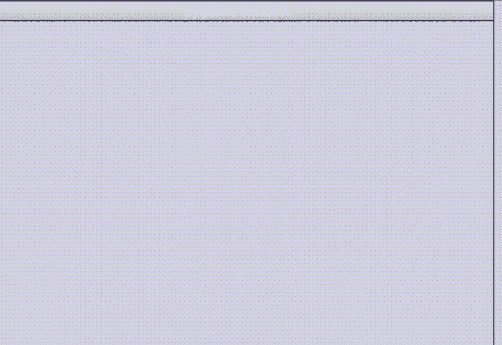

# 如何更改 PyGame 图标？

> 原文:[https://www . geeksforgeeks . org/如何更改 pygame-icon/](https://www.geeksforgeeks.org/how-to-change-the-pygame-icon/)

制作电子游戏时，您是否希望将您的图像或公司徽标设置为游戏图标？如果是，那么在声明想要设置为图标的图像后，使用 **set_icon()** 功能就可以轻松完成。阅读下面的文章，了解更多细节。

**语法:**

```
pygame_icon = pygame.image.load('#Enter the image')
pygame.display.set_icon(pygame_icon)
```

### 方法:

**第一步:**首先导入库 Pygame。

```
import pygame
```

**第二步:**现在，构建 GUI 游戏。

```
pygame.init()
```

**第三步:**进一步，设置你的 GUI 游戏的维度。

```
screen = pygame.display.set_mode([#width of game, #height of game])
```

**第四步:**接下来，将我们希望设置为图标的图像作为输入。

```
img = pygame.image.load('#Enter the image')
```

**第五步:**然后，将图像设置为图标。当游戏处于运行状态时，图标集会出现在左上角。

```
pygame.display.set_icon(img)
```

**第六步:**稍后，设置运行游戏的运行值。

```
running = True
```

**第七步:**设置你希望你的游戏在运行状态下做的事情

```
while running:
   for event in pygame.event.get():
```

*   **步骤 7.1:** 一旦 app 处于运行状态，如果用户想退出，就让其退出。

```
       if event.type == pygame.QUIT:
           running = False
```

*   **步骤 7.2:** 此外，设置你希望在你的应用中看到的背景颜色。

```
   screen.fill(# RGB Value of Color)
```

*   **第 7.3 步:**然后，让你的应用在运行状态下做你想让它做的任何事情。
*   **第 7.4 步:**做了所有你想做的事情后，更新完成的更改。

```
   pygame.display.update()
```

**第八步:**最后，退出 GUI 游戏

```
pygame.quit()
```

下面是实现。

## 计算机编程语言

```
# Python program to change 
# the Pygame icon

# Import the library Pygame
import pygame

# Construct the GUI game
pygame.init()

# Set dimensions of game GUI
screen = pygame.display.set_mode([600, 400])

# Take image as input
img = pygame.image.load('gfg_image.jpg')

# Set image as icon
pygame.display.set_icon(img)

# Set running value
running = True

# Setting what happens when game 
# is in running state
while running:
    for event in pygame.event.get():

        # Close if the user quits the game
        if event.type == pygame.QUIT:
            running = False

    # Set the background color
    screen.fill((255, 255, 0))

    # Draw a circle on the screen
    pygame.draw.circle(screen, (0, 0, 0), (300, 200), 75)

    # Update the GUI game
    pygame.display.update()

# Quit the GUI game
pygame.quit()
```

**输出:**

