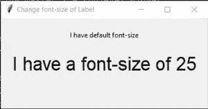
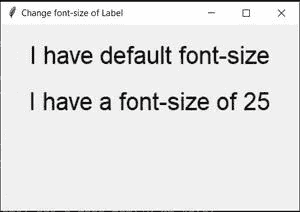
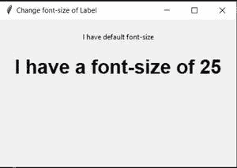

# 如何更改 Tkinter 标签字体大小？

> 原文:[https://www . geesforgeks . org/how-to-change-the-tkinter-label-font-size/](https://www.geeksforgeeks.org/how-to-change-the-tkinter-label-font-size/)

[Tkinter](https://www.geeksforgeeks.org/python-gui-tkinter/) 标签用于显示一行或多行，也可以用于显示位图或图像。在本文中，我们将更改标签小部件的字体大小。要创建标签，请使用以下命令:

> **语法:**标签=标签(父，选项，…)
> 
> **参数:**
> **父级**:显示该标签的小部件的对象，一般是根对象
> **文本**:显示一行或多行文本。
> **图像**:显示静态图像
> **复合:**同时显示文本和图像。它接受顶部、底部、左侧、右侧、中央。例如，如果您编写复合=主题图像将显示在文本的顶部。

我们可以用不同的方法做到这一点:

**方法 1:** 使用标签的**字体**属性。

## 蟒蛇 3

```py
# importing tkinter module and Widgets
from tkinter import Tk
from tkinter.ttk import Label

# Creating App class which will contain
# Label Widgets
class App:
    def __init__(self, master) -> None:

        # Instantiating master i.e toplevel Widget
        self.master = master

        # Creating first Label i.e with default font-size
        Label(self.master, text="I have default font-size").pack(pady=20)

        # Creating second label
        # This label has a font-family of Arial
        # and font-size of 25
        Label(self.master,
              text="I have a font-size of 25",

              # Changing font-size here
              font=("Arial", 25)
              ).pack()

if __name__ == "__main__":

    # Instantiating top level
    root = Tk()

    # Setting the title of the window
    root.title("Change font-size of Label")

    # Setting the geometry i.e Dimensions
    root.geometry("400x250")

    # Calling our App
    app = App(root)

    # Mainloop which will cause this toplevel
    # to run infinitely
    root.mainloop()
```

**输出:**



**方法二:**使用 Style 类。在这个方法中，我们将使用我们的自定义样式，否则所有的标签小部件将获得相同的样式。

## 蟒蛇 3

```py
# importing tkinter module and Widgets
from tkinter import Tk
from tkinter.ttk import Label, Style

# Creating App class which will contain
# Label Widgets
class App:
    def __init__(self, master) -> None:

        # Instantiating master i.e toplevel Widget
        self.master = master

        # Creating first Label i.e with default font-size
        Label(self.master, text="I have default font-size").pack(pady=20)

        # Instantiating Style class
        self.style = Style(self.master)

        # Configuring Custom Style
        # Name of the Style is "My.TLabel"
        self.style.configure("My.TLabel", font=('Arial', 25))

        # Creating second label
        # This label has a font-family of Arial
        # and font-size of 25
        Label(
            self.master,
            text="I have a font-size of 25",

            # Changing font-size using custom style
            style="My.TLabel").pack()

if __name__ == "__main__":

    # Instantiating top level
    root = Tk()

    # Setting the title of the window
    root.title("Change font-size of Label")

    # Setting the geometry i.e Dimensions
    root.geometry("400x250")

    # Calling our App
    app = App(root)

    # Mainloop which will cause this toplevel
    # to run infinitely
    root.mainloop()
```

**输出:**


**注意:**在上面的方法中，**t 标签**是默认样式的名称。因此，如果您想创建自己的样式名，请始终使用以下语法

> my _ style _ name . default _ style _ name
> 
> **例:**
> 新。按钮#覆盖按钮部件的样式
> 我的。标签#覆盖标签小部件的样式
> Abc。尝试#覆盖条目小部件的样式

如果您只使用默认样式名，那么它将应用于所有相应的小部件，即如果我使用**标签**而不是**我的。t 标签**则两个标签的字号都将为 25。重要的是，如果您使用默认的样式名称，那么您不需要提供样式属性。

**额外:**使用默认样式名称更改字体大小。

## 蟒蛇 3

```py
# importing tkinter module and Widgets
from tkinter import Tk
from tkinter.ttk import Label, Style

# Creating App class which will contain
# Label Widgets
class App:
    def __init__(self, master) -> None:

        # Instantiating master i.e toplevel Widget
        self.master = master

        # Creating first Label i.e with default font-size
        Label(self.master, text="I have default font-size").pack(pady=20)

        # Instantiating Style class
        self.style = Style(self.master)

        # Changing font-size of all the Label Widget
        self.style.configure("TLabel", font=('Arial', 25))

        # Creating second label
        # This label has a font-family of Arial
        # and font-size of 25
        Label(self.master, text="I have a font-size of 25").pack()

if __name__ == "__main__":

    # Instantiating top level
    root = Tk()

    # Setting the title of the window
    root.title("Change font-size of Label")

    # Setting the geometry i.e Dimensions
    root.geometry("400x250")

    # Calling our App
    app = App(root)

    # Mainloop which will cause this toplevel
    # to run infinitely
    root.mainloop()
```

请注意，在上述程序中，我们没有为任何标签提供**样式或字体属性**，但它们仍然具有相同的字体大小和字体系列。

**输出:**



**方法 3:** 使用**字体**类。在这种方法中，我们将创建一个字体对象，然后使用它来更改任何小部件的字体样式。这样做的好处

> 字体类由以下属性组成:
> **根**:顶层小部件的对象。
> **家族**:以字符串为单位的字体家族名称。
> **大小**:字体高度为整数，以磅为单位。
> **重量** : 'bold'/BOLD 为黑体，' normal'/NORMAL 为常规重量。
> **倾斜** : 'italic'/ITALIC 代表斜体，' roman'/ROMAN 代表未植入。
> **下划线**:下划线文字为 1/真/真，正常为 0/假/假。
> **过屈**:1/真/真为过屈文字，0/假/假为正常。

## 蟒蛇 3

```py
# importing tkinter module and Widgets
from tkinter import Tk
from tkinter.font import BOLD, Font
from tkinter.ttk import Label

# Creating App class which will contain Label Widgets
class App:
    def __init__(self, master) -> None:

        # Instantiating master i.e toplevel Widget
        self.master = master

        # Creating first Label i.e with default font-size
        Label(self.master, text="I have default font-size").pack(pady=20)

        # Creating Font, with a "size of 25" and weight of BOLD
        self.bold25 = Font(self.master, size=25, weight=BOLD)

        # Creating second label
        # This label has a default font-family
        # and font-size of 25
        Label(self.master, text="I have a font-size of 25",
              font=self.bold25).pack()

if __name__ == "__main__":

    # Instantiating top level
    root = Tk()

    # Setting the title of the window
    root.title("Change font-size of Label")

    # Setting the geometry i.e Dimensions
    root.geometry("400x250")

    # Calling our App
    app = App(root)

    # Mainloop which will cause this toplevel
    # to run infinitely
    root.mainloop()
```

**输出:**

