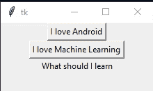

# 如何更改 Tkinter 标签文本？

> 原文:[https://www . geeksforgeeks . org/如何更改-tkinter-label-text/](https://www.geeksforgeeks.org/how-to-change-the-tkinter-label-text/)

**先决条件:**[tkinter 简介](https://www.geeksforgeeks.org/python-gui-tkinter/)

**Tkinter** 是 python 的标准 GUI(图形用户界面)包。它提供了一种快速简单的方法来创建图形用户界面应用程序。

要创建 tkinter 应用程序，请执行以下操作:

*   导入模块— tkinter
*   创建主窗口(容器)
*   向主窗口添加任意数量的小部件。
*   在小部件上应用事件触发器。

小部件是任何图形用户界面应用程序的控制工具。这里 widget 的主要作用是提供各种各样的控件。一些小部件是按钮、标签、文本框等等。

它的小部件之一是**标签**，负责实现文本和图像的显示框部分。[点击此处](https://www.geeksforgeeks.org/python-tkinter-label/)了解更多关于 Tkinter 标签小部件的信息。

现在，让我们看看如何更改标签的文本:

**方法 1:** 使用 *Label.config()* 方法。

> **语法:** Label.config(文本)
> 
> **参数:** **文本**–要在标签中显示的文本。

此方法用于在标签小部件上执行覆盖。

**示例:**

## 蟒蛇 3

```py
# importing everything from tkinter
from tkinter import *

# creating the tkinter window
Main_window = Tk()

# variable
my_text = "GeeksforGeeks updated !!!"

# function define for
# updating the my_label
# widget content
def counter():

    # use global variable
    global my_text

    # configure
    my_label.config(text = my_text)

# create a button widget and attached  
# with counter function  
my_button = Button(Main_window,
                   text = "Please update",
                   command = counter)

# create a Label widget
my_label = Label(Main_window,
                 text = "geeksforgeeks")

# place the widgets
# in the gui window
my_label.pack()
my_button.pack()

# Start the GUI
Main_window.mainloop()
```

**输出:**


**方法二:**使用 [*StringVar()*](https://www.geeksforgeeks.org/python-setting-and-retrieving-values-of-tkinter-variable/) 类。

> **语法:** StringVar()
> 
> **返回:**字符串变量对象

此类用于设置值并根据要求进行更改。

## 蟒蛇 3

```py
# importing everything from tkinter
from tkinter import *

# create gui window
Main_window = Tk()

# set the configuration
# of the window
Main_window.geometry("220x100")

# define a function
# for setting the new text
def java():
    my_string_var.set("You must go with Java")

# define a function
# for setting the new text
def python():
    my_string_var.set("You must go with Python")

# create a Button widget and attached  
# with java function  
btn_1 = Button(Main_window,
               text = "I love Android",
               command = java)

# create a Button widget and attached  
# with python function
btn_2 = Button(Main_window,
               text = "I love Machine Learning",
               command = python)

# create a StringVar class
my_string_var = StringVar()

# set the text
my_string_var.set("What should I learn")

# create a label widget
my_label = Label(Main_window,
                 textvariable = my_string_var)

# place widgets into
# the gui window
btn_1.pack()
btn_2.pack()
my_label.pack()

# Start the GUI 
Main_window.mainloop()
```

