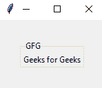
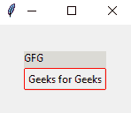
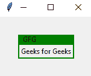

# 如何更改 Tkinter 标签框架边框颜色？

> 原文:[https://www . geesforgeks . org/how-change-tkinter-labeleframe-border-color/](https://www.geeksforgeeks.org/how-to-change-tkinter-lableframe-border-color/)

Tkinter 中的**标签框架**是创建包含其他小部件的矩形区域的小部件。在本文中，我们将了解如何更改标签框架的边框。但是为了实现颜色，我们需要为 Tkinter 检查主题，因此我们使用了 python 3 Tkinter 内置的 [**ttk 模块**](https://www.geeksforgeeks.org/tkinter-adding-style-to-the-input-text-using-ttk-entry-widget/) 。

**分步实施:**

**步骤 1:** 导入所有需要的模块

## 蟒蛇 3

```
# import tkinter 
import tkinter as tk 

# import ttk theme module for styling
import tkinter.ttk as ttk
```

**第二步:**构建标签框架，在里面放一些小部件。

## 蟒蛇 3

```
import tkinter as tk
import tkinter.ttk as ttk

# initialize the tkinter window
root = tk.Tk() 

# provide some width and height
root.geometry("300x300") 

# created a label frame with title "Group"
labelframe = ttk.LabelFrame(root, text = "GFG")

# provide padding 
labelframe.pack(padx=30, pady=30) 

# created the text label inside the the labelframe
left = tk.Label(labelframe, text="Geeks for Geeks") 
left.pack()

root.mainloop()
```

**输出:**



**例 1:** 在 Tkinter 中使用蛤蜊主题。

Clam 是 tkinter 窗口和小部件的主题。它属于 ttk 模块。创建 clam ttk 窗口的语法:

```
style = ttk.Style()
style.theme_use('clam')
```

**注意:**我们在 ttk 模块中使用了一个 clam 主题，可以使用边框颜色等属性。其他主题可能没有边框颜色**这样的属性。**

下面是实现:

## 蟒蛇 3

```
import tkinter as tk
import tkinter.ttk as ttk

root = tk.Tk()

# initialize style function
style = ttk.Style()

# Use clam theme
style.theme_use('clam')

# Used TLabelframe for styling labelframe widgets,
# and use red color for border
style.configure("TLabelframe", bordercolor="red")

labelframe = ttk.LabelFrame(root, text = "GFG")
labelframe.grid(padx = 30, pady = 30)

left = tk.Label(labelframe, text = "Geeks for Geeks")
left.pack()

root.mainloop()
```

**输出:**



**示例 2:** 构建自己的风格功能主题。

**语法:**

> #创建主题
> 
> style.theme_create('class_name '，#类名
> 
> 设置= { 0
> 
> “标签框架”:{ #小部件的名称
> 
> 配置“:{ #配置参数
> 
> 背景“:‘绿色’#更改背景参数
> 
> }
> 
> }
> 
> }
> 
> )
> 
> #使用主题
> 
> style.theme_use('class_name ')

我们在 ttk style 的帮助下创建了一个 style 主题函数。我们使用**主题 _ 创建**来创建功能，并且可以使用**主题 _ 使用**来分配主题。

**下面是实现:**

## 蟒蛇 3

```
import tkinter as tk
import tkinter.ttk as ttk

# initialize the tkinter window
root = tk.Tk()

# initializing the style function
style = ttk.Style()

# creating the theme with the
# initializing the style function
style = ttk.Style()

# creating the theme with the
style.theme_create('style_class',

                   # getting the settings
                   settings={

                       # getting through the Labelframe
                       # widget
                       'TLabelframe': {

                           # configure the changes
                           'configure': {
                               'background': 'green'
                           }
                       },

                       # getting through the Labelframe's 
                       # label widget
                       'TLabelframe.Label': {
                           'configure': {
                               'background': 'green'
                           }
                       }
                   }
                   )
style.theme_use('style_class')

# created a label frame with title "Group"
labelframe = ttk.LabelFrame(root, text="Group")

# provide padding
labelframe.pack(padx=30, pady=30)

# created the text label inside the the labelframe
left = tk.Label(labelframe, text="Geeks for Geeks")

left.pack()

root.mainloop()
```

**输出:**

