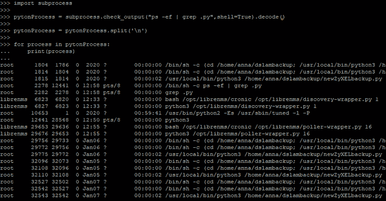
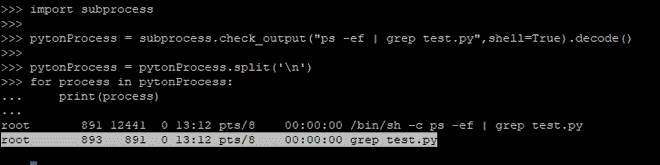
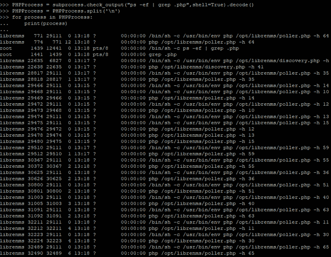

# 如何用 Python 检查 linux 中有没有脚本在运行？

> 原文:[https://www . geesforgeks . org/如何使用 python 检查任何脚本在 linux 中运行/](https://www.geeksforgeeks.org/how-to-check-any-script-is-running-in-linux-using-python/)

Python 是当今一种强大且呈指数级增长的编程语言。有多种方法可以检查哪个脚本在 Linux 环境的后台运行。其中之一就是使用 python 中的**子流程**模块。**子流程**用于通过创建新流程，通过 **Python** 代码运行新程序。在本文中，我们将看到如何使用 Python 检查任何脚本是否正在后台 Linux 中运行。

**要求:**

*   Python >=2.7，> = 3.0
*   点

**子流程安装:**

```py
pip install subprocess.run
```

我们将使用 subprocess.checkout()方法来获取所有正在运行的进程。

> **语法:**子进程. check_output(args，* stdin =None，stderr=None，shell=False，cwd=None，编码= None，errors=None，universal_newlines=None，timeout=None，text=None，**other_popen_kwargs)
> 
> **该运行命令带有参数并返回输出。**
> 
> stderr =子流程。STDOUT 用于捕获结果中的标准错误。

**例 1 :**

在下面的代码中，我们将在后台 Linux 中运行所有的 **py** 脚本

## 蟒蛇 3

```py
import subprocess

pytonProcess = subprocess.check_output("ps -ef | grep .py",shell=True).decode()
pytonProcess = pytonProcess.split('\n')

for process in pytonProcess:
    print(process)
```

**输出:**



**例 2 :**

在下面的例子中，我们将检查特定的脚本是否在后台运行

## 蟒蛇 3

```py
import subprocess

pytonProcess = subprocess.check_output("ps -ef | grep test.py",shell=True).decode()
pytonProcess = pytonProcess.split('\n')

for process in pytonProcess:
    print(process)
```

**输出:**



**例 3 :**

在下面的代码中，我们将获得在后台 Linux 中运行的所有 PHP 脚本。

## 蟒蛇 3

```py
import subprocess

pytonProcess = subprocess.check_output("ps -ef | grep .php",shell=True).decode()
PHPProcess = pytonProcess.split('\n')

for process in PHPProcess:
    print(process)
```

**输出:**

