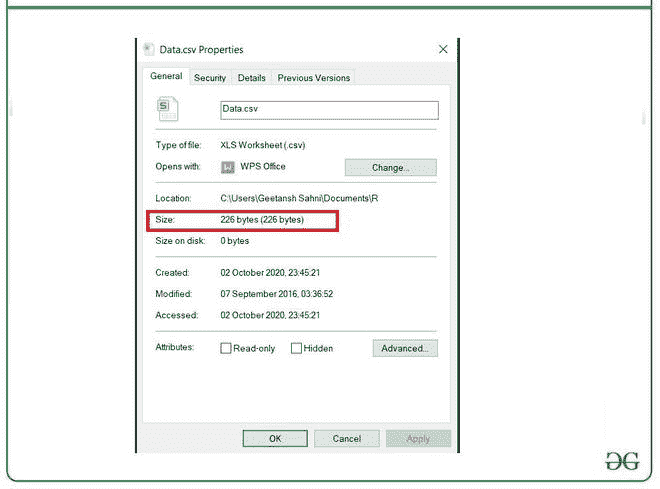
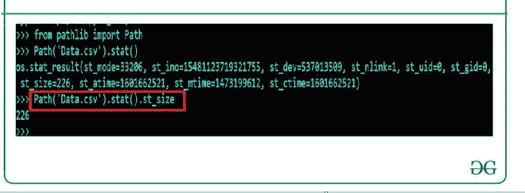

# 如何在 Python 中检查文件大小？

> 原文:[https://www . geesforgeks . org/如何检查 python 中的文件大小/](https://www.geeksforgeeks.org/how-to-check-file-size-in-python/)

**先决条件:**

*   OS
*   [pathlib](https://www.geeksforgeeks.org/pathlib-module-in-python/#:~:text=Pathlib%20module%20in%20Python%20provides,pure%20paths%20and%20concrete%20paths.)

给定一个文件，这里的任务是生成一个 Python 脚本来打印它的大小。本文解释了两种方法。

### **接近**

*   导入模块
*   获取文件大小

### **正在使用的文件**

**名称:** Data.csv

**大小:** 226 字节



**方法 1:使用路径库**

路径()。stat()。pathlib 模块的 st_size()函数获取任何类型文件的大小，该函数的输出将以字节为单位表示文件的大小。

**语法:**

```
Path('filename').stat().st_size()
```

**示例:**

## 蟒蛇 3

```
from pathlib import Path

sz = Path('Data.csv').stat().st_size

print(sz)
```

**输出:**



**方法 2:带 Os 模块**

os.path.getsize()函数只与 os Library 配合使用，在导入这个库的帮助下我们可以用这个来获取任何类型文件的大小，并且这个函数的输出将是文件的大小(以字节为单位)。

**语法:**

```
getsize(filename)
```

**示例:**

## 蟒蛇 3

```
import os

sz = os.path.getsize("Data.csv")

print(sz)
```

**输出:**


我们得到的结果是 226 字节