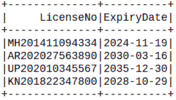
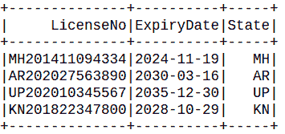

# 如何检查 PySpark 数据帧中的子串？

> 原文:[https://www . geesforgeks . org/如何检查 pyspark-dataframe 中的子字符串/](https://www.geeksforgeeks.org/how-to-check-for-a-substring-in-a-pyspark-dataframe/)

在本文中，我们将看到如何在 PySpark 数据帧中检查子字符串。

子串是一个更大的字符串内的连续字符序列。例如，“学习 pyspark”是“我正在从 GeeksForGeeks 学习 pyspark”的子串。让我们看看从 PySpark 数据帧的一列或多列中找到子串的不同方法。

**创建用于演示的数据框:**

## 计算机编程语言

```
# importing module
import pyspark

# importing sparksession from pyspark.sql module
from pyspark.sql import SparkSession

# creating sparksession and giving an app name
spark = SparkSession.builder.appName('sparkdf').getOrCreate()

# Column names for the dataframe
columns = ["LicenseNo", "ExpiryDate"]

# Row data for the dataframe
data = [
    ("MH201411094334", "2024-11-19"),
    ("AR202027563890", "2030-03-16"),
    ("UP202010345567", "2035-12-30"),
    ("KN201822347800", "2028-10-29"),
]

# Create the dataframe using the above values
reg_df = spark.createDataFrame(data=data,
                               schema=columns)

# View the dataframe
reg_df.show()
```

**输出:**



在上述数据框中，许可证号由 3 个信息组成，2 个字母的国家代码+注册年份+ 8 位数的注册号。

## **方法 1: U** 用柱唱数据框()

**data frame . with column(colName，col)** 可以用来从列数据中提取子串，方法是同时使用 pyspark 的 substring()函数。

> **语法:**data frame . with column(colName，col)
> 
> **参数:**
> 
> *   **列名:** str，**T3】新列名**
> *   col: str，新列的列表达式
> 
> 通过添加列或替换同名的现有列，返回新的数据框。

我们将使用 pyspark 的**子字符串()**函数，通过从 LicenseNo 列中提取相应的子字符串来创建一个新的列“State”。

> **语法:**py spark . SQL . functions . substring(str，pos，len)

**示例 1:** 对于作为子串的单个列。

## 计算机编程语言

```
from pyspark.sql.functions import substring

reg_df.withColumn(
  'State', substring('LicenseNo', 1, 2)
).show()
```

**输出:**



在这里，我们创建了一个新的列“状态”，其中子字符串取自“许可证号”列。(1，2)表示我们需要从第一个字符开始，从“LicenseNo”列中提取 2 个字符。

**示例 2:** 对于作为子串的多列

提取州代码为“州”，注册年为“注册年”，注册标识为“注册”，到期年为“出口”，到期日为“出口”，到期月为“出口”。

## 计算机编程语言

```
from pyspark.sql.functions import substring

reg_df \
.withColumn('State'  , substring('LicenseNo' , 1, 2)) \
.withColumn('RegYear', substring('LicenseNo' , 3, 4)) \
.withColumn('RegID'  , substring('LicenseNo' , 7, 8)) \
.withColumn('ExpYr'  , substring('ExpiryDate', 1, 4)) \
.withColumn('ExpMo'  , substring('ExpiryDate', 6, 2)) \
.withColumn('ExpDt'  , substring('ExpiryDate', 9, 2)) \
.show()
```