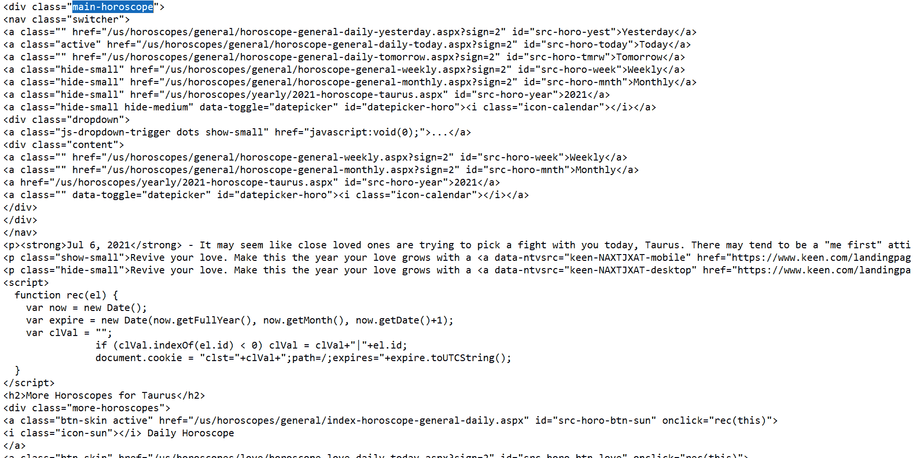
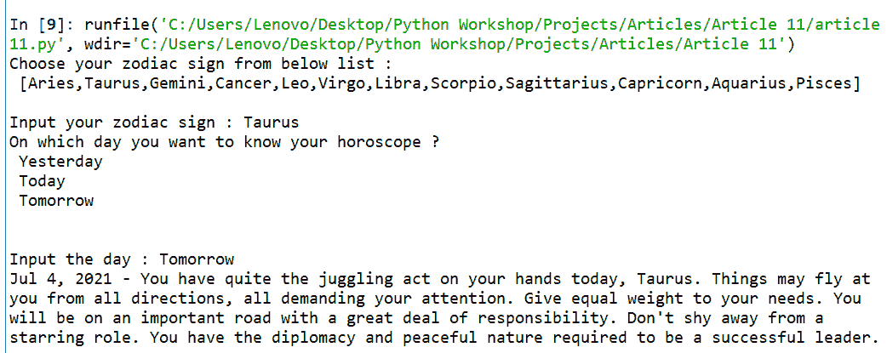

# 如何用 Python 查八字？

> 原文:[https://www . geesforgeks . org/如何使用 python 检查星座/](https://www.geeksforgeeks.org/how-to-check-horoscope-using-python/)

在这篇文章中，我们将看到如何获得一个星座前一天，当天以及使用后一天的美丽组合。

### **所需模块:**

*   [**bs4**](https://www.geeksforgeeks.org/implementing-web-scraping-python-beautiful-soup/)【T4:美人汤(bs4)是一个从 HTML 和 XML 文件中拉出数据的 Python 库。这个模块没有内置 Python。要安装此软件，请在终端中键入以下命令。

```py
pip install bs4
```

*   [**请求**](https://www.geeksforgeeks.org/python-requests-tutorial/) **:** 请求让你发送 HTTP/1.1 请求极其轻松。该模块也没有内置 Python。要安装此软件，请在终端中键入以下命令。

```py
pip install requests
```

### **分步实施:**

**步骤 1:导入模块**

请求模块允许您使用 Python 发送 HTTP 请求。HTTP 请求返回一个 Response Object，其中包含了所提到的网页的所有响应，并美化了该对象。该对象是一个 Python 库，用于从 HTML 和 XML 文件中提取数据。

## 蟒蛇 3

```py
import requests
from bs4 import BeautifulSoup
```

**第二步:定义“八字”功能**

该函数将两个变量作为输入“生肖 _ 星座”和“日”，这将是用户指定的生肖和用户想知道他们的星座的日子。然后，它将被发送到网站 url，在我们的例子中，它将分别是“{day}”和“{生肖 _ sign }”部分中的[www.horoscope.com](www.horoscope.com)。

这将确保我们想要的数据来自用户输入的指定日期和生肖。之后，一个 HTTP 请求将被发送到网站，在靓汤的帮助下，我们将从网站的 HTML 文件中拉出数据。

然后经过一些导航，我们发现我们需要的星座数据存在于“主星座”类中，我们将从 soup.find()函数中找到它，在提取段落文本字符串后，我们将简单地以字符串格式返回它。

## 蟒蛇 3

```py
# importing necessary modules
import requests
from bs4 import BeautifulSoup 

def horoscope(zodiac_sign: int, day: str) -> str:

      # website taking the user input variables
    url = (
        "https://www.horoscope.com/us/horoscopes/general/"
        f"horoscope-general-daily-{day}.aspx?sign={zodiac_sign}" 
    )

    # soup will contain all the website's data
    soup = BeautifulSoup(requests.get(url).content, 
                         "html.parser") 
    # print(soup)

    # we will search for main-horoscope
    # class and we will simply return it
    return soup.find("div", class_="main-horoscope").p.text 
```

**输出:**



这里我们必须使用“主星座”div 类

**注意:**这只是 HTML 代码或 Raw 数据。

**第三步:定义主功能**

首先，我们将把所有生肖的字符串存储为关键字，把一个特定的数字存储为字典中的值。然后，我们将要求用户输入他们的生肖，这将从我们的字典中给出一个数字，并将其存储为“生肖 _ 星座”，类似地，我们将在我们的“日”变量中存储日。这将被推到星座函数，它将生成一个字符串，我们最后返回。这个字符串将是网站告诉的星座。

## 蟒蛇 3

```py
if __name__ == "__main__":

      # dictionary for storing all zodiac signs
    dic={'Aries':1,'Taurus':2,'Gemini':3,
         'Cancer':4,'Leo':5,'Virgo':6,'Libra':7,
         'Scorpio':8,'Sagittarius':9,'Capricorn':10,
         'Aquarius':11,'Pisces':12} 

    # asking for user's input
    print('Choose your zodiac sign from below list : \n',
          '[Aries,Taurus,Gemini,Cancer,Leo,Virgo,Libra,\
          Scorpio,Sagittarius,Capricorn,Aquarius,Pisces]') 

    zodiac_sign = dic[input("Input your zodiac sign : ")]

    print("On which day you want to know your horoscope ?\n",
          "Yesterday\n", "Today\n", "Tomorrow\n")
    day = input("Input the day : ").lower()

    # the data will be sent to the horoscope function
    horoscope_text = horoscope(zodiac_sign, day) 

    # then we will simply print the resulting string
    print(horoscope_text) 
```

**以下是完整实现:**

## 蟒蛇 3

```py
import requests
from bs4 import BeautifulSoup

def horoscope(zodiac_sign: int, day: str) -> str:
    url = (
        "https://www.horoscope.com/us/horoscopes/general/"
        f"horoscope-general-daily-{day}.aspx?sign={zodiac_sign}"
    )
    soup = BeautifulSoup(requests.get(url).content,
                         "html.parser")

    # print(soup.find("div", class_="main-horoscope").p.text)
    return soup.find("div", class_="main-horoscope").p.text

if __name__ == "__main__":
    dic = {'Aries': 1, 'Taurus': 2, 'Gemini': 3,
           'Cancer': 4, 'Leo': 5, 'Virgo': 6,
           'Libra': 7, 'Scorpio': 8, 'Sagittarius': 9,
           'Capricorn': 10, 'Aquarius': 11, 'Pisces': 12}

    print('Choose your zodiac sign from below list : \n',
          '[Aries,Taurus,Gemini,Cancer,Leo,Virgo,Libra,\
          Scorpio,Sagittarius,Capricorn,Aquarius,Pisces]')

    zodiac_sign = dic[input("Input your zodiac sign : ")]
    print("On which day you want to know your horoscope ?\n",
          "Yesterday\n", "Today\n", "Tomorrow\n")

    day = input("Input the day : ").lower()
    horoscope_text = horoscope(zodiac_sign, day)
    print(horoscope_text)
```

**输出:**

