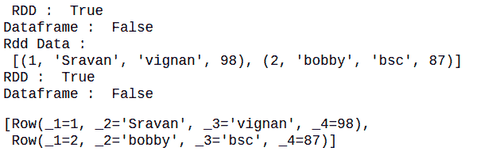

# 如何在 PySpark 中检查某个东西是 RDD 还是数据帧？

> 原文:[https://www . geesforgeks . org/how-to-check-if-this-a-rdd-or-a-data frame-in-py spark/](https://www.geeksforgeeks.org/how-to-check-if-something-is-a-rdd-or-a-dataframe-in-pyspark/)

在本文中，我们将使用 isinstance()，type()和 dispatch 方法检查数据是 RDD 还是数据帧。

## **方法 1。使用** [**方法**](https://www.geeksforgeeks.org/python-isinstance-method/)

**它用于检查特定数据是 RDD 还是数据帧。它返回布尔值。**

> ****语法:**是实例(数据、数据帧/RDD)**
> 
>  **在哪里
> 
> *   数据是我们的输入数据
> *   DataFrame 是来自 pyspark.sql 模块的方法
> *   RDD 是来自 pyspark.sql 模块的方法**

****检查我们的数据是否是数据帧的示例程序:****

## **蟒蛇 3**

```
# importing module
import pyspark

#import DataFrame
from pyspark.sql import DataFrame

# importing sparksession
# from pyspark.sql module
from pyspark.sql import SparkSession

# creating sparksession
# and giving an app name
spark = SparkSession.builder.appName('sparkdf').getOrCreate()

# list  of employee data
data = [[1, "sravan", "company 1"],
        [2, "ojaswi", "company 1"],
        [3, "rohith", "company 2"],
        [4, "sridevi", "company 1"],
        [1, "sravan", "company 1"],
        [4, "sridevi", "company 1"]]

# specify column names
columns = ['ID', 'NAME', 'Company']

# creating a dataframe from the lists of data
dataframe = spark.createDataFrame(data, columns)

# check if it is dataframe or not
print(isinstance(dataframe, DataFrame))
```

****输出:****

```
True
```

#### ****查数据是不是 RDD:****

**通过使用 isinstance()方法，我们可以检查。**

> ****语法:**是实例(数据，RDD)**
> 
> **在哪里**
> 
> 1.  **数据是我们的输入数据**
> 2.  **从 pyspark.sql 模块中删除该方法**

****示例:****

## **蟒蛇 3**

```
# import DataFrame
from pyspark.sql import DataFrame

# import RDD
from pyspark.rdd import RDD

# need to import for session creation
from pyspark.sql import SparkSession

# creating the  spark session
spark = SparkSession.builder.getOrCreate()

# create an rdd with some data
data = spark.sparkContext.parallelize([("1", "sravan", "vignan", 67, 89),
                                       ("2", "ojaswi", "vvit", 78, 89),
                                       ("3", "rohith", "vvit", 100, 80),
                                       ("4", "sridevi", "vignan", 78, 80),
                                       ("1", "sravan", "vignan", 89, 98),
                                       ("5", "gnanesh", "iit", 94, 98)])

# check the data is  rdd or not
print(isinstance(data, RDD))
```

****输出:****

```
True
```

### ****将 RDD 转换为数据帧并检查类型****

**在这里，我们将创建一个 RDD，并使用 toDF()方法将其转换为数据帧，并检查数据。**

## **蟒蛇 3**

```
# import DataFrame
from pyspark.sql import DataFrame

# import RDD
from pyspark.rdd import RDD

# need to import for session creation
from pyspark.sql import SparkSession

# creating the  spark session
spark = SparkSession.builder.getOrCreate()

# create an rdd with some data
rdd = spark.sparkContext.parallelize([(1, "Sravan", "vignan", 98),
                                      (2, "bobby", "bsc", 87)])

# check if it is an RDD
print(" RDD : ", isinstance(rdd, RDD))

# check if it is an DataFrame
print("Dataframe : ", isinstance(rdd, DataFrame))

# display data of rdd
print("Rdd Data : \n", rdd.collect())

# convert rdd to dataframe
data = rdd.toDF()

# check if it is an RDD
print("RDD : ", isinstance(rdd, RDD))

# check if it is an DataFrame
print("Dataframe : ", isinstance(rdd, DataFrame))

# display dataframe
data.collect()
```

****输出:****

****

## ****方法二:使用** [**类型()**](https://www.geeksforgeeks.org/python-type-function/) **功能****

**type()命令用于返回给定对象的类型。**

> ****语法:**类型(data_object)**
> 
> **这里，dataobject 是 rdd 或 dataframe 数据。**

****示例 1** :用 RDD 创建数据并检查类型的 Python 程序**

## **蟒蛇 3**

```
# need to import for session creation
from pyspark.sql import SparkSession

# creating the  spark session
spark = SparkSession.builder.getOrCreate()

# create an rdd with some data
rdd = spark.sparkContext.parallelize([(1, "Sravan","vignan",98),
                                      (2, "bobby","bsc",87)])

# check the type using type() command
print(type(rdd))
```

****输出:****

```
<class 'pyspark.rdd.RDD'>
```

****示例 2:** 创建数据框并检查类型的 Python 程序。**

## **蟒蛇 3**

```
# importing module
import pyspark

# importing sparksession from pyspark.sql module
from pyspark.sql import SparkSession

# creating sparksession and giving an app name
spark = SparkSession.builder.appName('sparkdf').getOrCreate()

# list  of employee data 
data =[[1,"sravan","company 1"],
       [2,"ojaswi","company 1"],
       [3,"rohith","company 2"],
       [4,"sridevi","company 1"],
       [1,"sravan","company 1"], 
       [4,"sridevi","company 1"]]

# specify column names
columns=['ID','NAME','Company']

# creating a dataframe from the lists of data
dataframe = spark.createDataFrame(data,columns)

# check thet type of
# data with type() command
print(type(dataframe))
```

****输出:****

```
<class 'pyspark.sql.dataframe.DataFrame'>
```

## ****方法 3:** 使用调度**

**调度装饰器用函数的名称创建一个调度器对象并存储这个对象，我们可以引用这个对象来执行操作。这里我们创建一个对象来检查我们的数据是 RDD 还是数据帧。所以我们使用单一调度**

****示例 1:** Python 代码，用于创建单个调度程序并传递数据，检查数据是否为 rdd**

## **蟒蛇 3**

```
# importing module
from pyspark.rdd import RDD
from pyspark.sql import DataFrame
import pyspark

# importing sparksession from pyspark.sql module
from pyspark.sql import SparkSession

# import singledispatch
from functools import singledispatch

# import spark context
from pyspark import SparkContext

# createan object for spark
# context with local and name is GFG
sc = SparkContext("local", "GFG")

# creating sparksession
# and giving an app name
spark = SparkSession.builder.appName('sparkdf').getOrCreate()

# import DataFrame

# import RDD

# creating the  spark session
spark = SparkSession.builder.getOrCreate()

# create a function to dispatch our function
@singledispatch
def check(x):
    pass

# this function is for returning
# an RDD if the given input is RDD
@check.register(RDD)
def _(arg):
    return "RDD"

# this function is for returning
# an RDD if the given input is DataFrame
@check.register(DataFrame)
def _(arg):
    return "DataFrame"

# create an pyspark dataframe
# and check whether it is RDD or not
print(check(sc.parallelize([("1", "sravan", "vignan", 67, 89)])))
```

****输出:****

```
RDD
```

****示例 2:** 检查数据是否为数据帧的 Python 代码**

## **蟒蛇 3**

```
# importing module
from pyspark.rdd import RDD
from pyspark.sql import DataFrame
import pyspark

# importing sparksession from pyspark.sql module
from pyspark.sql import SparkSession

# import singledispatch
from functools import singledispatch

# import spark context
from pyspark import SparkContext

# createan object for spark
# context with local and name is GFG
sc = SparkContext("local", "GFG")

# creating sparksession and giving an app name
spark = SparkSession.builder.appName('sparkdf').getOrCreate()

# creating the  spark session
spark = SparkSession.builder.getOrCreate()

# create a function to dispatch our function
@singledispatch
def check(x):
    pass

# this function is for returning
# an RDD if the given input is RDD
@check.register(RDD)
def _(arg):
    return "RDD"

# this function is for returning
# an RDD if the given input is DataFrame
@check.register(DataFrame)
def _(arg):
    return "DataFrame"

# create an pyspark dataframe and
# check whether it is dataframe or not
print(check(spark.createDataFrame([("1", "sravan",
                                    "vignan", 67, 89)])))
```

****输出:****

```
DataFrame
```