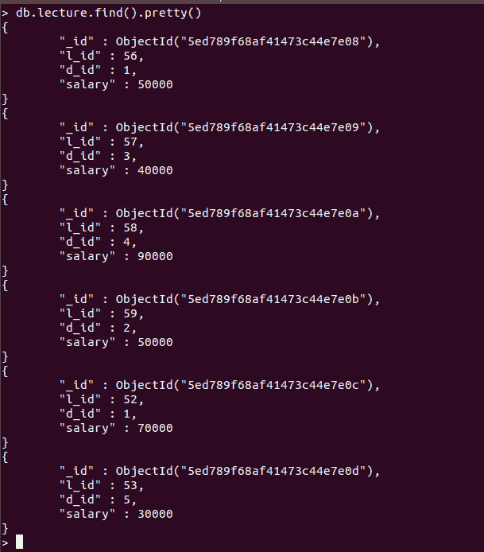

# 如何检查 PyMongo 光标是否为空？

> 原文:[https://www . geeksforgeeks . org/如何检查 pymongo 光标是否为空/](https://www.geeksforgeeks.org/how-to-check-if-the-pymongo-cursor-is-empty/)

[**【MongoDB】**](https://www.geeksforgeeks.org/mongodb-and-python/)是一个开源的 NOSQL 数据库，用 C++实现。它是一个面向文档的数据库实现，将数据存储在名为 Collections(MongoDB 文档组)的结构中。 **PyMongo** 是一个著名的开源库，用于嵌入式 MongoDB 查询。PyMongo 被广泛用于与 MongoDB 数据库交互，因为 python 是数据分析和数据科学的强大语言。

## 检查光标对象是否为空？

当使用 pymongo 使用[查询给定集合时。find()](https://www.geeksforgeeks.org/python-mongodb-find/) 方法，返回值是 PyMongo.cursor.Cursor Class 类型的对象，它包含与查询匹配的文档。在查询没有返回结果的情况下，PyMongo 游标将为空。如果你想获得个人文件，你需要使用[。find_one()](https://www.geeksforgeeks.org/python-mongodb-find_one-query/) 法。要检查光标对象是否为空，可以遵循几种方法–

**方法 1:** 返回的游标是可迭代的，因此我们可以将其转换为列表。如果列表的长度为零(即列表为空)，这意味着光标也为空。

**样本数据库:**



**示例:**

## 蟒蛇 3

```py
import pymongo

connection = pymongo.MongoClient()
db = connection.GFG
col = db.lecture

# This is a cursor instance
cur = col.find()   

results = list(cur)

# Checking the cursor is empty
# or not
if len(results)==0:
    print("Empty Cursor")
else:
    print("Cursor is Not Empty")
    print("Do Stuff Here")
```

**输出:**

```py
Cursor is Not Empty
Do Stuff Here
```

**方法 2:** 另一种方法是使用[。count()](https://www.geeksforgeeks.org/python-list-function-count/) 方法，返回查询的匹配文档数。如果的返回值为。count()为 0，则光标为“T4”y

**示例:**

## 蟒蛇 3

```py
import pymongo

connection = pymongo.MongoClient()
db = connection.GFG
col = db.lecture

# This is a cursor instance
cur = col.find()

if cur.count()==0:
    print("Empty Cursor")
else:
    print("Cursor is Not Empty")
    print("Do Stuff Here")
```

**输出:**

```py
Cursor is Not Empty
Do Stuff Here
```