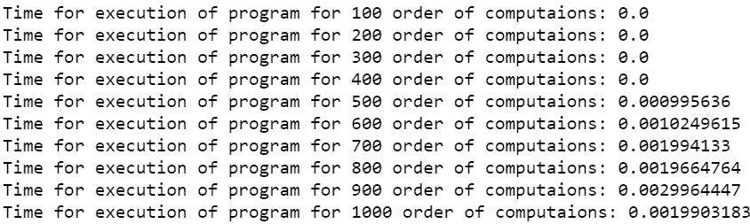

# 如何检查 Python 脚本的执行时间？

> 原文:[https://www . geesforgeks . org/如何检查 python 脚本的执行时间/](https://www.geeksforgeeks.org/how-to-check-the-execution-time-of-python-script/)

在本文中，我们将讨论如何测量 Python 脚本的运行时间。

python 中有很多类似[](https://www.geeksforgeeks.org/time-functions-in-python-set-1-time-ctime-sleep/)****[**time it**](https://www.geeksforgeeks.org/timeit-python-examples/)**和 [**datetime**](https://www.geeksforgeeks.org/python-datetime-module-with-examples/) 这样的 Python 模块，可以存储程序特定部分被执行的时间。通过操作或获取执行特定部分的开始时间和结束时间之间的差值，我们可以计算执行该部分所需的时间。******

****以下方法可用于计算时差:****

*   ******Python 中的时间模块**提供了各种与时间相关的功能。该模块属于 Python 的标准实用程序模块。[**Time . Time()**](https://www.geeksforgeeks.org/python-time-time-method/)Time 模块的方法用于获取自纪元以来的时间，单位为秒。闰秒的处理依赖于平台。****
*   ****Python **日期时间库**定义了一个函数，主要用于获取当前的时间和日期。 [**now()**](https://www.geeksforgeeks.org/python-now-function/) 函数返回当前本地日期和时间，在 datetime 模块下定义。****
*   ******timeit** 运行您的代码片段数百万次(默认值为 1000000)，这样您就可以获得统计上最相关的代码执行时间度量。****

******示例 1:** 使用时间模块和 time.time()函数计算时间****

## ****蟒蛇 3****

```py
**# program to compute the time
# of execution of any python code
import time

# we initialize the variable start
# to store the starting time of
# execution of program
start = time.time()

# we can take any program but for
# example we have taken the below
# program
a = 0
for i in range(1000):
    a += (i**100)

# now we have initialized the variable
# end to store the ending time after
# execution of program
end = time.time()

# difference of start and end variables
# gives the time of execution of the
# program in between
print("The time of execution of above program is :", end-start)**
```

******输出:******

```py
**The time of execution of above program is : 0.001995563507080078**
```

****我们已经计算出上述程序从 10^-3.订单中出来的时间我们可以通过增加使用相同算法的计算次数来检查时间。****

******示例 2:** 检查不同计算次数的程序执行时间。****

## ****蟒蛇 3****

```py
**# program to compute the time
# of execution of any python code
# for different number of computations
import time

# we initialize a for loop and in each
# iterations store the time of start
# and end of the iterations
for j in range(100, 1100, 100):
    start = time.time()

    # program to iterate the range of
    # below loop increasing the value
    # in each iterations
    a = 0
    for i in range(j):
        a += (i**100)

    # the end variable to store the
    # ending time after execution of
    # program after each iterations
    end = time.time()

    # difference of start and end variables
    # gives the time of execution of the program
    # in between in each iterations
    print("Time for execution of program for {} order of computations: {}".format(
        j, round(end-start, 10)))**
```

******输出:******

********

****我们看到执行次数增加，计算时间增加的一般趋势。但是，它可能不会显示任何线性趋势或固定增量。****

******示例 3:** 使用 python 中的 datetime 模块和 datetime.now 函数。****

## ****蟒蛇 3****

```py
**# program to compute the time of
# execution of any python code
from datetime import datetime

# we initialize the variable start to
# store the starting time of execution
# of program
start = datetime.now()

# we can take any program but for
# example we have taken the below
# program
a = 0
for i in range(1000):
    a += (i**100)

# now we have initialized the variable
# end to store the ending time after
# execution of program
end = datetime.now()

# difference of start and end variables
# gives the time of execution of the
# program in between
print("The time of execution of above program is :",
      str(end-start)[5:])**
```

******输出:******

```py
**The time of execution of above program is : 00.001996**
```

******示例 4:** 使用[计时](https://www.geeksforgeeks.org/timeit-python-examples/)****

****这将为我们提供任何程序的执行时间。该模块提供了一种简单的方法来查找小部分 Python 代码的执行时间。它提供了 **timeit()** 方法来做同样的事情。模块函数 timeit.timeit(stmt，setup，timer，number)接受四个参数:****

*   ****stmt，也就是你想要衡量的语句；它默认为“通过”。****
*   ****安装程序，它是在运行 stmt 之前运行的代码；它默认为“通过”。我们通常使用它来导入代码所需的模块。****
*   ****计时器，它是一个计时器。计时器对象；它通常有一个合理的默认值，所以你不必担心它。****
*   ****number 这是您希望运行 stmt 的执行次数。****

## ****蟒蛇 3****

```py
**# program to compute the time of
# execution of any python code using timit

# importing the required module
import timeit

# code snippet to be executed only once
mysetup = "from math import sqrt"

# code snippet whose execution time
# is to be measured
mycode = '''
def example():
    mylist = []
    for x in range(100):
        mylist.append(sqrt(x))
'''

# timeit statement
print ("The time of execution of above program is :",
       timeit.timeit(setup = mysetup,
                    stmt = mycode,
                    number = 10000))**
```

******输出:******

```py
**The time of execution of above program is : 0.0023286999994525104**
```