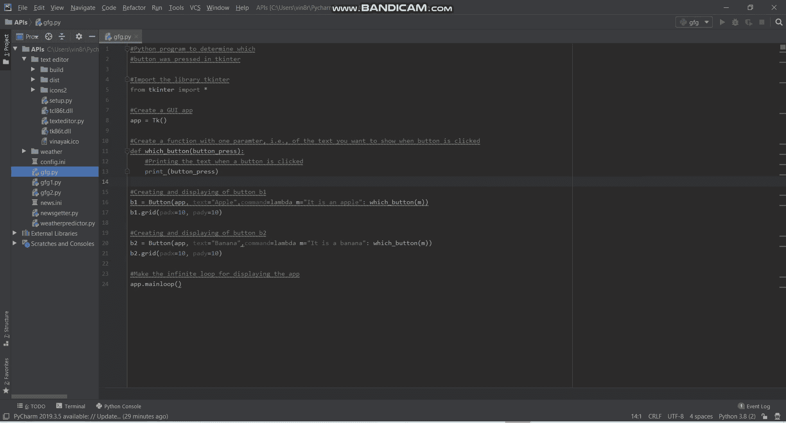

# 如何查看 Tkinter 中点击了哪个按钮？

> 原文:[https://www . geesforgeks . org/how-to-check-哪个按钮被点击了-in-tkinter/](https://www.geeksforgeeks.org/how-to-check-which-button-was-clicked-in-tkinter/)

你是否在你的应用程序中使用各种按钮，你是否对哪个按钮被按下感到困惑？不知道如何摆脱这个解决方案！！别担心，把文章过一遍就行了。在本文中，我们将详细解释知道哪个按钮被按下的过程。

### 逐步方法:

**第一步:**首先导入库 Tkinter。

```py
from tkinter import *
```

**步骤 2:** 现在，使用 Tkinter 创建一个 GUI 应用程序。

```py
app = Tk()
```

**步骤 3:** 然后，创建一个带有一个参数的函数，即当点击一个按钮时要显示的文本的参数

```py
def which_button(button_press):
   print (button_press)
```

**步骤 4:** 进一步，通过调用您在步骤 3 中声明的 which _ button 函数来创建和显示第一个按钮。

```py
b1 = Button(app, text="#Text you want to show in button b1",
            command=lambda m="#Text you want to show when\
            b1 is clicked": which_button(m))

b1.grid(padx=10, pady=10)
```

**步骤 5:** 此外，通过调用您在步骤 3 中声明的 which_button 函数来创建和显示第二个按钮。

```py
b2 = Button(app, text="#Text you want to show in button b2",
            command=lambda m="#Text you want to show when \
            b2 is clicked": which_button(m))

b2.grid(padx=10, pady=10)
```

**第 6 步:**接下来，继续重复第 4 步和第 5 步 n 个按钮，将 n 替换为您希望它在应用程序上显示的按钮数量。不要忘记调用您在步骤 3 中声明的 which _ button 函数。

```py
bn = Button(app, text="#Text you want to show in button bn",
            command=lambda m="#Text you want to show when \
            bn is clicked": which_button(m))

bn.grid(padx=10, pady=10)
```

**第七步:**最后，创建一个无限循环在屏幕上显示应用。

```py
app.mainloop()
```

**示例:**

在本例中，如果屏幕上打印了文本“**是苹果**，我们就知道按下了“**苹果**”按钮，否则当屏幕上打印了“**是香蕉**时，我们就知道按下了“**香蕉**”按钮。

## 计算机编程语言

```py
# Python program to determine which
# button was pressed in tkinter

# Import the library tkinter
from tkinter import *

# Create a GUI app
app = Tk()

# Create a function with one paramter, i.e., of 
# the text you want to show when button is clicked
def which_button(button_press):
    # Printing the text when a button is clicked
    print(button_press)

# Creating and displaying of button b1
b1 = Button(app, text="Apple",
            command=lambda m="It is an apple": which_button(m))

b1.grid(padx=10, pady=10)

# Creating and displaying of button b2
b2 = Button(app, text="Banana",
            command=lambda m="It is a banana": which_button(m))
b2.grid(padx=10, pady=10)

# Make the infinite loop for displaying the app
app.mainloop()
```

**输出:**

