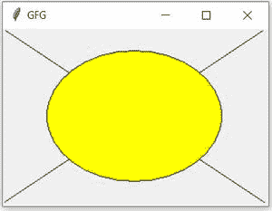
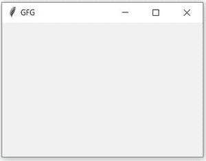

# 如何清除 Tkinter Canvas？

> 原文:[https://www.geeksforgeeks.org/how-to-clear-tkinter-canvas/](https://www.geeksforgeeks.org/how-to-clear-tkinter-canvas/)

[Tkinter](https://www.geeksforgeeks.org/python-gui-tkinter/) 是一个 Python 包，用于创建有效的 GUI 应用程序。Tkinter 的 Canvas 小部件只是一个矩形区域，用于绘制图片、简单的形状或任何复杂的图形。我们可以在画布上放置任何小部件，如文本、按钮或框架。

这里的任务是生成一个可以清除 Tkinter Canvas 的 Python 脚本。因为将使用该模块删除功能。这个方法有一个特殊的参数 **all** ，代表画布上的所有组件。要清除此画布，请将此特殊参数赋予 delete 方法。因此，下面的行足以清除画布:

```py
delete('all')
```

如果您想要删除任何特定的项目，那么您可以为该项目分配一个标签，而不是**全部**将该标签传递给删除方法。

下面给出了实现这一特定功能的代码:

**程序:**

在清理画布之前

## 蟒蛇 3

```py
# import tkinter
from tkinter import *

# make an object of Tk interface
window = Tk()

# Give the title to out window
window.title('GFG')

# creating canvas
canvas = Canvas(window, width=300, height=200)
canvas.pack()

# draw line to out canvas
canvas.create_line(0, 0, 300, 200)
canvas.create_line(0, 200, 300, 0)

# draw oval to out canvas
canvas.create_oval(50, 25, 250, 175, fill="yellow")

window.mainloop()
```

**输出:**



简单画布示例

清理画布后

## 蟒蛇 3

```py
# import tkinter
from tkinter import *

# make an object of Tk interface
window = Tk()

# Give the title to out window
window.title('GFG')

# creating canvas
canvas = Canvas(window, width=300, height=200)
canvas.pack()

# draw line to out canvas
canvas.create_line(0, 0, 300, 200)
canvas.create_line(0, 200, 300, 0)

# draw oval to out canvas
canvas.create_oval(50, 25, 250, 175, fill="yellow")

# clear the canvas
canvas.delete('all')

window.mainloop()
```

**输出:**



清除画布