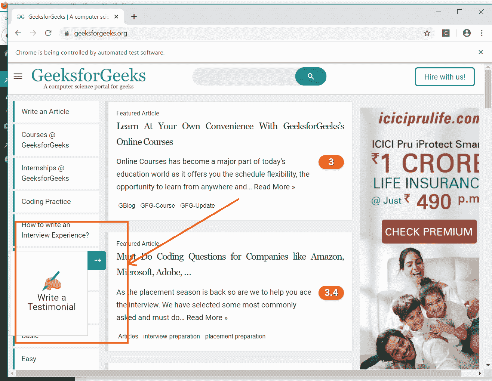

# 如何使用硒点击网页上的按钮？

> 原文:[https://www . geesforgeks . org/如何使用硒点击网页上的按钮/](https://www.geeksforgeeks.org/how-to-click-a-button-on-webpage-using-selenium/)

Selenium 可以自动点击网页上出现的按钮。本文围绕如何在网页中使用 Selenium 点击任何按钮展开。为了做到这一点，我们必须采取两个主要步骤:

1.  找到按钮。
2.  点击按钮。

我们可以使用**find _ element _ by _ class _ name()**、 **find_element_by_name()** 、 **find_element_by_id()** 等方法找到网页上的按钮，然后我们可以使用 **click()** 方法点击它。

**语法:**

```
# finding the button using ID
button = driver.find_element_by_id(ID)

# clicking on the button
button.click()
```

**代码:**

## 蟒蛇 3

```
import time
# importing webdriver from selenium
from selenium import webdriver

# Here Chrome  will be used
driver = webdriver.Chrome()

# URL of website
url = "https://www.geeksforgeeks.org/"

# Opening the website
driver.get(url)

# getting the button by class name
button = driver.find_element_by_class_name("slide-out-btn")

# clicking on the button
button.click()
```

这将点击按钮，将显示一个弹出窗口。
**输出–**

