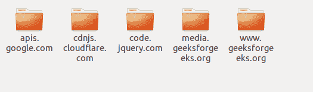

# 如何用 Python 中的 pywebcopy 克隆网页？

> 原文:[https://www . geeksforgeeks . org/如何克隆网页-使用-pywebcopy-in-python/](https://www.geeksforgeeks.org/how-to-clone-webpage-using-pywebcopy-in-python/)

有时我们需要在您的本地硬盘上有一个方便的网页。因此，这里我们将编写一个简单的 Python 脚本来废弃一个网页。网页抓取用于从网站提取数据，用于离线阅读、存储或任何其他原因。在写剧本之前，我们需要知道 **pywebcopy。pywebcopy** 可在 **PyPi** 上获得，并且可以使用 **pip 轻松安装。**在终端输入以下命令安装该模块

```
pip install pywebcopy
```

**pywebcopy** Python 包，用于将完整的网页和网站克隆到本地存储。

**进场:**

*   导入 pywebcopy
*   将参数传入**save _ 网页(URL =“…”，project_folder=“路径/下载”，kwargs)**
*   检查你给定的位置。

下面是实现。

## 蟒蛇 3

```
from pywebcopy import save_webpage

kwargs = {'project_name': 'site folder'}

save_webpage(

    # url pf the website
    url='https://www.geeksforgeeks.org/data-structures/linked-list/',

    # folder where the copy will be saved
    project_folder='F:/ro/geek',
    **kwargs
)
```

**输出:**



网页的完整克隆被制作并存储在指定的位置。