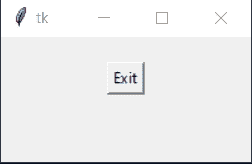
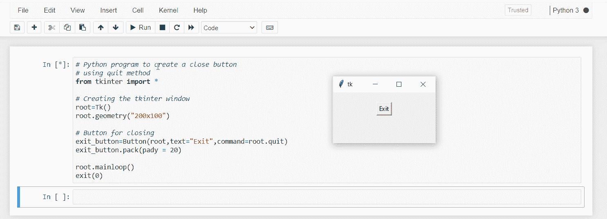

# 如何用按钮关闭 Tkinter 窗口？

> 原文:[https://www . geesforgeks . org/如何用按钮关闭窗口/](https://www.geeksforgeeks.org/how-to-close-a-tkinter-window-with-a-button/)

**先决条件:**T2【Tkinter】T3

Python 的 Tkinter 模块提供了 Button 函数，可以在 Tkinter 窗口中创建一个按钮，一旦点击该按钮，就可以执行任何任务。可以在**按钮()**功能的*命令*参数中分配任务。下面给出了实现这一点的各种方法。

### **方法一:使用销毁()非类方法**

**进场:**

*   导入 tkinter module。
*   创建一个名为 root 的主窗口。
*   添加一个按钮。
*   将 **root.destroy** 分配给该按钮的命令属性。

**示例:** *直接使用破坏()中的命令属性*

## 蟒蛇 3

```py
# Python program to create a close button
# using destroy Non-Class method
from tkinter import *

# Creating the tkinter window
root = Tk()
root.geometry("200x100")

# Button for closing
exit_button = Button(root, text="Exit", command=root.destroy)
exit_button.pack(pady=20)

root.mainloop()
```

**示例:** *在函数*中使用 destroy()

## 蟒蛇 3

```py
# Python program to create a close button
# using destroy Non-Class method
from tkinter import *

# Creating the tkinter window
root = Tk()
root.geometry("200x100")

# Function for closing window

def Close():
    root.destroy()

# Button for closing
exit_button = Button(root, text="Exit", command=Close)
exit_button.pack(pady=20)

root.mainloop()
```

**输出:**



### **方法二:使用销毁()类方法**

**进场:**

*   导入 tkinter module。
*   创建一个 tkinter 窗口类。
*   创建一个名为 root 的主窗口。
*   添加一个按钮。
*   将 **root.destroy** 分配给该按钮的命令属性。

**示例:** *直接使用破坏()中的命令属性*

## 蟒蛇 3

```py
# Python program to create a close button
# using destroy Class method
from tkinter import *

# Class for tkinter window

class Window():
    def __init__(self):

        # Creating the tkinter Window
        self.root = Tk()
        self.root.geometry("200x100")

        # Button for closing
        exit_button = Button(self.root, text="Exit", command=self.root.destroy)
        exit_button.pack(pady=20)

        self.root.mainloop()

# Running test window
test = Window()
```

**示例:** *在函数*中使用销毁()

## 蟒蛇 3

```py
# Python program to create a close button
# using destroy Class method
from tkinter import *

# Class for tkinter window

class Window():
    def __init__(self):

        # Creating the tkinter Window
        self.root = Tk()
        self.root.geometry("200x100")

        # Button for closing
        exit_button = Button(self.root, text="Exit", command=self.Close)
        exit_button.pack(pady=20)

        self.root.mainloop()

    # Function for closing window
    def Close(self):
        self.root.destroy()

# Running test window
test = Window()
```

**输出:**


### **方法三:使用退出()方法**

如果您从 IDLE 调用您的 Tkinter 应用程序，这种方法不能正常工作，因为 quit()将终止整个 TCL 解释器，并导致 mainloop 退出，保留所有小部件不变。因此，如果您正在使用 IDLE 以外的任何其他编辑器/解释器，最好使用 quit()。或者，可以在 mainloop 之后使用 exit()函数退出 Python 程序。

如果您的 Tkinter 应用程序是从 **IDLE** 执行的，则不建议使用 **quit()** ，因为它将关闭解释器，让程序及其所有小部件保持运行。也主要是不推荐，因为它可能会在一些口译员中失败。

**进场:**

*   导入 tkinter module。
*   创建一个名为 root 的主窗口。
*   添加一个按钮。
*   将 **root.quit** 分配给该按钮的命令属性。
*   调用 mainloop 后添加 exit()函数

**示例:**

## 蟒蛇 3

```py
# Python program to create a close button
# using quit method
from tkinter import *

# Creating the tkinter window
root = Tk()
root.geometry("200x100")

# Button for closing
exit_button = Button(root, text="Exit", command=root.quit)
exit_button.pack(pady=20)

root.mainloop()
exit(0)
```

**输出:**


普通编辑器中的输出(VS 代码)


空闲时的输出



Jupyter 笔记本中的输出