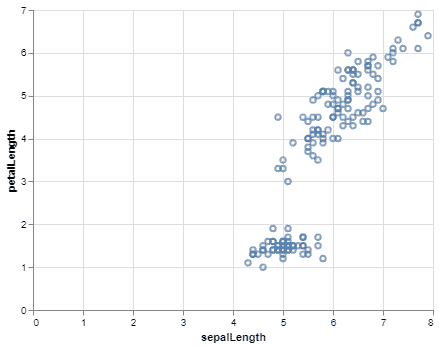
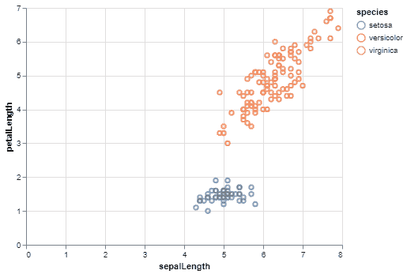
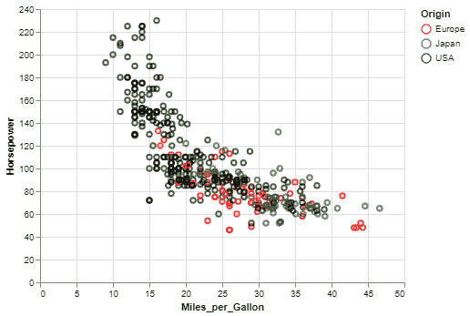
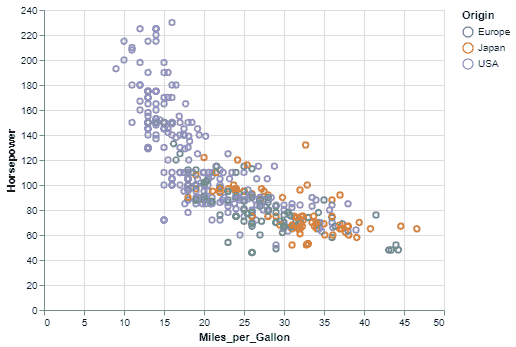

# 如何用牛郎星中的变量给散点图上色？

> 原文:[https://www . geeksforgeeks . org/如何通过阿尔泰星中的变量给散点图上色/](https://www.geeksforgeeks.org/how-to-color-a-scatter-plot-by-a-variable-in-altair/)

**牛郎星**是一个简单易用的 python 统计可视化库。它提供了许多类型的可视化，从简单的条形图到像方框图这样的复合可视化。散点图是阿尔泰程序库中最有用的可视化工具之一，用于二元分析和查找数据集中两个数据列之间的关系。

## 入门指南

有时，简单的散点图不足以衡量数据集中变量之间的关系。更好的可视化是两个定量变量/数据列相对于第三个变量的关系图。第三个变量几乎总是一个**名义或分类变量**。我们可以使用第三个变量对散点图中的数据点进行着色。给散点图着色将帮助我们识别哪个数据点对应于第三个变量的哪个类别。

要对散点图进行着色，用户只需将数据集的标称变量映射到颜色编码。

**让我们用一个例子来理解散点图着色的重要性:**

Iris 数据集是数据科学中最受欢迎的数据集之一，在大多数数据集库中都有。数据集记录了三个物种的鸢尾花。数据集中可用的数据列有第十列、第十列、第十列、第十列和物种。首先，我们将使用一个简单的散点图来可视化这个数据集，然后看看通过给这个散点图着色可以实现什么。

为了制作一个简单的散点图，我们使用来自 Vega *_datasets* 库的虹膜数据集，并将其传递给 Chart 对象，并使用 mark_point()方法。然后，我们将 x 轴和 y 轴编码映射为 sepalLength 和 petalLength 变量。

使用不带颜色的虹膜的简单散点图:

## 蟒蛇 3

```
# Python3 program to illustrate
# How to color a Scatter Plot
# using altair

# Importing altair and vega_datasets library
import altair as alt
from vega_datasets import data

# Selecting the iris dataset
iris = data.iris()

# Making the Scatter Plot
alt.Chart(iris).mark_point().encode(
  # Map the sepalLength to x-axis
    x = 'sepalLength',
  # Map the petalLength to y-axis
    y = 'petalLength',
)
```

**输出:**



不着色的虹膜数据集散点图

如您所见，我们可以从这个散点图中推断出一组点与另一组点是线性可分的，但是我们看不到哪些数据点对应于哪些物种，以及存在哪些类型的关系。为了使这个图更有信息，我们将使用物种变量给这个散点图着色。

**代码:**

## 蟒蛇 3

```
# Python3 program to illustrate
# How to color a Scatter Plot
# using altair

# Importing altair and vega_datasets library
import altair as alt
from vega_datasets import data

# Selecting the iris dataset
iris = data.iris()

# Making the Scatter Plot
alt.Chart(iris).mark_point().encode(
  # Map the sepalLength to x-axis
    x = 'sepalLength',
  # Map the petalLength to y-axis
    y = 'petalLength',
  # Coloring the Scatter Plot
  # Map the species to color
    color = 'species'
)
```

**输出:**



带颜色的虹膜数据集散点图

阿尔泰自动生成图例，指定哪个颜色代表颜色变量的哪个类别。在看到彩色数据点时，我们可以推断濑户物种具有长萼片但短花瓣。杂色种具有几乎相等和中等大小的花瓣和萼片，而弗吉尼亚种也具有几乎相等但大尺寸的花瓣和萼片。

如您所见，我们可以通过给散点图着色来提取更多信息。

## 自定义颜色

如果您不喜欢牛郎星为散点图选择的颜色，可以自定义颜色。通过将色阶类传递给色阶参数，可以使用颜色类的色阶参数更改默认颜色。可用的自定义包括:

1.  颜色到离散值的自定义映射:对于自定义映射，我们分别使用值和颜色的比例和传递列表的域和范围参数。
2.  配色方案:织女星项目给出了很多配色方案。如果你喜欢深色，你可以使用“深色 2”方案，如果有超过 10 个类别，你可以使用“类别 20”方案。

**示例 1:** 颜色到离散值的自定义映射:

## 蟒蛇 3

```
# Python3 program to illustrate
# How to do custom mapping
# of colors to discrete values
# for scatter plot coloring
# using altair

# Importing altair and vega_datasets library
import altair as alt
from vega_datasets import data

# Selecting the cars dataset
cars = data.cars()

# Making two lists for
# values and colors resp.
dom = ['Europe', 'Japan', 'USA']
rng = ['red', 'green', 'black']

# Making the Scatter Plot
alt.Chart(cars).mark_point().encode(

    # Map Miles_per_Gallon to x-axis
    x='Miles_per_Gallon',

    # Map the Horsepower to y-axis
    y='Horsepower',

    # Coloring the Scatter Plot
    # using Origin variable and
    # custom colors
    color=alt.Color('Origin', scale=alt.
                    Scale(domain=dom, range=rng))
)
```

**输出:**



使用自定义颜色和值映射的汽车数据集散点图

**示例 2(配色方案):**

## 蟒蛇 3

```
# Python3 program to illustrate
# How to select color schemes
# for scatter plot coloring
# using altair

# Importing altair and vega_datasets library
import altair as alt
from vega_datasets import data

# Selecting the cars dataset
cars = data.cars()

# Making the Scatter Plot
alt.Chart(cars).mark_point().encode(

    # Map Miles_per_Gallon to x-axis
    x='Miles_per_Gallon',

    # Map the Horsepower to y-axis
    y='Horsepower',

    # Coloring the Scatter Plot
    # using Origin variable and
    # color scheme
    color = alt.Color('Origin', scale=alt.
                      Scale(scheme = 'dark2'))
)
```

**输出:**



使用配色方案的汽车数据集散点图