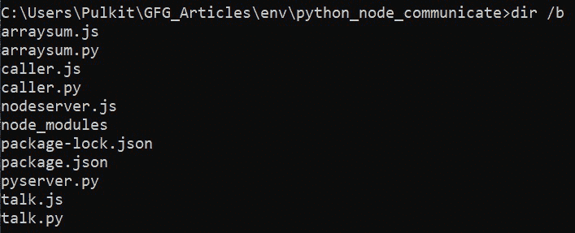

# Python 和 Node.js 之间如何进行 JSON 数据的通信？

> 原文:[https://www . geesforgeks . org/how-communication-JSON-数据在 python 和节点之间-js/](https://www.geeksforgeeks.org/how-to-communicate-json-data-between-python-and-node-js/)

下面的文章介绍了如何在 python 和 Node.js 之间传递 JSON 数据，假设我们使用的是 Node.js 应用程序，我们希望利用一个只有 Python 才有的特定库，反之亦然。我们应该能够将结果从一种语言共享到另一种语言，为了实现这一点，我们将使用 JSON，因为它与语言无关。

**进场:**

1.  为每种语言设置一个服务器，并使用旧的 GET 和 POST 请求使用 JSON 共享数据。
2.  从 Node.js 调用一个 python 后台进程，反之亦然，并在这两种情况下监听进程的 *stdout* 流。

**项目结构:**下面使用的所有文件都存在于如下所示的同一个目录中。



文件结构

**1。使用服务器:**这类似于使用第三方应用编程接口服务的方法，其中我们向远程服务器发出获取数据的 GET 请求，并发出发送数据的 POST 请求。唯一的区别是我们将在本地运行服务器(这也适用于具有所需网址的远程服务器)。

**Node.js 转 Python:** 当我们在 Node.js 工作，想用 Python 处理一些数据的时候。

在下面的例子中，我们将为 Python 设置一个服务器，并从 node.js 发出请求。我们正在使用**微框架，因为这是在 Python 中设置服务器并在 Node.js 中发出请求的最简单方法。我们将需要一个 ***请求*** 包。**

****模块安装:****

*   **使用以下命令为 Python 安装烧瓶模块:

    ```
    pip install flask
    ```** 
*   **使用以下命令为节点安装请求模块:

    ```
    npm install request-promise
    ```** 

****示例:**计算包含整数的数组的和，并将结果返回给 Node.js**

## **pyserver.py**

```
from flask import Flask
import json 

# Setup flask server
app = Flask(__name__) 

# Setup url route which will calculate
# total sum of array.
@app.route('/arraysum', methods = ['POST']) 
def sum_of_array(): 
    data = request.get_json() 
    print(data)

    # Data variable contains the 
    # data from the node server
    ls = data['array'] 
    result = sum(ls) # calculate the sum

    # Return data in json format 
    return json.dumps({"result":result})

if __name__ == "__main__": 
    app.run(port=5000)
```

**使用以下命令运行**服务器**。**

```
python pyserver.py
```

**这将在***http://127 . 0 . 0 . 1:5000/***启动服务器。现在我们从 Node.js 向*T5【http://127 . 0 . 0 . 1:5000/arraysum*发出 POST 请求**

## **talk.js**

```
var request = require('request-promise');

async function arraysum() {

    // This variable contains the data
    // you want to send 
    var data = {
        array: [1, 2, 3, 4, 5, 6, 7, 8, 9, 10]
    }

    var options = {
        method: 'POST',

        // http:flaskserverurl:port/route
        uri: 'http://127.0.0.1:5000/arraysum',
        body: data,

        // Automatically stringifies
        // the body to JSON 
        json: true
    };

    var sendrequest = await request(options)

        // The parsedBody contains the data
        // sent back from the Flask server 
        .then(function (parsedBody) {
            console.log(parsedBody);

            // You can do something with
            // returned data
            let result;
            result = parsedBody['result'];
            console.log("Sum of Array from Python: ", result);
        })
        .catch(function (err) {
            console.log(err);
        });
}

arraysum();
```

**通过以下命令运行该脚本。**

```
node talk.js
```

****输出:****

```
{ result: 55 }
Sum of Array from Python:  55
```

****Python 到 Node.js:** 当我们在 Python 中工作，想在 Node.js 中处理一些数据的时候。**

**这里我们将颠倒上述过程，使用 ***express*** 在 node.js 中启动服务器，使用 python 中的 ***请求*** 包。**

****模块安装:****

*   **使用以下命令为 Python 安装请求模块:

    ```
    pip install requests
    ```** 
*   **使用以下命令为 NodeJS 安装快速和主体解析器模块:

    ```
    npm install express
    npm install body-parser
    ```** 

## **nodeserver.js**

```
var express = require('express');
var bodyParser = require('body-parser');

var app = express();

app.use(bodyParser.json());
app.use(bodyParser.urlencoded({ extended: false }));

app.post("/arraysum", (req, res) => {

    // Retrieve array form post body
    var array = req.body.array;  
    console.log(array);

    // Calculate sum
    var sum = 0;
    for (var i = 0; i < array.length; i++) {
        if (isNaN(array[i])) {
            continue;
        }
        sum += array[i];
    }
    console.log(sum);

    // Return json response
    res.json({ result: sum });
});

// Server listening to PORT 3000
app.listen(3000);
```

**使用以下命令运行**服务器**。**

```
node nodeserver.js
```

**这将在***http://127 . 0 . 0 . 1:3000/***启动服务器。现在我们从 Python 向***127 . 0 . 0 . 1:3000/arraysum***发出 POST 请求**

## **talk.py**

```
import requests

# Sample array
array = [1,2,3,4,5,6,7,8,9,10]

# Data that we will send in post request.
data = {'array':array}

# The POST request to our node server
res = requests.post('http://127.0.0.1:3000/arraysum', json=data) 

# Convert response data to json
returned_data = res.json() 

print(returned_data)
result = returned_data['result'] 
print("Sum of Array from Node.js:", result)
```