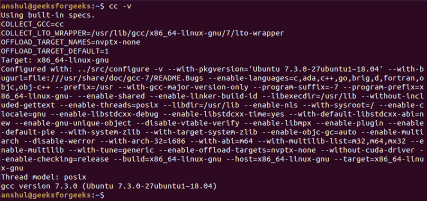
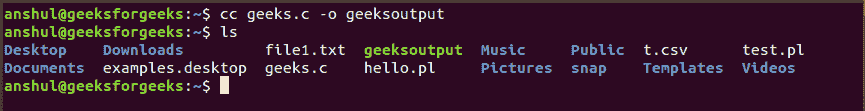
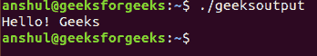
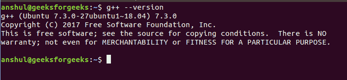
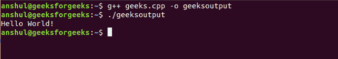
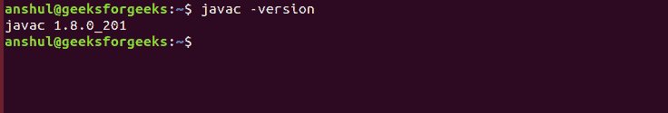
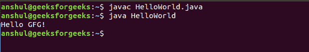

# 如何在 Linux 中编译运行 C/C++/Java 程序

> 原文:[https://www . geesforgeks . org/如何编译并运行 c-c-plus-plus-Java-programs-in-Linux/](https://www.geeksforgeeks.org/how-to-compile-and-run-c-c-plus-plus-java-programs-in-linux/)

c 是一种过程编程语言。它最初是由丹尼斯·里奇在 1969 年至 1973 年间开发的。它主要是作为编写操作系统的系统编程语言开发的。C 语言的主要特性包括对内存的低级访问、一组简单的关键字和干净的风格，这些特性使 C 语言适合像操作系统或编译器开发这样的系统编程。
首先需要安装一些 GNU、GCC、C/C++编译器等开发工具和应用，在 Linux 上编译执行代码。您可以使用以下命令验证安装的工具:

*查看 cc 的版本信息:*

```py
cc -v
```

[](https://media.geeksforgeeks.org/wp-content/uploads/20190308155301/how-1.png)

现在考虑一个简单的名为 *Geeks.c* 的 C 程序文件，如下所示:

```py
#include <stdio.h> 
int main(void) 
{ 
    printf("Hello! Geeks\n"); 
    return 0; 
} 
```

要编译这段代码，我们可以使用:

```py
cc filename.c -o executable_file_name
```

这里， *filename.c* 是 C 程序文件，用-o 选项显示代码中的错误。如果没有发现错误，这将生成一个可执行文件作为*可执行文件名称*。

```py
cc Geeks.c -o geeksoutput
```

[](https://media.geeksforgeeks.org/wp-content/uploads/20190308155303/how-2.png)

这里 *geeksoutput* 是生成的可执行文件。所以我们可以这样执行:

```py
./geeksoutput
```

[](https://media.geeksforgeeks.org/wp-content/uploads/20190308155304/how-3.png)

**对于 C++程序文件:**

C++是一种通用编程语言，现在广泛用于竞争性编程。它具有命令式、面向对象和泛型编程特性。C++运行在很多平台上，如视窗、Linux、Unix、Mac 等。在我们开始用 C++编程之前。我们需要在本地计算机上建立一个环境来成功编译和运行我们的 C++程序。您可以使用以下命令验证安装的工具:

*查看 g++的版本信息:*

```py
g++ --version
```

[](https://media.geeksforgeeks.org/wp-content/uploads/20190308170121/how-4.png)

现在考虑一个简单的名为 *geeks.cpp* 的 C++程序文件，如下所示:

```py
#include<iostream>  
using namespace std; 

// main function
// where the execution
// of program begins 
int main() 
{ 
    // prints Hello World!
    cout<<"Hello World!\n"; 

    return 0; 
} 
```

要编译这段代码，我们可以使用:

```py
g++ filename.cpp -o executable_file_name
```

这里， *filename.cpp* 是 C++程序文件，使用-o 选项显示代码中的错误。如果没有发现错误，这将生成一个可执行文件作为*可执行文件名称*。

```py
g++ geeks.cpp -o geeksoutput
```

这里 *geeksoutput* 是生成的可执行文件。所以我们可以这样执行:

```py
./geeksoutput
```

[](https://media.geeksforgeeks.org/wp-content/uploads/20190308170122/how-5.png)

**对于 Java 程序文件:**

Java 是最流行、应用最广泛的编程语言和平台之一。平台是一种有助于开发和运行用任何编程语言编写的程序的环境。您可以使用以下命令验证安装的工具:

*查看 Java 的版本信息:*

```py
javac -version
```

[](https://media.geeksforgeeks.org/wp-content/uploads/20190308172538/how-6.png)

要编译代码，我们可以使用:

```py
javac filename.java
```

为了执行，我们将使用包含主方法的类名，如下所示:

```py
java classname
```

**示例:**现在考虑一个名为*HelloWorld.java*的简单 Java 程序文件，如下所示:

```py
class HelloWorld 
{ 

    // Main Method
    public static void main(String args[]) 
    { 
        System.out.println("Hello, GFG"); 
    } 
} 
```

[](https://media.geeksforgeeks.org/wp-content/uploads/20190308172539/how-7.png)