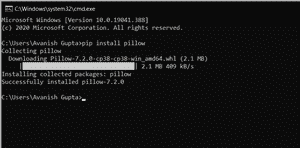
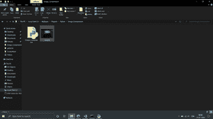
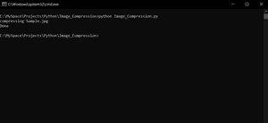
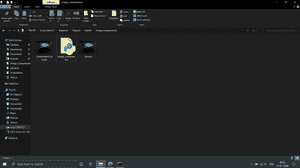

# 如何使用 Python 和 PIL 压缩图像？

> 原文:[https://www . geeksforgeeks . org/如何使用 python 和 pil 压缩图像/](https://www.geeksforgeeks.org/how-to-compress-images-using-python-and-pil/)

有些组织从 10 万或更多的人那里接收数据，这些数据大多是文本形式的，只有一些图像。大多数人都知道文本部分以表格的形式存储在数据库中，但是图像呢？与文本数据相比，图像较小，但在存储方面构成了更大的空间。因此，为了节省空间并保持进程的平稳运行，他们要求用户提交压缩图像。由于大多数读者都有一点 CS 背景(无论是在学校还是大学)，他们明白使用在线免费工具压缩图像对他们来说不是一个好的做法。

在 Windows 7 之前，微软曾经推出过 MS Office 图片管理器，可以将图片压缩到一定程度，但也有一定的局限性。

懂一点 python 的可以安装 python，在命令提示符下(终端为 Linux 用户)使用 **pip 安装** [**枕**](https://www.geeksforgeeks.org/python-pillow-a-fork-of-pil/) 到**安装枕叉**。

你会得到这样的屏幕



将所有文件组合在一个文件夹中，并将文件 Compress.py 保存在同一文件夹中。

用 python 运行 python 文件。

以下是该文件的源代码:

## 蟒蛇 3

```
# run this in any directory 
# add -v for verbose 
# get Pillow (fork of PIL) from
# pip before running -->
# pip install Pillow

# import required libraries
import os
import sys
from PIL import Image

# define a function for
# compressing an image
def compressMe(file, verbose = False):

      # Get the path of the file
    filepath = os.path.join(os.getcwd(), 
                            file)

    # open the image
    picture = Image.open(filepath)

    # Save the picture with desired quality
    # To change the quality of image,
    # set the quality variable at
    # your desired level, The more 
    # the value of quality variable 
    # and lesser the compression
    picture.save("Compressed_"+file, 
                 "JPEG", 
                 optimize = True, 
                 quality = 10)
    return

# Define a main function
def main():

    verbose = False

    # checks for verbose flag
    if (len(sys.argv)>1):

        if (sys.argv[1].lower()=="-v"):
            verbose = True

    # finds current working dir
    cwd = os.getcwd()

    formats = ('.jpg', '.jpeg')

    # looping through all the files
    # in a current directory
    for file in os.listdir(cwd):

        # If the file format is JPG or JPEG
        if os.path.splitext(file)[1].lower() in formats:
            print('compressing', file)
            compressMe(file, verbose)

    print("Done")

# Driver code
if __name__ == "__main__":
    main()
```

#### 压缩前的文件夹:



运行文件前的文件夹

#### 用于执行代码的命令行:

PS:请进入目录后运行代码。



用于执行代码的命令行

#### 代码执行后的文件夹:



运行代码后的文件夹

你可以清楚地看到压缩文件。