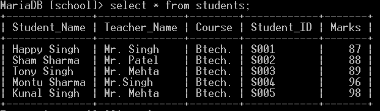

# 如何用 Python 计算 MySQL 表一列的平均值？

> 原文:[https://www . geeksforgeeks . org/如何使用 python 计算 mysql 表的平均列数/](https://www.geeksforgeeks.org/how-to-compute-the-average-of-a-column-of-a-mysql-table-using-python/)

需要一个 MySQL 连接器来生成 Python 和 MySQL 服务器之间的连接。这里我们将导入 mysql.connector 库，以获取给定数据库中指定列的平均值。

如果需要了解如何安装 MySQL，参见[如何在 Python 3 中安装 MySQL。](https://www.geeksforgeeks.org/mysqldb-connection-python/)

### **SQL 的平均函数**

函数的作用是:返回表中数值列的平均值。它通常与 WHERE 子句一起使用。

**AVG()函数语法**

> 从表名
> 中选择 AVG(列名)
> 条件；

以下程序将帮助您更好地理解这一点。

**使用的数据库:**



学校数据库中的学生表

#### **应遵循的步骤:**

*   所以我们首先要导入 **mysql.connector** 。导入后，我们使用**MySQL . connector . connect()**函数连接到 MySQL 数据库。
*   然后我们必须为表创建一个游标。
*   接下来，我们执行我们的函数，使用 cursor.execute()函数找到学生表的 Marks 列的平均值。在这个函数中，我们将“从学生中选择 AVG(分数)作为平均值”放在一行中。
*   然后我们创建一个名为 row 的变量，并将其设置为 cursor.fetchall()。
*   然后，我们使用 for 循环并打印出 i[0]，它代表 Marks 列的平均值。
*   一旦我们做了需要做的事情，我们就关闭数据库。
*   通过这种方法，我们可以使用 Python 找到 MySQL 表中一列所有行的平均值。

**实施:**

使用 Python 3 中的 MySQL 连接器来查找 Average 的程序。

## 蟒蛇 3

```
import mysql.connector

# database connection
connection = mysql.connector.connect(
    host="localhost", user="root",
      password="", database="school")
cursor = connection.cursor()

# queries for retrievint all rows
retrieve = "Select AVG(Marks) AS average from students;"

# executing the queries
cursor.execute(retrieve)
rows = cursor.fetchall()
for i in rows:
    print("Average marks is :" + str(i[0]))

# committing the connection then closing it.
connection.commit()
connection.close()
```

**输出:**


学生成绩栏平均值表的输出。