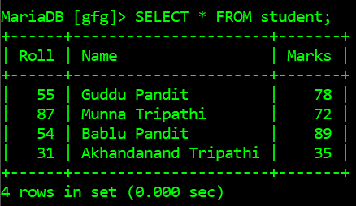
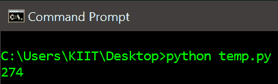
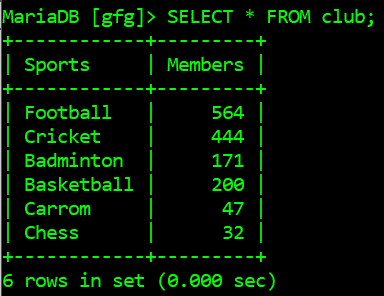

# 如何用 Python 计算 MySQL 表一列的所有行的和？

> 原文:[https://www . geeksforgeeks . org/如何使用 python 计算 mysql 表的所有行和列的总和/](https://www.geeksforgeeks.org/how-to-compute-the-sum-of-all-rows-of-a-column-of-a-mysql-table-using-python/)

MySQL 服务器是一个开源的关系数据库管理系统，是，是对基于网络的应用程序的主要支持。数据库和相关表格是许多网站和应用程序的主要组成部分，因为数据是通过网络存储和交换的。为了从网络服务器、访问 MySQL 数据库，我们使用了 Python 中的各种模块，如 PyMySQL、mysql.connector 等。

在本文中，我们将计算数据库中特定 MySQL 表中一列的所有行的总和。首先，我们将连接到一个包含 MySQL 表的数据库。将要使用的 SQL 查询是:

```
SELECT SUM(column_name) FROM table_name
```

*A* nd 最后，显示表格中行的总和。

**下面是一些描述如何计算数据库中 MySQL 表的一列的所有行的总和的程序:**

**例 1**

下面是数据库 *gfg* 中的表*学生*，它将被 Python 脚本访问:



下面是获取 MySQL 表中特定列的行数总和的程序:

## 蟒蛇 3

```
# import required module
import mysql.connector

# connect python with mysql with your hostname, 
# database, user and password
db = mysql.connector.connect(host='localhost',
                             database='gfg',
                             user='root',
                             password='')

# create cursor object
cursor = db.cursor()

# get the sum of rows of a column
cursor.execute("SELECT SUM(Marks) FROM student")

# fetch sum and display it
print(cursor.fetchall()[0][0])

# terminate connection
db.close()
```

**输出:**



**例 2**

下面是从给定数据库的表中获取行总和的另一个示例，下面是表模式和行:



下面是从*俱乐部*表中获取*成员*行和的 python 脚本:

## 蟒蛇 3

```
# import required module
import mysql.connector

# connect python with mysql with your hostname, 
# database, user and password
db = mysql.connector.connect(host='localhost',
                             database='gfg',
                             user='root',
                             password='')

# create cursor object
cursor = db.cursor()

# get the sum of rows of a column
cursor.execute("SELECT SUM(members) FROM club")

# fetch sum and display it
print(cursor.fetchall()[0][0])

# terminate connection
db.close()
```

**输出:**

