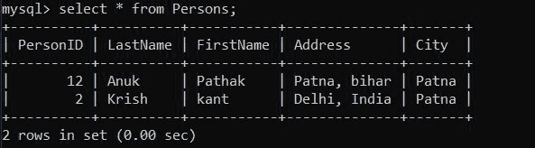
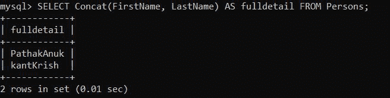

# 如何用 Python 连接 MySQL 表的列值？

> 原文:[https://www . geeksforgeeks . org/如何使用 python 连接一个 mysql 表的列值/](https://www.geeksforgeeks.org/how-to-concatenate-column-values-of-a-mysql-table-using-python/)

**先决条件:** [Python: MySQL 创建表](https://www.geeksforgeeks.org/python-mysql-create-table/)

在本文中，我们展示了如何使用 Python 连接 MySQL 表的列值。我们在 SQL Server 中使用各种数据类型来适当地定义特定列中的数据。我们可能需要将多个列中的数据连接成一个字符串

串联列意味着合并列数据并将其显示为单个列。这也可以在 MySQL 中使用 CONCAT()函数来完成，但是我们正在使用一个 Python 程序来连接多个列。 [**MySQL 连接器**](https://www.geeksforgeeks.org/mysql-connector-python-module-in-python/) -Python 模块是 Python 中的一个 API，用于与 MySQL 数据库进行通信。

**我们将使用这个数据库:**



### 如何连接 MySQL 表的列值:

> **语法:**选择连接(列名 1，列名 2)作为表名的完整细节



### 如何使用 Python 连接 MySQL 表的列值:

此示例显示了列的串联。步骤如下:

*   使用 connect()函数建立与数据库服务器的连接。传递主机、用户(根用户或您的用户名)、密码(如果存在)和数据库参数来连接()方法。
*   然后使用 cursor()函数创建一个游标对象。
*   对 Person 表执行上面不用的语法。

> **语法:**
> 光标执行(“选择连接(列名 1，列名 2)作为表名的全部细节”)

**代码:**

## 蟒蛇 3

```py
# Establish connection to MySQL database
import mysql.connector

mydb = mysql.connector.connect(
  host="localhost",
  user="root",
  password="root123",
  database = "geeks"
  )
mycursor = mydb.cursor()

mycursor.execute("SELECT Concat(FirstName, LastName) AS fulldetail FROM Persons;")

myresult = mycursor.fetchall()

for x in myresult:
  print(x)
```

**输出:**

```py
('PathakAnuk',)
('kantKrish',)
```