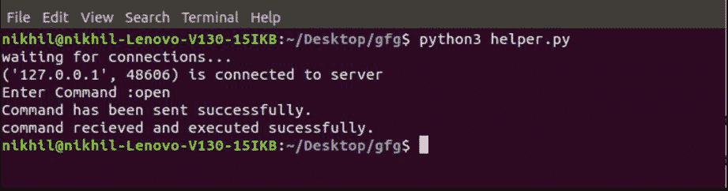
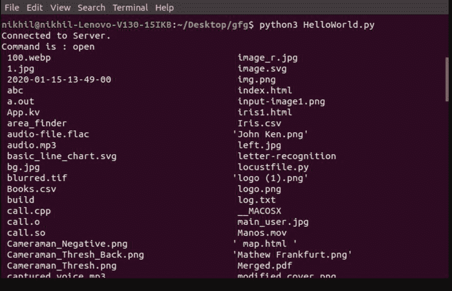

# 如何使用 Python 从任何地方控制 PC？

> 原文:[https://www . geesforgeks . org/如何使用 python 从任何地方控制 PC/](https://www.geeksforgeeks.org/how-to-control-pc-from-anywhere-using-python/)

**先决条件–**[**Python 中的 Socket 编程**](https://www.geeksforgeeks.org/socket-programming-python/)

在这个解决方案中，我们使用套接字编程的概念来建立两台计算机之间的通信。

### **Python 中的套接字编程**

套接字编程是连接网络上两个系统相互通信的一种方式。套接字是为发送和接收数据而构建的端点，它是 IP 地址和端口的组合。我们将导入套接字模块，以便在 Python 中使用套接字编程。以下是构建解决方案所需的方法:

**插座模块中的方法:**

<figure class="table">

| **方法** | **描述** |
| socket.socket()。 | 创建套接字。 |
| socket.bind() | 该方法将主机名和端口名绑定到套接字。 |
| socket.listen() | 此方法启动 TCP 侦听器。 |
| socket.accept() | 接受客户端连接，并等待连接到达。 |
| socket.connect() | 启动 TCP 连接。 |
| socket.close() | 关闭插座。 |

</figure>

**其他插座方式:**

<figure class="table">

| **方法** | **描述** |
| s.recv() | 它接收 TCP 消息 |
| s.send() | 它发送 TCP 消息 |
| socket.gethostname() | 它返回主机名 |

</figure>

所以我们要开发两个 python 程序一个是 **master.py** (服务器)另一个是 **slave.py** (客户端)，使用 master.py 我们可以控制有 slave.py 程序的系统。要使用 python 从任何地方控制电脑，请遵循下面提到的步骤:

**第一步:在一个终端**中创建并执行“master.py”

## 蟒蛇 3

```
import time
import socket
import sys
import os

# Initialize s to socket
s = socket.socket()

# Initialize the host
host = socket.gethostname()

# Initialize the port
port = 8080

# Bind the socket with port and host
s.bind(('', port))

print("waiting for connections...")

# listening for connections
s.listen()

# accepting the incoming connections
conn, addr = s.accept()

print(addr, "is connected to server")

# take command as input
command = input(str("Enter Command :"))

conn.send(command.encode())

print("Command has been sent successfully.")

# receive the confirmation
data = conn.recv(1024)

if data:
    print("command received and executed successfully.")
```

**第二步:** **创建并执行“slave.py”是另一个终端**

## 蟒蛇 3

```
import time
import socket
import sys
import os

# Initialize s to socket
s = socket.socket()

# Initialize the host
host = "127.0.0.1"

# Initialize the port
port = 8080

# bind the socket with port and host
s.connect((host, port))

print("Connected to Server.")

# receive the command from master program
command = s.recv(1024)
command = command.decode()

# match the command and execute it on slave system
if command == "open":
    print("Command is :", command)
    s.send("Command received".encode())

    # you can give batch file as input here
    os.system('ls')
```

**输出:**



终端运行 master.py



终端运行从机. py