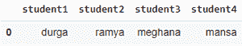
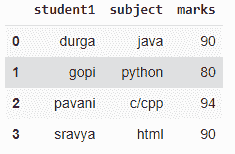
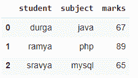
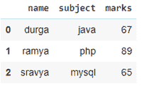

# 如何在 Python 中将列表转换为数据帧行？

> 原文:[https://www . geesforgeks . org/如何将列表转换为 python 中的数据框行/](https://www.geeksforgeeks.org/how-to-convert-a-list-to-a-dataframe-row-in-python/)

在本文中，我们将讨论如何在 Python 中将列表转换为数据框行。

## 方法 1:使用测试函数

这就是所谓的转置函数，这将把列表转换成一行。这里每个值都存储在一列中。

> **语法:**熊猫。数据帧(列表)。T

**示例:**

## 蟒蛇 3

```py
# import pandas module
import pandas as pd

# conside a list
list1 = ["durga", "ramya", "meghana", "mansa"]

# convert the list into dataframe row
data = pd.DataFrame(list1).T

# add columns
data.columns = ['student1', 'student2',
                'student3', 'student4']

# display
data
```

**输出:**



## 方法 2:从多维列表创建数据框行

这里，我们将列表列表转换为数据框行

> **语法** : pd。数据帧(列表)
> 
> 其中列表是列表的列表

**示例:**

## 蟒蛇 3

```py
# import pandas module
import pandas as pd

# conside a list
list1 = [["durga", "java", 90], ["gopi", "python", 80],
         ["pavani", "c/cpp", 94], ["sravya", "html", 90]]

# convert the list into dataframe row
data = pd.DataFrame(list1)

# add columns
data.columns = ['student1', 'subject', 'marks']

# display
data
```

**输出:**



## 方法 3:使用带有索引和列的列表

这里我们从列表中获取数据(行)，并从列中为这些值分配列

> **语法** : pd。数据帧(列表、列、数据类型)
> 
> 在哪里
> 
> *   列表是输入值的列表
> *   列是值列表的列名
> *   dtype 是列数据类型

**例**:

## 蟒蛇 3

```py
# import pandas module
import pandas as pd

# conside a list
list1 = [["durga", "java", 90], ["gopi", "python", 80],
         ["pavani", "c/cpp", 94], ["sravya", "html", 90]]

# convert the list into dataframe row by adding columns
data = pd.DataFrame(list1, columns=['student1',
                                    'subject', 
                                    'marks'])

# display
data
```

**输出:**


## 方法四:使用 [zip()](https://www.geeksforgeeks.org/zip-in-python/) 功能

在这里，我们将单独的列表作为输入，这样每个列表都将作为一列，因此列表的数量 dataframe 中的 n 列，并且使用 zip 函数来组合列表。

> **语法** pd。DataFrame(列表(zip)(列表 1，列表 2，.，列表 n))、列)
> 
> 在哪里
> 
> *   列是列表值的列
> *   list1.list n 表示列的输入列表数

**例**:

## 蟒蛇 3

```py
# import pandas module
import pandas as pd

# conside a list
list1 = ["durga", "ramya", "sravya"]
list2 = ["java", "php", "mysql"]
list3 = [67, 89, 65]

# convert the list into dataframe row by 
# using zip()
data = pd.DataFrame(list(zip(list1, list2, list3)),
                    columns=['student', 'subject', 'marks'])

# display
data
```

**输出:**



## 方法 5:使用字典列表

这里我们将作为数据框中的列的单个列表传递给字典的键，因此通过将字典传递给 dataframe()，我们可以将列表转换为 data frame。

> **语法** : pd。DataFrame{'key': list1，' key': list2，…..，' key': listn}

这些键将是数据框中的列名。

**例**:

## 蟒蛇 3

```py
# import pandas module
import pandas as pd

# conside a list
list1 = ["durga", "ramya", "sravya"]

list2 = ["java", "php", "mysql"]

list3 = [67, 89, 65]

# convert the list into dataframe row by 
# using dictionary
dictionary = {'name': list1, 'subject': list2, 
              'marks': list3}

data = pd.DataFrame(dictionary)

# display
data
```

**输出:**



## 方法 6:从多维列表创建带有列的数据框行

这里我们从多维列表中获取输入，并在 DataFrame()函数中分配列名

> **语法:** pd。数据框(列表、列)
> 
> 在哪里
> 
> 1.  列表是多维列表
> 2.  列是列名

**示例:**

## 蟒蛇 3

```py
# import pandas module
import pandas as pd

# conside a list
list1 = [["durga", "java", 90],
         ["gopi", "python", 80],
         ["pavani", "c/cpp", 94],
         ["sravya", "html", 90]]

# convert the list into dataframe
# row using columns from multi lists
data = pd.DataFrame(list1, columns=['student1', 
                                    'subject', 
                                    'marks'])

# display
data
```

**输出:**

