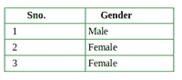
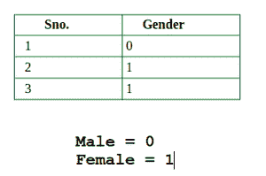
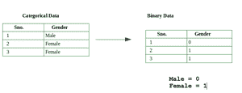

# Python 中如何将分类数据转换为二进制数据？

> 原文:[https://www . geesforgeks . org/如何在 python 中将分类数据转换为二进制数据/](https://www.geeksforgeeks.org/how-to-convert-categorical-data-to-binary-data-in-python/)

**分类数据**是对应于分类变量的数据。分类变量是一个接受固定的、有限的一组可能值的变量。**例如**性别、血型、是否有农村户口等。

**分类数据的特征:**

*   这主要用于统计学。
*   加法、减法等数值运算。这种类型的数据是不可能的。
*   分类数据的所有值都在类别中。
*   它通常使用数组数据结构。

**示例:**



**分类数据**

一个**二进制数据**是一个使用两种可能状态或值即 0 和 1 的数据。二进制数据主要用于各种领域，例如在计算机科学中，我们将其命名为比特(二进制数字)，在数字电子和数学中，我们将其命名为*真值，*我们在统计学中将其命名为二进制变量。

**特征:**

*   (0 和 1)也称为(真和假)、(成功和失败)、(是和否)等。
*   二进制数据是一种离散数据，也用于统计。

**示例:**



**二进制数据**

## **分类数据到二进制数据的转换**

我们的任务是将分类数据转换为二进制数据，如下图所示:



**分步方法:**

**步骤 1)** 为了将分类数据转换为二进制数据，我们使用了熊猫框架中的一些函数。这就是熊猫框架被导入的原因

## 蟒蛇 3

```py
# import required module
import pandas as pd
```